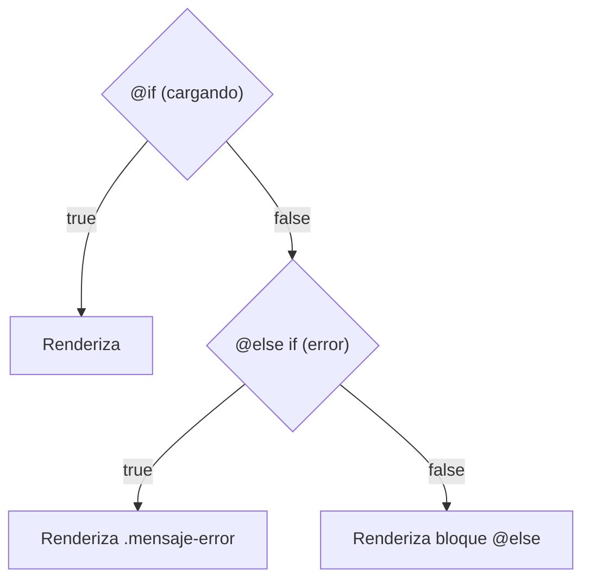

# Módulo 3: El Nuevo Control de Flujo Nativo (`@if` y `@switch`)

Una de las críticas históricas más persistentes hacia Angular era su sintaxis de renderizado condicional: tener que escribir `*ngIf="condicion; else templateRef"` y declarar múltiples etiquetas `<ng-template>` resultaba engorroso y poco intuitivo frente a frameworks como Svelte o React.

En **Angular 17**, Google introdujo una sintaxis declarativa nativa integrada en el compilador de plantillas, inspirada en los mejores lenguajes modernos.

---

## 3.1 La Nueva Sintaxis `@if`, `@else if` y `@else`

El bloque `@if` reemplaza por completo a `*ngIf`:

```html
@if (cargando) {
  <app-skeleton-loader />
} @else if (error) {
  <div class="mensaje-error">
    <p>Ocurrió un error: {{ error }}</p>
    <button (click)="reintentar()">Reintentar</button>
  </div>
} @else {
  <main class="contenido-principal">
    <h1>Panel de Administración</h1>
    <app-metricas />
  </main>
}
```



### 1. Asignación de Alias con `as`
Al igual que en TypeScript, puedes evaluar una expresión o un Observable y capturar su resultado en una variable local disponible dentro del bloque:

```html
@if (usuario$ | async; as usuario) {
  <div class="tarjeta-perfil">
    <h2>{{ usuario.nombre }}</h2>
    <p>Email: {{ usuario.email }}</p>
    <span class="badge">{{ usuario.rol }}</span>
  </div>
} @else {
  <p>Inicia sesión para continuar.</p>
}
```

### 2. Estrechamiento de Tipos Seguro (*Strict Type Narrowing*)
El compilador de Angular ahora estrecha los tipos de TypeScript con precisión absoluta dentro de las plantillas:

```typescript
export class DetallePagoComponent {
  // Unión discriminada:
  public pago: PagoExitoso | PagoFallido | null = null;
}
```

```html
@if (pago !== null) {
  @if (pago.tipo === 'EXITO') {
    <!-- TypeScript sabe con 100% de certeza que pago es PagoExitoso -->
    <p>Código de transacción: {{ pago.transaccionId }}</p>
  } @else {
    <!-- TypeScript sabe con 100% de certeza que pago es PagoFallido -->
    <p>Motivo del rechazo: {{ pago.motivoFallo }}</p>
  }
}
```

---

## 3.2 El Nuevo `@switch`, `@case` y `@default`

El antiguo `[ngSwitch]` requería directivas de atributo y estructurales combinadas (`*ngSwitchCase`). La nueva sintaxis es limpia, concisa y no necesita importar nada:

```html
@switch (estadoPedido) {
  @case ('PENDIENTE') {
    <span class="badge badge-amarillo">Esperando confirmación</span>
  }
  @case ('EN_TRANSITO') {
    <span class="badge badge-azul">En camino con mensajería</span>
    <app-mapa-seguimiento [pedidoId]="pedido.id" />
  }
  @case ('ENTREGADO') {
    <span class="badge badge-verde">Entregado exitosamente</span>
  }
  @default {
    <span class="badge badge-gris">Estado desconocido</span>
  }
}
```

### Diferencias Clave con JavaScript tradicional:
- **No requiere `break`:** A diferencia del `switch` de JS o C++, en Angular **no existe el comportamiento de caída (*fallthrough*)**. Solo se ejecuta el bloque que coincida.
- **Tipado estricto:** Si `estadoPedido` es un tipo unión de TypeScript, el compilador puede verificar que los casos coincidan.

---

## 3.3 ¿Por Qué es Superior al Antiguo `*ngIf`?

1. **Cero dependencias:** No necesitas importar `CommonModule` ni `NgIf`. El soporte viene incorporado en el núcleo del compilador.
2. **Mayor rendimiento:** No se crean instancias de directivas ni `ViewContainerRef` intermediarios. El compilador de Angular transforma los bloques `@if` en instrucciones de bytecode optimizadas para el navegador.
3. **Legibilidad:** Estructura natural de llaves `{}` idéntica a cualquier lenguaje de programación moderno.

---

## 3.4 Migración Automática desde `*ngIf`

Si cuentas con una base de código existente con directivas de asterisco, el CLI incluye un asistente automático para convertir todo el proyecto en segundos:

```bash
ng generate @angular/core:control-flow
```

---

## 🛠️ Reto Práctico del Módulo

1. Crea un componente con un estado de autenticación: `estadoAuth: 'CARGANDO' | 'LOGUEADO' | 'NO_AUTENTICADO'`.
2. Utiliza `@if` y `@else if` para renderizar un mensaje de bienvenida si está logueado, un formulario de login si no lo está, y un spinner si está cargando.
3. Convierte esa misma lógica utilizando un bloque `@switch` con `@case` y `@default`.
4. Comprueba en la consola del navegador que el compilador no arroja advertencias de tipado.
