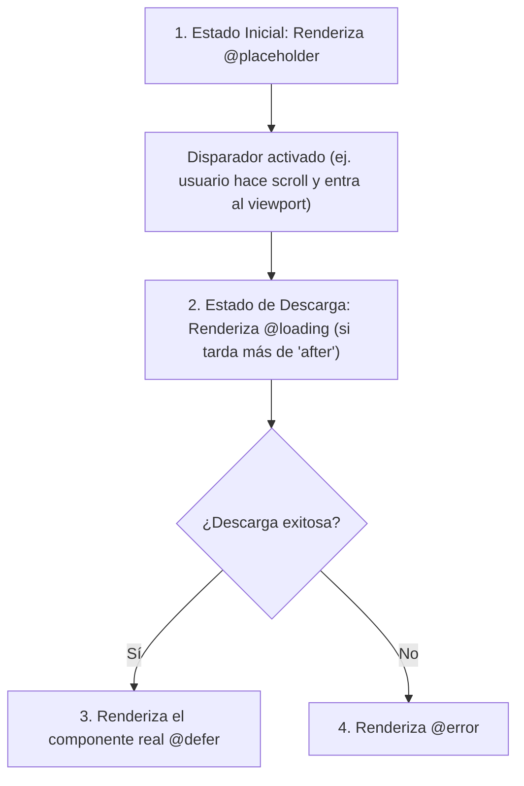

# Módulo 5: Vistas Diferidas Declarativas con `@defer` (*Deferrable Views*)

Hasta Angular 16, la única manera de dividir el código JavaScript en trozos (*Code Splitting*) y retrasar su descarga era a través del enrutador (`loadChildren` o `loadComponent`). Si una página de aterrizaje tenía un gráfico interactivo pesado de 2 MB al final del scroll, el usuario tenía que descargarlo obligatoriamente en la carga inicial.

En **Angular 17**, el equipo de Google introdujo una de las características más aclamadas de la web moderna: **Deferrable Views (`@defer`)**, permitiendo la carga diferida granular de componentes directamente desde la plantilla HTML de forma declarativa y sin configuración en el Router.

---

## 5.1 Los 4 Bloques de una Vista Diferida

Una vista diferida se compone del bloque principal `@defer` y tres bloques auxiliares para gestionar el estado visual:

```html
@defer (on viewport) {
  <!-- Se descarga y renderiza SOLO cuando entra en la pantalla del usuario -->
  <app-grafico-pesado [datos]="ventas" />
} @placeholder (minimum 500ms) {
  <!-- Lo que se muestra ANTES de que comience la carga (HTML ligero) -->
  <div class="grafico-placeholder">
    <p>El gráfico se cargará al desplazarse hacia aquí...</p>
  </div>
} @loading (after 100ms; minimum 1s) {
  <!-- Lo que se muestra MIENTRAS se descarga el chunk por la red -->
  <div class="spinner-carga">
    <span>Descargando librería de visualización...</span>
  </div>
} @error {
  <!-- Lo que se muestra si falla la conexión a internet -->
  <div class="alerta-error">
    <p>No se pudo cargar el componente. Verifica tu conexión.</p>
  </div>
}
```



---

## 5.2 Parámetros de Estabilización Visual: `after` y `minimum`

Para evitar que los spinners aparezcan y desaparezcan en microsegundos provocando parpadeos visuales desagradables (*flashing*):
- **`after 100ms`:** Si la descarga del componente tarda menos de 100 milisegundos (por ejemplo, porque ya estaba en la caché del navegador), el bloque `@loading` **ni siquiera se muestra**.
- **`minimum 500ms`:** Si el bloque `@loading` o `@placeholder` llega a mostrarse, garantiza que permanezca visible al menos 500 ms para que la interfaz se sienta suave y estable.

---

## 5.3 Catálogo de Disparadores (*Triggers*)

Los disparadores le indican a Angular **cuándo** debe iniciar la descarga y renderizado del bloque `@defer`:

### 1. Basados en Eventos (`on`)
- **`on viewport`:** Utiliza la API nativa `IntersectionObserver`. El componente solo se descarga cuando el área del placeholder entra en la ventana visible del navegador.
- **`on idle` (Predeterminado):** Se descarga en segundo plano utilizando `requestIdleCallback()` cuando el navegador no está procesando tareas críticas.
- **`on interaction`:** Se descarga cuando el usuario hace clic o interactúa con el placeholder o con un elemento de referencia.
- **`on hover`:** Se descarga cuando el usuario pasa el ratón por encima del área.
- **`on timer(2s)`:** Se descarga transcurrido un tiempo programado (ej. 2 segundos después del render inicial).
- **`on immediate`:** Inicia la descarga inmediatamente después de que la página termina de renderizarse.

### 2. Disparadores con Referencia Externa
Puedes condicionar la carga de un bloque pesado a la interacción con otro botón situado en otra parte de la pantalla:

```html
<button #btnComentarios>Ver Comentarios (24)</button>

@defer (on interaction(btnComentarios)) {
  <app-hilo-comentarios [articuloId]="articulo.id" />
} @placeholder {
  <p>Haz clic en el botón superior para ver el debate.</p>
}
```

### 3. Basados en Condiciones Lógicas (`when`)
Acepta una expresión booleana controlada desde la clase TypeScript:

```html
@defer (when usuarioHaAceptadoTerminos) {
  <app-pasarela-pago />
}
```

---

## 5.4 La Joya del Rendimiento: Estrategia de `prefetch`

Puedes separar el momento en que **se descarga** el código del momento en que **se dibuja en pantalla**. Por ejemplo, precargar el código cuando el usuario pone el cursor encima del botón, pero no dibujarlo hasta que haga clic:

```html
<button #btnReporte>Abrir Reporte Financiero</button>

@defer (on interaction(btnReporte); prefetch on hover(btnReporte)) {
  <!-- El archivo .js se descarga cuando el usuario hace hover en el botón.
       Al hacer clic, el componente se monta instantáneamente sin espera de red. -->
  <app-reporte-financiero />
}
```

> [!IMPORTANT]
> **Requisito técnico:** Para que un componente sea empaquetado en un chunk diferido con `@defer`, **debe ser un componente `standalone: true`** y no debe estar importado de manera directa en el código TypeScript de ningún módulo no diferido de la misma página.

---

## 🛠️ Reto Práctico del Módulo

1. Crea un componente `app-mapa-interactivo` que simule una librería de mapas pesada con varias imágenes.
2. Coloca en tu página principal un contenido largo con scroll de al menos `150vh`.
3. Al final de la página, envuelve `app-mapa-interactivo` en un bloque `@defer (on viewport)`.
4. Abre la pestaña *Network* de las DevTools del navegador, recarga la página arriba del todo y observa cómo el archivo JavaScript del mapa no se descarga hasta que haces scroll y llegas al final.
