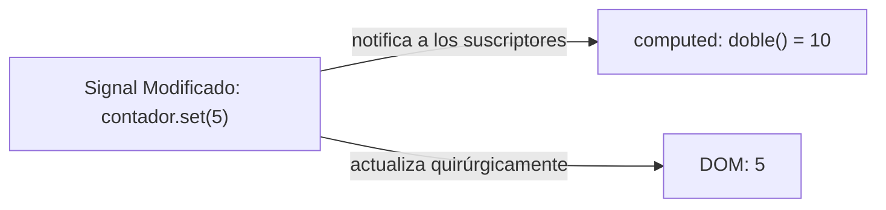

# Módulo 6: Fundamentos de Reactividad de Grano Fino con *Angular Signals*

Durante años, la reactividad en Angular estuvo ligada a dos tecnologías: **Zone.js** (que monitorizaba eventos globales para disparar dirty checking en todo el árbol de componentes) y **RxJS** (ideal para asincronismo complejo, pero con una curva de aprendizaje empinada y riesgo constante de fugas de memoria).

Con **Angular 17**, Google introdujo su modelo de reactividad más trascendental: **Angular Signals**. Los Signals proporcionan **reactividad de grano fino (*fine-grained reactivity*)**, permitiendo que Angular sepa exactamente qué partes de la interfaz deben actualizarse sin necesidad de revisar el resto de la aplicación.

---

## 6.1 ¿Qué es un Signal?

Un **Signal** es un contenedor reactivo (*wrapper*) alrededor de un valor que notifica automáticamente a los consumidores (plantillas, funciones computadas o efectos) cuando ese valor cambia.



### Características Esenciales:
1. **Síncrono y predecible:** No requiere desuscripciones manuales ni operadores de RxJS.
2. **Sin fallos de sincronización (*Glitch-free*):** Garantiza que las propiedades calculadas derivadas nunca lean un estado intermedio inconsistente.
3. **Lectura mediante llamada a función:** Para leer el valor actual de un Signal, se invoca como una función sin argumentos: `miSignal()`.

---

## 6.2 Creación y Lectura de Signals Escribibles (`signal`)

Para declarar un estado reactivo en un componente:

```typescript
import { Component, signal } from '@angular/core';

@Component({
  selector: 'app-contador',
  standalone: true,
  template: `
    <div class="contador-card">
      <!-- Se lee invocando la función contador() -->
      <h2>Contador: {{ contador() }}</h2>
      <p>Usuario activo: {{ usuario().nombre }}</p>

      <button (click)="incrementar()">+1</button>
      <button (click)="resetear()">Reset</button>
      <button (click)="actualizarNombre()">Cambiar Nombre</button>
    </div>
  `
})
export class ContadorComponent {
  // 1. Declaración con valor inicial primitivo:
  public contador = signal<number>(0);

  // 2. Declaración con objeto:
  public usuario = signal<{ id: number; nombre: string }>({
    id: 1,
    nombre: 'Elena Torres'
  });

  // Modificación mediante métodos
  incrementar(): void {
    // .update() recibe el valor actual y retorna el nuevo valor transformado:
    this.contador.update(valorPrevio => valorPrevio + 1);
  }

  resetear(): void {
    // .set() reemplaza directamente el valor por uno nuevo:
    this.contador.set(0);
  }

  actualizarNombre(): void {
    this.usuario.update(user => ({ ...user, nombre: 'Elena de la Rosa' }));
  }
}
```

---

## 6.3 Métodos de Mutación: `.set()` vs `.update()`

| Método | Propósito | Ejemplo |
| :--- | :--- | :--- |
| **`.set(nuevoValor)`** | Reemplaza incondicionalmente el valor del Signal sin importar el valor previo. | `this.cargando.set(false);` |
| **`.update(fn)`** | Calcula el nuevo valor basándose en el estado anterior mediante una función pura. | `this.contador.update(v => v + 1);` |

---

## 6.4 Exponer Signals de Sólo Lectura con `asReadonly()`

Para proteger el estado interno de un servicio o componente y evitar que terceros modifiquen el valor desde el exterior, se utiliza **`asReadonly()`**:

```typescript
// src/app/core/services/carrito.service.ts
import { Injectable, signal } from '@angular/core';

export interface Producto {
  id: number;
  titulo: string;
  precio: number;
}

@Injectable({ providedIn: 'root' })
export class CarritoService {
  // Signal privado y modificable internamente:
  private readonly _items = signal<Producto[]>([]);

  // Signal público de sólo lectura expuesto a los componentes:
  public readonly items = this._items.asReadonly();

  public agregar(producto: Producto): void {
    this._items.update(actuales => [...actuales, producto]);
  }

  public limpiar(): void {
    this._items.set([]);
  }
}
```

Si un componente intenta hacer `carritoService.items.set(...)`, TypeScript arrojará un error de compilación inmediato.

---

## 6.5 Comparadores de Igualdad Personalizados (`equal`)

Por defecto, un Signal notifica a sus dependientes si el nuevo valor no es idéntico por referencia estricta (`===`). Puedes personalizar la función de igualdad para evitar renders innecesarios:

```typescript
// Solo notifica si el ID del usuario cambió, ignorando timestamps o campos irrelevantes:
public usuarioActivo = signal(
  { id: 101, token: 'abc' },
  { equal: (a, b) => a.id === b.id }
);
```

---

## 🛠️ Reto Práctico del Módulo

1. Crea un componente con un Signal para una lista de tareas: `tareas = signal<string[]>([])`.
2. Añade un campo de texto con una referencia local `#inputTarea`.
3. Crea un método `agregarTarea(texto: string)` que utilice `tareas.update()` para agregar la nueva tarea al array inmutablemente.
4. Renderiza la lista con `@for (t of tareas(); track $index)` y añade un botón para eliminar tareas con `tareas.update()`.
