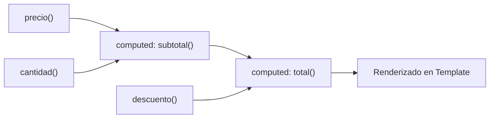

# Módulo 7: Señales Derivadas (`computed`) y Efectos Secundarios (`effect`)

En el paradigma de Angular Signals, el estado se clasifica en dos categorías:
1. **Estado Fuente (*Source State*):** Creado con `signal()`, representa la verdad fundamental del componente.
2. **Estado Derivado (*Derived State*):** Creado con **`computed()`**, se calcula automáticamente a partir de uno o más Signals fuente.

Para reaccionar a estos cambios ejecutando operaciones secundarias (como sincronización con `localStorage` o APIs externas del navegador), Angular provee la función **`effect()`**.

---

## 7.1 Señales Computadas (`computed`)

Un **`computed()`** declara un Signal de sólo lectura cuyo valor depende de otros Signals:

```typescript
import { Component, signal, computed } from '@angular/core';

@Component({
  selector: 'app-tienda-resumen',
  standalone: true,
  template: `
    <div>
      <p>Precio base: ${{ precio() }}</p>
      <p>Cantidad: {{ cantidad() }}</p>
      <p>Descuento aplicado: {{ descuento() * 100 }}%</p>
      <hr />
      <h3>Total a Pagar: ${{ total() }}</h3>
    </div>
  `
})
export class TiendaResumenComponent {
  public precio = signal<number>(100);
  public cantidad = signal<number>(2);
  public descuento = signal<number>(0.10); // 10%

  // 1. Signal derivado simple:
  public subtotal = computed(() => this.precio() * this.cantidad());

  // 2. Signal derivado dependiente de múltiples fuentes:
  public total = computed(() => {
    const sub = this.subtotal();
    return sub - (sub * this.descuento());
  });
}
```



### Características Críticas de `computed()`:
1. **Memoización automática:** Si lees `total()` 50 veces en la plantilla, la fórmula matemática se calcula **una sola vez**. El resultado queda almacenado en caché hasta que `precio`, `cantidad` o `descuento` cambien.
2. **Dependencias dinámicas:** Si tu función tiene un `if/else`, `computed()` solo se suscribe a los Signals leídos en esa ruta de ejecución específica.
3. **Inmutabilidad:** No puedes llamar a `total.set()` ni `total.update()`; su valor depende estrictamente de sus fuentes.
4. **Libre de inconsistencias (*Glitch-free*):** Resuelve el clásico "problema del diamante" de la programación reactiva; nunca verás valores temporales corruptos.

---

## 7.2 Efectos Secundarios con `effect()`

Un **`effect()`** es una operación que se ejecuta automáticamente cada vez que cualquiera de los Signals que lee en su interior cambia de valor:

```typescript
import { Component, signal, effect, inject } from '@angular/core';

@Component({
  selector: 'app-configuracion-usuario',
  standalone: true,
  template: `
    <button (click)="alternarModoOscuro()">
      Modo Actual: {{ modoOscuro() ? '🌙 Oscuro' : '☀️ Claro' }}
    </button>
  `
})
export class ConfiguracionUsuarioComponent {
  public modoOscuro = signal<boolean>(
    localStorage.getItem('tema') === 'oscuro'
  );

  constructor() {
    // El efecto se registra en el constructor (dentro del contexto de inyección):
    effect(() => {
      const esOscuro = this.modoOscuro();
      console.log(`El tema cambió a: ${esOscuro ? 'oscuro' : 'claro'}`);

      // Sincronización con el DOM nativo y localStorage:
      document.body.classList.toggle('dark-theme', esOscuro);
      localStorage.setItem('tema', esOscuro ? 'oscuro' : 'claro');
    });
  }

  alternarModoOscuro(): void {
    this.modoOscuro.update(v => !v);
  }
}
```

---

## 7.3 Limpieza de Recursos en Efectos con `onCleanup`

Si tu efecto inicia un temporizador, una suscripción o una llamada que debe cancelarse cuando el Signal vuelva a cambiar, utiliza la función auxiliar **`onCleanup`**:

```typescript
effect((onCleanup) => {
  const usuarioId = this.usuarioIdActivo();
  
  const timer = setTimeout(() => {
    console.log(`Enviando analítica para usuario ${usuarioId}`);
  }, 2000);

  // Se ejecuta antes de que el efecto vuelva a dispararse o cuando el componente se destruye:
  onCleanup(() => {
    clearTimeout(timer);
  });
});
```

---

## 7.4 Contexto de Inyección y Reglas de Oro

> [!CAUTION]
> **Regla #1: Dónde declarar un `effect()`:**
> Los efectos deben crearse dentro de un **contexto de inyección** (típicamente en el `constructor()` o como inicializador de una propiedad de clase). Si necesitas crearlo dentro de un método arbitrario, debes pasarle manualmente el inyector: `effect(() => ..., { injector: this.injector })`.

> [!WARNING]
> **Regla #2: NO uses `effect()` para modificar otros Signals:**
> Modificar un Signal dentro de un efecto (`signalB.set(...)`) puede provocar bucles infinitos y romper el flujo unidireccional de datos. De hecho, Angular bloquea esto por defecto arrojando un error. **Si necesitas calcular un valor a partir de otro Signal, usa siempre `computed()`**.

---

## 🛠️ Reto Práctico del Módulo

1. Crea un Signal fuente `busqueda = signal<string>('')`.
2. Crea una lista de clientes: `clientes = signal<string[]>(['Carlos', 'Ana', 'Beatriz', 'David', 'Alberto'])`.
3. Crea un Signal computado `clientesFiltrados = computed(...)` que devuelva solo los nombres que contengan el texto de `busqueda()`.
4. Añade un `effect()` que imprima en la consola: *"Se encontraron X clientes coincidentes"* cada vez que cambie el resultado.
