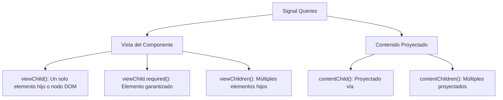

# Módulo 9: Consultas al DOM Reactivas: *Signal Queries*

Históricamente, acceder a elementos del DOM o a componentes hijos mediante `@ViewChild` y `@ContentChild` era una fuente frecuente de errores: las propiedades eran `undefined` hasta que se ejecutaba el ciclo `ngAfterViewInit`, y si el elemento estaba dentro de un `*ngIf`, rastrear cuándo aparecía o desaparecía requería código defensivo complejo.

En **Angular 17.2**, el equipo de Angular introdujo las **Signal Queries**, transformando todas las consultas al DOM en **Signals reactivos**.

---

## 9.1 Las Nuevas Funciones de Consulta



---

## 9.2 `viewChild()` y `viewChild.required()`

A diferencia de `@ViewChild` (que es una propiedad estática que requería `ngAfterViewInit`), `viewChild()` devuelve un **Signal** que se actualiza automáticamente:

```typescript
import { Component, ElementRef, viewChild, effect } from '@angular/core';

@Component({
  selector: 'app-auto-foco',
  standalone: true,
  template: `
    <input #inputBuscador type="text" placeholder="Escribe para buscar..." />
    <button (click)="limpiar()">Limpiar</button>
  `
})
export class AutoFocoComponent {
  // Captura el elemento con la referencia de plantilla #inputBuscador:
  // Retorna Signal<ElementRef<HTMLInputElement>>
  public inputRef = viewChild.required<ElementRef<HTMLInputElement>>('inputBuscador');

  constructor() {
    // Al ser un Signal, podemos reaccionar a él dentro de un effect() de inmediato:
    effect(() => {
      const input = this.inputRef();
      input.nativeElement.focus();
    });
  }

  limpiar(): void {
    const el = this.inputRef().nativeElement;
    el.value = '';
    el.focus();
  }
}
```

---

## 9.3 Reacción Automática a Elementos Condicionales

El mayor beneficio de las Signal Queries se observa cuando el elemento consultado está dentro de un `@if`:

```typescript
@Component({
  selector: 'app-panel-edicion',
  standalone: true,
  template: `
    <button (click)="mostrarEditor.set(true)">Editar Perfil</button>

    @if (mostrarEditor()) {
      <textarea #editorTexto placeholder="Escribe tu biografía..."></textarea>
    }
  `
})
export class PanelEdicionComponent {
  public mostrarEditor = signal<boolean>(false);

  // Retorna Signal<ElementRef<HTMLTextAreaElement> | undefined>
  public editor = viewChild<ElementRef<HTMLTextAreaElement>>('editorTexto');

  constructor() {
    effect(() => {
      const area = this.editor();
      if (area) {
        console.log('El textarea acaba de aparecer en el DOM. Enfocando...');
        area.nativeElement.focus();
      } else {
        console.log('El textarea fue desmontado del DOM.');
      }
    });
  }
}
```

> [!TIP]
> ¡No más banderas booleanas ni `setTimeout` dentro de `ngAfterViewChecked`! El Signal `editor()` pasa de `undefined` a la referencia real de forma totalmente reactiva y segura.

---

## 9.4 `viewChildren()`: Colecciones de Elementos

Si tienes una lista generada con `@for` y necesitas consultar todos los componentes hijos:

```typescript
import { Component, viewChildren, effect } from '@angular/core';
import { TarjetaItemComponent } from './tarjeta-item.component';

@Component({
  selector: 'app-lista-items',
  standalone: true,
  imports: [TarjetaItemComponent],
  template: `
    @for (item of items(); track item.id) {
      <app-tarjeta-item [titulo]="item.titulo" />
    }
  `
})
export class ListaItemsComponent {
  public items = signal([{ id: 1, titulo: 'A' }, { id: 2, titulo: 'B' }]);

  // Retorna Signal<ReadonlyArray<TarjetaItemComponent>>
  public tarjetas = viewChildren(TarjetaItemComponent);

  constructor() {
    effect(() => {
      console.log(`Cantidad de tarjetas montadas en pantalla: ${this.tarjetas().length}`);
    });
  }
}
```

---

## 9.5 `contentChild()` y `contentChildren()`

Permite acceder a los elementos o directivas inyectados desde el exterior a través de `<ng-content>`:

```typescript
@Component({
  selector: 'app-acordeon-seccion',
  standalone: true,
  template: `<div class="seccion"><ng-content></ng-content></div>`
})
export class AcordeonSeccionComponent {
  // Captura el encabezado proyectado por el padre:
  public encabezado = contentChild<ElementRef<HTMLHeadingElement>>('encabezadoProyectado');
}
```

---

## 🛠️ Reto Práctico del Módulo

1. Crea un componente con un botón "Mostrar Campo Secreto" controlado por un Signal `visible = signal(false)`.
2. Envuelve un `<input #campoSecreto />` dentro de un `@if (visible())`.
3. Declara `inputSecreto = viewChild<ElementRef<HTMLInputElement>>('campoSecreto')`.
4. Mediante un `effect()`, haz que el input reciba el foco inmediatamente cuando se vuelva visible.
