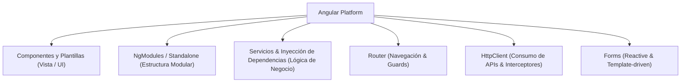

# Módulo 1: Introducción a Angular (v14 - v16) y Entorno de Desarrollo

Angular es una plataforma y framework de desarrollo empresarial de código abierto creado por Google para construir aplicaciones web de una sola página (*Single Page Applications* o SPAs) escalables, robustas y de alto rendimiento.

En las versiones **14, 15 y 16**, Angular consolidó su arquitectura basada en TypeScript estricto, el motor de compilación **Ivy** y comenzó la transición histórica más importante de su ecosistema: el nacimiento de los **Standalone Components** y las APIs funcionales, manteniendo la compatibilidad plena con la arquitectura empresarial basada en **NgModules**.

---

## 1.1 Filosofía y Arquitectura de Angular

A diferencia de librerías como React (que se centran exclusivamente en la vista), Angular es un **framework "baterías incluidas" (*opinionated*)**: provee de forma oficial soluciones integradas para enrutamiento, consumo HTTP, validación de formularios, inyección de dependencias y pruebas unitarias.



### Características Fundamentales:
1. **TypeScript por defecto:** Diseñado desde su núcleo para aprovechar tipado estático, decoradores, interfaces y genéricos.
2. **Motor de Compilación Ivy:** Genera código JavaScript optimizado, admite compilación AOT (*Ahead-Of-Time*) y permite la recarga rápida de módulos (*HMR - Hot Module Replacement*).
3. **Inyección de Dependencias Jerárquica:** Sistema nativo para compartir instancias de servicios sin necesidad de librerías externas.
4. **Patrón Arquitectónico Basado en Componentes:** La interfaz se divide en un árbol jerárquico de componentes desacoplados y reutilizables.

---

## 1.2 Requisitos y Herramientas del Entorno

Para trabajar con Angular 14 a 16 necesitas:
- **Node.js:** Versión LTS compatible (Node 16 o 18 para Angular 14-15; Node 16, 18 o 20 para Angular 16).
- **Gestor de paquetes:** `npm` o `pnpm`.
- **Angular CLI (`@angular/cli`):** La herramienta de línea de comandos para inicializar, desarrollar, crear componentes y compilar proyectos.

### Instalación del CLI y Creación del Proyecto

```bash
# Instalar Angular CLI de forma global (ejemplo con versión 16)
npm install -g @angular/cli@16

# Verificar versión instalada
ng version

# Crear un nuevo proyecto
ng new mi-empresa-app
```

Durante el asistente de creación, el CLI preguntará:
1. *¿Deseas agregar enrutamiento de Angular?* ➔ `Yes`
2. *¿Qué formato de hoja de estilo te gustaría utilizar?* ➔ `SCSS` (o `CSS`)
3. *¿Habilitar el modo de análisis estricto de TypeScript?* ➔ `Yes` (habilitado por defecto para garantizar calidad de código)

---

## 1.3 Estructura Anatómica del Proyecto

Un proyecto clásico de Angular generado por el CLI contiene la siguiente jerarquía de archivos:

```text
mi-empresa-app/
├── angular.json           # Configuración del CLI, esquemas, assets y perfiles de build
├── package.json           # Dependencias y scripts de ejecución
├── tsconfig.json          # Configuración base de TypeScript
├── tsconfig.app.json      # Configuración de compilación de la app
├── tsconfig.spec.json     # Configuración para pruebas con Karma/Jasmine
└── src/
    ├── index.html         # Archivo raíz con la etiqueta <app-root></app-root>
    ├── main.ts            # Punto de entrada de la aplicación (bootstrap)
    ├── styles.scss        # Estilos globales de la aplicación
    ├── assets/            # Imágenes, tipografías y recursos estáticos
    └── app/
        ├── app.component.ts      # Componente principal
        ├── app.component.html    # Plantilla HTML del componente principal
        ├── app.component.scss    # Estilos aislados del componente
        ├── app.component.spec.ts # Pruebas unitarias
        └── app.module.ts         # Módulo raíz (en proyectos clásicos NgModule)
```

---

## 1.4 El Archivo de Configuración Maestro: `angular.json`

El archivo `angular.json` define cómo el CLI compila, prueba y sirve tu aplicación. Los bloques más relevantes son:

```json
{
  "$schema": "./node_modules/@angular/cli/lib/config/schema.json",
  "version": 1,
  "projects": {
    "mi-empresa-app": {
      "projectType": "application",
      "root": "",
      "sourceRoot": "src",
      "prefix": "app",
      "architect": {
        "build": {
          "builder": "@angular-devkit/build-angular:browser",
          "options": {
            "outputPath": "dist/mi-empresa-app",
            "index": "src/index.html",
            "main": "src/main.ts",
            "polyfills": ["zone.js"],
            "tsConfig": "tsconfig.app.json",
            "assets": ["src/favicon.ico", "src/assets"],
            "styles": ["src/styles.scss"],
            "scripts": []
          },
          "configurations": {
            "production": {
              "budgets": [
                {
                  "type": "initial",
                  "maximumWarning": "500kb",
                  "maximumError": "1mb"
                }
              ],
              "outputHashing": "all"
            }
          }
        },
        "serve": {
          "builder": "@angular-devkit/build-angular:dev-server",
          "configurations": {
            "production": {
              "browserTarget": "mi-empresa-app:build:production"
            }
          }
        }
      }
    }
  }
}
```

---

## 1.5 Compilación JIT vs AOT

Angular admite dos modalidades de compilación de plantillas HTML y TypeScript:

1. **JIT (Just-In-Time):** El navegador descarga el compilador de Angular junto con el código de la app y compila las plantillas en tiempo de ejecución en la máquina del cliente. Se utilizaba principalmente en desarrollo en versiones antiguas.
2. **AOT (Ahead-Of-Time):** El compilador de Angular transforma las plantillas HTML y código TypeScript en JavaScript puro y ultrarrápido durante el proceso de empaquetado (*build*).
   - **Menor peso del bundle:** No se envía el compilador de Angular al navegador.
   - **Detección temprana de errores:** Errores en plantillas (variables mal escritas, tipos incorrectos) fallan durante la compilación en la terminal, no en producción.
   - **Mayor seguridad:** Reduce drásticamente riesgos de inyección de código.

> [!NOTE]
> Desde Angular 9 con Ivy, **AOT está habilitado de forma predeterminada tanto en desarrollo (`ng serve`) como en producción (`ng build`)**.

---

## 1.6 Comandos Esenciales de Angular CLI

El CLI automatiza la creación de código siguiendo las directrices de arquitectura oficiales:

```bash
# Servir en entorno local con recarga en vivo
ng serve -o

# Generar un módulo con enrutamiento propio
ng generate module features/dashboard --routing

# Generar un componente dentro de un módulo
ng generate component features/dashboard/components/metric-card

# Generar un servicio inyectable
ng generate service core/services/auth

# Generar un guard de rutas
ng generate guard core/guards/auth

# Compilar para producción
ng build --configuration production
```

---

## 🛠️ Reto Práctico del Módulo

1. Instala Angular CLI en tu entorno de desarrollo (`npm install -g @angular/cli@16`).
2. Genera un nuevo proyecto ejecutando `ng new tienda-clasica --routing --style=scss --strict`.
3. Abre el archivo `src/app/app.component.html`, elimina el código autogenerado y añade un encabezado simple `<h1>Bienvenido a Angular 14-16</h1>`.
4. Ejecuta `ng serve -o` y verifica en `http://localhost:4200` que la compilación AOT se ejecuta limpiamente.
