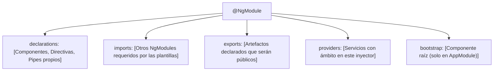
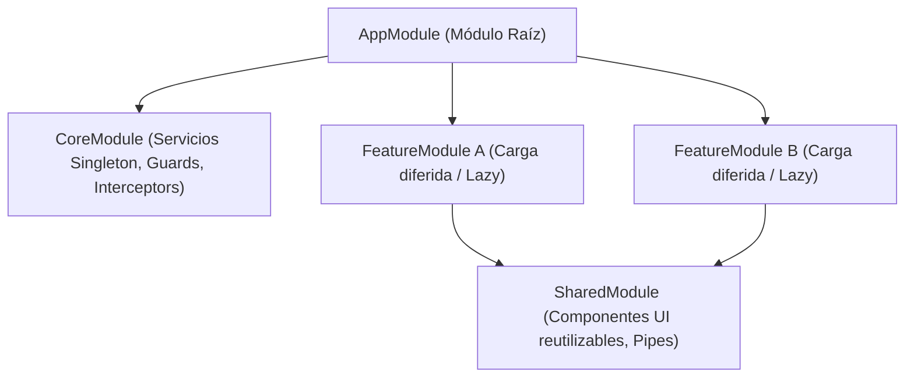

# Módulo 2: Arquitectura Basada en `NgModule`

En Angular tradicional (versiones 2 a 14, y aún ampliamente vigente en entornos empresariales en 15 y 16), el **`NgModule`** es la unidad fundamental de cohesión, empaquetado y modularización. 

Un `NgModule` actúa como un manifiesto técnico que declara qué componentes pertenecen a un contexto de negocio, qué utilidades externas necesitan para funcionar y qué artefactos quedan públicos para que otros módulos los consuman.

---

## 2.1 Anatomía del Decorador `@NgModule`

Un módulo de Angular es una clase de TypeScript precedida por el decorador `@NgModule({})`. Sus propiedades principales son:



```typescript
import { NgModule } from '@angular/core';
import { CommonModule } from '@angular/common';
import { FormsModule } from '@angular/forms';

import { FacturaDetalleComponent } from './components/factura-detalle/factura-detalle.component';
import { FormatoMonedaPipe } from './pipes/formato-moneda.pipe';
import { ResaltarDirective } from './directives/resaltar.directive';
import { FacturasService } from './services/facturas.service';

@NgModule({
  // 1. Elementos que PERTENECEN a este módulo (exclusivos)
  declarations: [
    FacturaDetalleComponent,
    FormatoMonedaPipe,
    ResaltarDirective
  ],
  // 2. Módulos cuyas declaraciones necesitamos usar dentro de nuestras plantillas
  imports: [
    CommonModule, // Provee *ngIf, *ngFor, etc.
    FormsModule
  ],
  // 3. Elementos que HACEMOS PÚBLICOS para quienes importen FacturasModule
  exports: [
    FacturaDetalleComponent,
    FormatoMonedaPipe
  ],
  // 4. Servicios disponibles para este módulo (antigua forma de inyección)
  providers: [
    FacturasService
  ]
})
export class FacturasModule {}
```

> [!IMPORTANT]
> **Regla de oro de `declarations`:** Un componente, directiva o pipe solo puede declararse en **un único `NgModule`**. Intentar declararlo en dos módulos distintos provocará un error de compilación inmediato.

---

## 2.2 El Proceso de Arranque (*Bootstrapping*)

El punto de entrada físico de la aplicación es `src/main.ts`. Allí se inicializa la plataforma web del navegador y se arranca el módulo principal (`AppModule`):

```typescript
// src/main.ts
import { platformBrowserDynamic } from '@angular/platform-browser-dynamic';
import { AppModule } from './app/app.module';

platformBrowserDynamic()
  .bootstrapModule(AppModule)
  .catch(err => console.error('Error al inicializar la app:', err));
```

A su vez, `AppModule` es el único módulo que define la propiedad `bootstrap`:

```typescript
// src/app/app.module.ts
import { NgModule } from '@angular/core';
import { BrowserModule } from '@angular/platform-browser';
import { AppRoutingModule } from './app-routing.module';
import { AppComponent } from './app.component';

@NgModule({
  declarations: [AppComponent],
  imports: [
    BrowserModule, // Importa CommonModule y servicios críticos del DOM (solo en AppModule)
    AppRoutingModule
  ],
  bootstrap: [AppComponent] // Indica qué componente se inserta en <app-root> de index.html
})
export class AppModule {}
```

---

## 2.3 Patrón de Arquitectura Empresarial: Core, Shared y Feature Modules

Para evitar aplicaciones monolíticas inmanejables, los proyectos empresariales en Angular dividen su código en tres categorías estándar de módulos:



### 1. `CoreModule` (Servicios Singleton y Configuración Global)
Contiene elementos que solo deben instanciarse **una sola vez** en toda la aplicación: servicios de autenticación, interceptores HTTP, guards de navegación y el layout maestro (Navbar, Sidebar).

> [!TIP]
> Para garantizar que ningún desarrollador cometa el error de importar el `CoreModule` en otro submódulo secundario, se implementa una guardia en su constructor:

```typescript
// src/app/core/core.module.ts
import { NgModule, Optional, SkipSelf } from '@angular/core';

@NgModule({
  providers: [
    // Interceptores y servicios globales
  ]
})
export class CoreModule {
  constructor(@Optional() @SkipSelf() parentModule: CoreModule) {
    if (parentModule) {
      throw new Error(
        'CoreModule ya ha sido cargado en AppModule. No lo importes en ningún FeatureModule.'
      );
    }
  }
}
```

### 2. `SharedModule` (Componentes y Utilidades Reutilizables)
Contiene componentes visuales tontos o de presentación (*Dumb Components* como botones personalizados, modales, spinners), directivas y pipes reutilizados en múltiples pantallas:

```typescript
// src/app/shared/shared.module.ts
import { NgModule } from '@angular/core';
import { CommonModule } from '@angular/common';
import { FormsModule, ReactiveFormsModule } from '@angular/forms';

import { LoadingSpinnerComponent } from './components/loading-spinner/loading-spinner.component';
import { CapitalizarPipe } from './pipes/capitalizar.pipe';

@NgModule({
  declarations: [
    LoadingSpinnerComponent,
    CapitalizarPipe
  ],
  imports: [
    CommonModule,
    FormsModule,
    ReactiveFormsModule
  ],
  exports: [
    // Exportamos tanto lo propio como módulos comunes de Angular
    CommonModule,
    FormsModule,
    ReactiveFormsModule,
    LoadingSpinnerComponent,
    CapitalizarPipe
  ]
})
export class SharedModule {}
```

### 3. `FeatureModules` (Módulos de Funcionalidad / Dominio)
Representan un módulo funcional del negocio (ej. `UsuariosModule`, `ProductosModule`, `VentasModule`). Cada uno agrupa sus propios componentes, servicios de dominio y enrutamiento con carga perezosa (*Lazy Loading*).

---

## 🛠️ Reto Práctico del Módulo

1. Crea la estructura base de carpetas en tu proyecto: `src/app/core`, `src/app/shared`, y `src/app/features/productos`.
2. Genera el `SharedModule` mediante el CLI: `ng g m shared`.
3. Declara y exporta un componente de tarjeta genérica dentro de `SharedModule`.
4. Importa `SharedModule` dentro de un `ProductosModule` y comprueba que la plantilla de productos puede renderizar la tarjeta sin conflictos de compilación.
