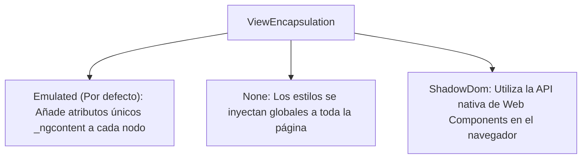

# Módulo 3: Componentes y Plantillas en Angular Clásico

Los componentes son los bloques de construcción visuales de cualquier aplicación en Angular. Un componente encapsula el estado (propiedades de TypeScript), la lógica (métodos) y la interfaz visual (plantilla HTML y estilos CSS/SCSS).

---

## 3.1 Anatomía del Decorador `@Component`

Un componente es una clase estándar de TypeScript decorada con `@Component({})`, que le suministra metadatos al compilador de Angular para saber cómo instanciarlo y dibujarlo en el DOM:

```typescript
import { Component, ChangeDetectionStrategy, ViewEncapsulation } from '@angular/core';

@Component({
  selector: 'app-tarjeta-usuario',             // Tag HTML personalizado para instanciarlo
  templateUrl: './tarjeta-usuario.component.html', // Ruta a la plantilla HTML externa
  styleUrls: ['./tarjeta-usuario.component.scss'], // Hojas de estilo asociadas
  changeDetection: ChangeDetectionStrategy.OnPush, // Estrategia de detección de cambios
  encapsulation: ViewEncapsulation.Emulated       // Modo de encapsulación de estilos CSS
})
export class TarjetaUsuarioComponent {
  // Estado público expuesto a la plantilla
  public nombre: string = 'Carlos Méndez';
  public rol: string = 'Arquitecto de Software';
  public activo: boolean = true;

  // Lógica interactiva invocada desde la plantilla
  public toggleEstado(): void {
    this.activo = !this.activo;
  }
}
```

---

## 3.2 Encapsulación de Estilos (*View Encapsulation*)

Angular implementa un mecanismo sofisticado para asegurar que los estilos de un componente no "se filtren" ni contaminen al resto de la aplicación, emulando el comportamiento del Shadow DOM nativo:



### 1. `ViewEncapsulation.Emulated` (Predeterminado)
El compilador inspecciona tus selectores CSS y añade atributos identificadores únicos a las etiquetas HTML generadas:

```html
<!-- HTML resultante en el navegador -->
<p _ngcontent-c12 class="descripcion">Este párrafo tiene estilos aislados.</p>
```
```css
/* CSS transformado por Angular */
p.descripcion[_ngcontent-c12] {
  color: #1e293b;
}
```

### 2. Pseudo-selectores Especiales de Encapsulación
- **`:host`:** Permite estilizar el elemento contenedor raíz del componente desde su propio archivo de estilos:
  ```scss
  :host {
    display: block;
    border: 1px solid #e2e8f0;
    border-radius: 8px;
    padding: 1rem;
  }

  /* Aplica estilos condicionados a una clase en el host: */
  :host(.destacado) {
    border-color: #3b82f6;
  }
  ```
- **`::ng-deep`:** Rompe la encapsulación para forzar estilos sobre componentes hijos o librerías de terceros (como Angular Material). Aunque está marcado como deprecado por el estándar, sigue siendo ampliamente utilizado en proyectos de Angular 14-16 cuando es estrictamente indispensable:
  ```scss
  /* Afecta a los botones dentro de este componente sin importar su encapsulación */
  :host ::ng-deep .mat-mdc-button {
    border-radius: 9999px;
  }
  ```

---

## 3.3 Patrón Arquitectónico: *Smart* vs *Dumb Components*

En el desarrollo profesional con Angular, se aplica la separación de responsabilidades dividiendo los componentes en dos familias:

| Característica | Componentes Contenedores (*Smart / Container*) | Componentes de Presentación (*Dumb / Presentational*) |
| :--- | :--- | :--- |
| **Rol Principal** | Gestionar estado, comunicarse con servicios y APIs | Renderizar UI y reaccionar a interacciones |
| **Dependencias** | Inyectan servicios (`AuthService`, `Store`, `Router`) | No inyectan servicios de negocio; reciben `@Input()` |
| **Emisión de Datos** | Manejan la persistencia y cambios de datos | Emiten eventos mediante `@Output()` |
| **Reutilización** | Muy baja (están acoplados a una página o feature) | Altísima (diseñados para usarse en múltiples pantallas) |
| **Detección de Cambios** | Default u OnPush | Idealmente siempre **`ChangeDetectionStrategy.OnPush`** |

```mermaid
flowchart TD
    Smart["Smart Component: FacturasPageComponent<br/>(Inyecta FacturasService y gestiona estado)"]
    Smart -->|@Input(factura)| Dumb["Dumb Component: FacturaFilaComponent<br/>(Solo dibuja la fila)"]
    Dumb -->|@Output(eliminar)| Smart
```

---

## 🛠️ Reto Práctico del Módulo

1. Crea un componente con el CLI: `ng g c shared/components/badge --style=scss`.
2. Utiliza el selector `:host` para darle `display: inline-flex`, un fondo suave y bordes redondeados.
3. Añade una regla `:host(.badge-success)` para pintar el fondo verde si el componente recibe esa clase desde el padre.
4. Inspecciona con las DevTools del navegador el atributo generado `_ngcontent-xxx` para constatar el funcionamiento de `ViewEncapsulation.Emulated`.
