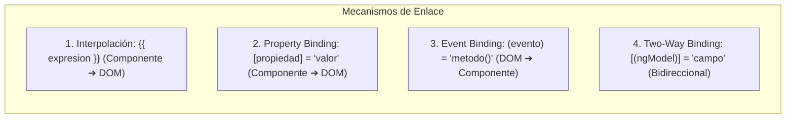

# Módulo 4: Enlace de Datos (*Data Binding*) y Directivas de Atributo

El sistema de enlace de datos de Angular conecta de manera reactiva la clase TypeScript de un componente con su plantilla HTML. Controla el flujo unidireccional o bidireccional de información y eventos.

---

## 4.1 Los 4 Tipos de Data Binding en Angular



### 1. Interpolación (`{{ expresion }}`)
Permite incrustar valores calculados o cadenas de texto en el DOM:

```html
<p>Bienvenido, {{ usuario.nombre | uppercase }}</p>
<p>Total a pagar: ${{ (subtotal * 1.16).toFixed(2) }}</p>
```

### 2. Enlace de Propiedad (*Property Binding* - `[propiedad]="valor"`)
Pasa valores directamente a las propiedades del objeto DOM o de componentes hijos (no a los atributos estáticos de HTML):

```html
<!-- Modificar propiedades booleanas de elementos HTML -->
<button [disabled]="formularioInvalido">Enviar Solicitud</button>

<!-- Enlace dinámico a fuentes de imágenes -->


<!-- Clases y estilos individuales dinámicos -->
<div [class.activo]="itemSeleccionado" [style.color]="esUrgente ? 'red' : 'black'">
  Alerta del sistema
</div>
```

### 3. Enlace de Eventos (*Event Binding* - `(evento)="metodo($event)"`)
Captura acciones del usuario en el navegador y ejecuta métodos de la clase TypeScript:

```html
<!-- Click convencional pasando el evento del navegador -->
<button (click)="guardarCambios($event)">Guardar</button>

<!-- Modificadores de teclado nativos del template parser -->
<input 
  type="text" 
  (keyup.enter)="filtrarResultados()" 
  (keyup.escape)="limpiarInput()"
/>
```

### 4. Enlace Bidireccional (*Two-Way Binding* - `[(ngModel)]`)
La famosa sintaxis de "banana en una caja" `[()]` combina Property Binding `[]` y Event Binding `()` en una sola expresión. Requiere importar **`FormsModule`** en el módulo correspondiente:

```typescript
// En el componente:
export class PerfilComponent {
  public email: string = 'admin@empresa.com';
}
```

```html
<!-- En la plantilla: -->
<input type="email" [(ngModel)]="email" />
<p>El correo actual es: {{ email }}</p>
```

---

## 4.2 Directivas de Atributo Nativas: `ngClass` y `ngStyle`

Las directivas de atributo modifican la apariencia o el comportamiento de un elemento del DOM existente.

### 1. `ngClass`
Acepta un objeto donde las claves son nombres de clases CSS y los valores son condiciones booleanas:

```html
<div [ngClass]="{
  'alerta-exito': estado === 'OK',
  'alerta-peligro': estado === 'ERROR',
  'deshabilitado': procesando
}">
  Mensaje de notificación
</div>
```

### 2. `ngStyle`
Permite calcular estilos CSS en línea de forma dinámica a partir de un objeto:

```html
<div [ngStyle]="{
  'background-color': nivelCriticidad === 'ALTO' ? '#f87171' : '#60a5fa',
  'font-size.px': tamanoTexto,
  'padding': esCompacto ? '0.5rem' : '1.5rem'
}">
  Panel dinámico
</div>
```

---

## 4.3 Creación de una Directiva de Atributo Personalizada

Para manipular el DOM de manera desacoplada y segura frente a SSR, se utiliza `@Directive` en combinación con `ElementRef` y **`Renderer2`**:

```typescript
// src/app/shared/directives/resaltar.directive.ts
import { Directive, ElementRef, HostListener, Input, Renderer2, OnInit } from '@angular/core';

@Directive({
  selector: '[appResaltar]' // Selector de atributo CSS entre corchetes
})
export class ResaltarDirective implements OnInit {
  @Input() appResaltar: string = '#fef08a'; // Color de resaltado personalizable
  @Input() colorTexto: string = '#000000';

  constructor(
    private el: ElementRef,
    private renderer: Renderer2
  ) {}

  ngOnInit(): void {
    this.renderer.setStyle(this.el.nativeElement, 'transition', 'background-color 0.25s ease');
  }

  // Escuchar eventos en el elemento host de forma declarativa:
  @HostListener('mouseenter') onMouseEnter(): void {
    this.cambiarColor(this.appResaltar, this.colorTexto);
  }

  @HostListener('mouseleave') onMouseLeave(): void {
    this.cambiarColor('', '');
  }

  private cambiarColor(bg: string, color: string): void {
    this.renderer.setStyle(this.el.nativeElement, 'backgroundColor', bg);
    this.renderer.setStyle(this.el.nativeElement, 'color', color);
  }
}
```

```html
<!-- Uso en cualquier elemento HTML: -->
<p [appResaltar]="'#bbf7d0'" [colorTexto]="'#166534'">
  Pasa el cursor sobre este texto para ver la directiva en acción.
</p>
```

---

## 🛠️ Reto Práctico del Módulo

1. Crea una directiva personalizada con el CLI: `ng g d shared/directives/solo-numeros`.
2. Utiliza `@HostListener('keydown', ['$event'])` para interceptar las teclas presionadas en un `<input>`.
3. Permite teclas de control (`Backspace`, `Delete`, `Tab`, `ArrowLeft`, `ArrowRight`) y bloquea cualquier caracter que no sea un número decimal con `event.preventDefault()`.
4. Aplica la directiva a un campo de teléfono en una plantilla y comprueba que solo admita dígitos numéricos.
