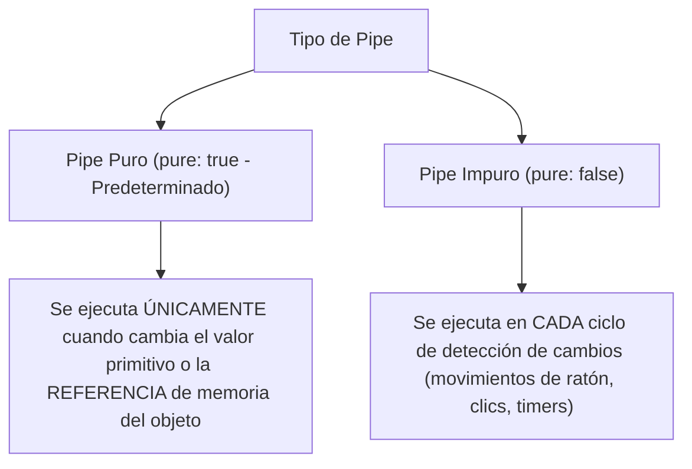

# Módulo 6: Pipes Nativos, `AsyncPipe` y Pipes Personalizados

Los **Pipes** en Angular son funciones de transformación de datos aplicadas directamente en las plantillas HTML mediante el operador de tubería (`|`). Permiten formatear fechas, números, monedas o estructuras de datos para su presentación visual sin alterar el valor original en la clase TypeScript.

---

## 6.1 Catálogo de Pipes Nativos Esenciales

Angular incluye una colección rica de pipes en `@angular/common`:

```html
<!-- 1. Formateo de Texto -->
<p>{{ 'arquitectura frontend' | uppercase }}</p>    <!-- ARQUITECTURA FRONTEND -->
<p>{{ 'SISTEMAS DISTRIBUIDOS' | lowercase }}</p>   <!-- sistemas distribuidos -->
<p>{{ 'guia de angular profesional' | titlecase }}</p> <!-- Guia De Angular Profesional -->

<!-- 2. Formateo Numérico y Porcentajes -->
<!-- Sintaxis: {minEnteros}.{minDecimales}-{maxDecimales} -->
<p>{{ 3.141592 | number:'1.2-2' }}</p>             <!-- 3.14 -->
<p>{{ 0.856 | percent:'1.1-2' }}</p>               <!-- 85.6% -->

<!-- 3. Formateo Monetario -->
<!-- Sintaxis: [codigoISO]:[mostrarSimbolo]:[digitos] -->
<p>{{ 12500.5 | currency:'USD':'symbol':'1.2-2' }}</p> <!-- $12,500.50 -->
<p>{{ 450 | currency:'EUR':'code' }}</p>               <!-- 450.00 EUR -->

<!-- 4. Formateo de Fechas -->
<p>{{ fechaHoy | date:'fullDate' }}</p>
<p>{{ fechaHoy | date:'dd/MM/yyyy HH:mm' }}</p>

<!-- 5. Inspección y Depuración (JSON) -->
<pre>{{ usuarioObjeto | json }}</pre>

<!-- 6. Corte de Arrays o Cadenas -->
<p>{{ 'Angular Ivy' | slice:0:7 }}</p>             <!-- Angular -->
```

### Encadenamiento de Pipes (*Pipe Chaining*)
Puedes pasar el resultado de un pipe directamente al siguiente:

```html
<p>{{ fechaCreacion | date:'MMMM' | uppercase }}</p> <!-- NOVIEMBRE -->
```

---

## 6.2 El Rey de los Pipes: `AsyncPipe`

El **`AsyncPipe`** es uno de los artefactos más importantes en Angular. Permite vincularse a un `Observable` o a una `Promise` directamente en la plantilla HTML:

```html
<div *ngIf="usuario$ | async as usuario">
  <h3>{{ usuario.nombre }}</h3>
  <p>{{ usuario.email }}</p>
</div>
```

### ¿Por qué el `AsyncPipe` es obligatorio en buenas prácticas?
1. **Suscripción automática:** Se suscribe al `Observable` cuando el componente se dibuja en pantalla.
2. **Desuscripción automática:** Cuando el componente es destruido (por ejemplo, el usuario cambia de ruta), el `AsyncPipe` ejecuta automáticamente `.unsubscribe()`, **eliminando el 90% de las fugas de memoria (*memory leaks*)** en aplicaciones Angular.
3. **Compatibilidad con `OnPush`:** Notifica al motor de detección de cambios de Angular cada vez que el Observable emite un nuevo valor.

---

## 6.3 Pipes Puros (*Pure*) frente a Impuros (*Impure*)



> [!WARNING]
> Crear un pipe impuro para filtrar arrays o listas grandes puede degradar gravemente el rendimiento y causar caídas de FPS, ya que la función se ejecutará cientos de veces por segundo.

---

## 6.4 Creación de un Pipe Personalizado

Para crear un pipe personalizado, se implementa la interfaz **`PipeTransform`**:

```typescript
// src/app/shared/pipes/tiempo-relativo.pipe.ts
import { Pipe, PipeTransform } from '@angular/core';

@Pipe({
  name: 'tiempoRelativo',
  pure: true // Garantiza máximo rendimiento
})
export class TiempoRelativoPipe implements PipeTransform {
  transform(fecha: Date | string | number): string {
    if (!fecha) return '';

    const timestamp = new Date(fecha).getTime();
    const ahora = Date.now();
    const diferenciaSegundos = Math.floor((ahora - timestamp) / 1000);

    if (diferenciaSegundos < 60) {
      return 'Hace un momento';
    }

    const minutos = Math.floor(diferenciaSegundos / 60);
    if (minutos < 60) {
      return `Hace ${minutos} ${minutos === 1 ? 'minuto' : 'minutos'}`;
    }

    const horas = Math.floor(minutos / 60);
    if (horas < 24) {
      return `Hace ${horas} ${horas === 1 ? 'hora' : 'horas'}`;
    }

    const dias = Math.floor(horas / 24);
    return `Hace ${dias} ${dias === 1 ? 'día' : 'días'}`;
  }
}
```

```html
<!-- Uso en cualquier plantilla del módulo: -->
<span>Publicado: {{ articulo.fechaCreacion | tiempoRelativo }}</span>
```

---

## 🛠️ Reto Práctico del Módulo

1. Crea un pipe con el CLI: `ng g p shared/pipes/filtro-estado`.
2. Haz que reciba un array de tareas y un estado (`'PENDIENTE' | 'COMPLETO'`).
3. Retorna un nuevo array filtrado inmutable (`tareas.filter(t => t.estado === estado)`).
4. Aplica el pipe sobre una lista de tareas en un componente y verifica que filtre correctamente la información.
