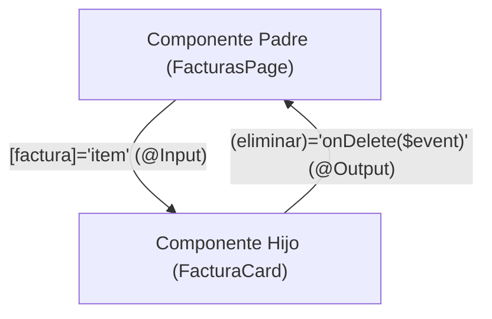

# Módulo 7: Comunicación entre Componentes en Angular Clásico

El diseño modular en Angular se basa en componentes desacoplados que deben comunicarse de forma limpia, predecible y unidireccional (*One-Way Data Flow*).

---

## 7.1 De Padre a Hijo: `@Input()` y Setters

El decorador `@Input()` permite que un componente padre le transmita datos a un componente hijo a través de Property Binding `[]`.



```typescript
// factura-card.component.ts (Hijo)
import { Component, Input } from '@angular/core';

export interface Factura {
  id: number;
  total: number;
  cliente: string;
}

@Component({
  selector: 'app-factura-card',
  template: `
    <div class="card">
      <h4>{{ factura.cliente }}</h4>
      <p>Total: ${{ factura.total }}</p>
    </div>
  `
})
export class FacturaCardComponent {
  // Recibe la propiedad desde el padre:
  @Input() factura!: Factura;
}
```

```html
<!-- En la plantilla del padre: -->
<app-factura-card [factura]="facturaSeleccionada"></app-factura-card>
```

### Interceptar Cambios en Inputs con Getters y Setters
Si necesitas ejecutar una lógica cada vez que el valor del `@Input` cambia, utiliza un `setter`:

```typescript
export class ContadorComponent {
  private _valor: number = 0;

  @Input()
  set valor(nuevoValor: number) {
    this._valor = nuevoValor;
    console.log(`El contador se actualizó a: ${nuevoValor}`);
    this.recalcularMetricas();
  }

  get valor(): number {
    return this._valor;
  }

  private recalcularMetricas(): void { /* ... */ }
}
```

---

## 7.2 De Hijo a Padre: `@Output()` y `EventEmitter`

Para notificar al componente padre sobre una acción o evento ocurrido en el hijo, se utiliza `@Output()` instanciando un **`EventEmitter<T>`**:

```typescript
// buscador.component.ts (Hijo)
import { Component, EventEmitter, Output } from '@angular/core';

@Component({
  selector: 'app-buscador',
  template: `
    <input 
      type="text" 
      #inputRef 
      placeholder="Buscar..." 
      (keyup.enter)="emitirBusqueda(inputRef.value)"
    />
    <button (click)="emitirBusqueda(inputRef.value)">Buscar</button>
  `
})
export class BuscadorComponent {
  // Evento tipado que escuchará el padre:
  @Output() buscar = new EventEmitter<string>();

  emitirBusqueda(termino: string): void {
    if (!termino.trim()) return;
    this.buscar.emit(termino.trim()); // Dispara el evento hacia el padre
  }
}
```

```html
<!-- En la plantilla del padre: -->
<app-buscador (buscar)="ejecutarFiltroEnApi($event)"></app-buscador>
```

---

## 7.3 Acceso a la Vista: `@ViewChild` y `@ViewChildren`

Cuando un componente padre necesita acceder directamente a las propiedades o métodos públicos de un componente hijo (o a un elemento HTML nativo del DOM), utiliza **`@ViewChild`**:

```typescript
import { Component, ElementRef, ViewChild, AfterViewInit } from '@angular/core';

@Component({
  selector: 'app-login',
  template: `
    <input type="text" #inputUsuario placeholder="Nombre de usuario" />
    <button (click)="enfocar()">Enfocar</button>
  `
})
export class LoginComponent implements AfterViewInit {
  // Captura el elemento con la variable de plantilla #inputUsuario
  @ViewChild('inputUsuario') inputUsuarioRef!: ElementRef<HTMLInputElement>;

  ngAfterViewInit(): void {
    // La referencia solo está disponible a partir del ciclo AfterViewInit
    this.inputUsuarioRef.nativeElement.focus();
  }

  enfocar(): void {
    this.inputUsuarioRef.nativeElement.focus();
  }
}
```

---

## 7.4 Proyección de Contenido con `<ng-content>`

Permite crear componentes contenedores reutilizables (como paneles, modales o tarjetas) cuyo contenido interno es inyectado desde el exterior por quien lo consume.

### Proyección Multi-Slot con Selectores
Puedes proyectar múltiples fragmentos en zonas específicas utilizando el atributo `select`:

```html
<!-- panel-colapsable.component.html (Hijo genérico) -->
<div class="panel">
  <header class="panel-header">
    <ng-content select="[panel-titulo]"></ng-content>
  </header>
  <div class="panel-body">
    <!-- Slot por defecto para cualquier contenido restante -->
    <ng-content></ng-content>
  </div>
  <footer class="panel-footer">
    <ng-content select="[panel-acciones]"></ng-content>
  </footer>
</div>
```

```html
<!-- En el componente consumidor (Padre): -->
<app-panel-colapsable>
  <h3 panel-titulo>Reporte Mensual de Ventas</h3>
  
  <p>Aquí va el cuerpo del reporte y los gráficos correspondientes.</p>
  
  <div panel-acciones>
    <button>Exportar PDF</button>
  </div>
</app-panel-colapsable>
```

---

## 🛠️ Reto Práctico del Módulo

1. Crea un componente `app-modal` reutilizable con slots para `[modal-cabecera]`, contenido general y `[modal-pie]`.
2. Añade un `@Output() cerrar = new EventEmitter<void>()` en el modal que se active al presionar la tecla `Escape` o un botón de cerrar.
3. En un componente consumidor, proyecta un formulario dentro del modal y escucha el evento `cerrar` para alternar su visibilidad.
