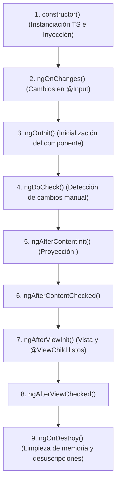

# Módulo 8: El Ciclo de Vida de los Componentes (*Lifecycle Hooks*)

Cada componente y directiva en Angular tiene un ciclo de vida gestionado por el framework desde su creación, pasando por la detección de cambios en sus propiedades, hasta su eventual destrucción del DOM. 

Para reaccionar a estos momentos clave, Angular provee interfaces con métodos específicos llamados **Lifecycle Hooks**.

---

## 8.1 La Secuencia de Ejecución del Ciclo de Vida



---

## 8.2 Los Métodos Fundamentales

### 1. `constructor()` frente a `ngOnInit()`
* **`constructor`:** Es un método nativo de TypeScript. Su **única responsabilidad** debe ser recibir dependencias inyectadas. Los `@Input()` aún no están inicializados y la vista no existe.
* **`ngOnInit()`:** Se ejecuta una sola vez cuando Angular ha terminado de resolver los valores iniciales de los `@Input()`. Es el lugar idóneo para invocar peticiones HTTP o suscribirse a eventos de negocio:

```typescript
import { Component, OnInit } from '@angular/core';
import { UsuariosService, Usuario } from './usuarios.service';

@Component({
  selector: 'app-perfil',
  template: `<h2>{{ usuario?.nombre }}</h2>`
})
export class PerfilComponent implements OnInit {
  public usuario: Usuario | null = null;

  constructor(private usuariosService: UsuariosService) {}

  ngOnInit(): void {
    this.usuariosService.obtenerPerfil().subscribe({
      next: (data) => (this.usuario = data),
      error: (err) => console.error('Error al cargar perfil:', err)
    });
  }
}
```

### 2. `ngOnChanges(changes: SimpleChanges)`
Se ejecuta antes de `ngOnInit` y **cada vez que cambia la referencia o valor de una propiedad decorada con `@Input()`**:

```typescript
import { Component, Input, OnChanges, SimpleChanges } from '@angular/core';

@Component({...})
export class HistorialComponent implements OnChanges {
  @Input() clienteId!: number;

  ngOnChanges(changes: SimpleChanges): void {
    if (changes['clienteId']) {
      const cambio = changes['clienteId'];
      console.log(`Valor previo: ${cambio.previousValue}`);
      console.log(`Valor actual: ${cambio.currentValue}`);
      console.log(`¿Es el primer cambio?: ${cambio.isFirstChange()}`);

      if (!cambio.isFirstChange()) {
        this.recargarHistorial(cambio.currentValue);
      }
    }
  }

  private recargarHistorial(id: number): void { /* ... */ }
}
```

### 3. `ngAfterViewInit()`
Se ejecuta una sola vez cuando la plantilla HTML del propio componente y todas las vistas de sus componentes hijos han sido completamente renderizadas en el DOM. 
- Es el momento donde los elementos capturados con **`@ViewChild`** o librerías externas de JavaScript (Canvas, Chart.js) están garantizados para su manipulación.

> [!CAUTION]
> **El temido `ExpressionChangedAfterItHasBeenCheckedError`:** En modo de desarrollo, Angular realiza una segunda pasada de verificación para asegurarse de que la vista es consistente. Si modificas una propiedad visible en el HTML dentro de `ngAfterViewInit()`, provocarás este error. Para actualizar estado visual, hazlo antes (en `ngOnInit`) o envuélvelo en `queueMicrotask()` o `setTimeout()`.

### 4. `ngOnDestroy()`
Se dispara inmediatamente antes de que Angular desmonte y destruya el componente del DOM (por ejemplo, al cambiar de ruta o por un `*ngIf="false"`):
- **Obligatorio para evitar fugas de memoria (*Memory Leaks*):** Cancelar temporizadores (`setInterval`, `setTimeout`), desuscribirse de Observables creados manualmente con `.subscribe()`, y desconectar WebSockets o listeners del DOM.

```typescript
import { Component, OnInit, OnDestroy } from '@angular/core';
import { Subscription, interval } from 'rxjs';

@Component({...})
export class MonitorTiempoComponent implements OnInit, OnDestroy {
  private timerSub!: Subscription;

  ngOnInit(): void {
    this.timerSub = interval(1000).subscribe(segundo => {
      console.log(`Segundo transcurrido: ${segundo}`);
    });
  }

  ngOnDestroy(): void {
    // Si no te desuscribes, el intervalo seguirá corriendo infinitamente en segundo plano
    if (this.timerSub) {
      this.timerSub.unsubscribe();
      console.log('Suscripción limpiada correctamente');
    }
  }
}
```

---

## 🛠️ Reto Práctico del Módulo

1. Crea un componente con `ngOnInit` y `ngOnDestroy`.
2. Dentro de `ngOnInit`, inicializa un `setInterval` que imprima un mensaje cada 2 segundos.
3. Conmuta la visibilidad del componente con un botón padre usando `*ngIf`.
4. Observa en la consola qué ocurre si destruyes el componente sin limpiar el timer, y luego corrígelo con `clearInterval` en `ngOnDestroy`.
