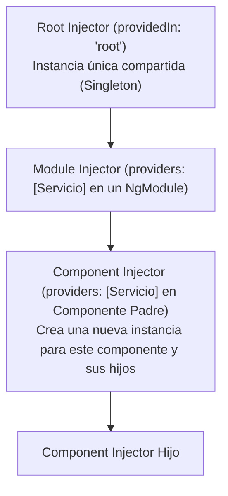

# Módulo 9: Servicios e Inyección de Dependencias (*Dependency Injection*)

En Angular, los componentes no deben realizar operaciones pesadas como almacenamiento de estado compartido, lógica matemática de negocio o consumo directo de APIs. Esas responsabilidades pertenecen a los **Servicios**.

Para conectar los servicios con los componentes de forma desacoplada y comprobable (*testable*), Angular implementa su propio motor de **Inyección de Dependencias (DI)**.

---

## 9.1 Anatomía de un Servicio con `@Injectable`

Un servicio es una clase de TypeScript decorada con `@Injectable()`:

```typescript
// src/app/core/services/carrito.service.ts
import { Injectable } from '@angular/core';

export interface ItemCarrito {
  id: number;
  nombre: string;
  precio: number;
  cantidad: number;
}

@Injectable({
  providedIn: 'root' // Singleton global accesible en toda la aplicación
})
export class CarritoService {
  private items: ItemCarrito[] = [];

  public agregar(item: ItemCarrito): void {
    const existe = this.items.find(i => i.id === item.id);
    if (existe) {
      existe.cantidad += item.cantidad;
    } else {
      this.items.push({ ...item });
    }
  }

  public obtenerTotal(): number {
    return this.items.reduce((acc, item) => acc + item.precio * item.cantidad, 0);
  }

  public listar(): ItemCarrito[] {
    return [...this.items];
  }
}
```

---

## 9.2 El Árbol Jerárquico de Inyectores

El sistema de inyección en Angular es jerárquico. Si un inyector no encuentra una dependencia, la busca en su inyector padre hasta llegar a la raíz (*Root Injector*):



### Ámbitos de Inyección (*Scopes*):
1. **`providedIn: 'root'` (Recomendado):**
   - Se crea una única instancia compartida (*Singleton*) para toda la app.
   - **Tree-shakable:** Si la aplicación no usa el servicio en ningún componente, el compilador lo descarta automáticamente del bundle final para ahorrar peso.
2. **A nivel de `@Component({ providers: [MiServicio] })`:**
   - Cada vez que se crea una etiqueta de este componente en el DOM, **se genera una instancia completamente nueva e independiente** de ese servicio. Al destruirse el componente, la instancia del servicio se destruye con él.

---

## 9.3 Inyección Clásica por Constructor frente a la Función `inject()` (Angular 14+)

Hasta Angular 13, la única manera de inyectar dependencias era a través de los parámetros del constructor:

```typescript
// Enfoque clásico:
@Component({...})
export class CheckoutComponent {
  constructor(
    private carritoService: CarritoService,
    private router: Router
  ) {}
}
```

### La Revolución de `inject()` en Angular 14
Angular 14 introdujo la función nativa **`inject()`**, que permite inyectar dependencias directamente en la inicialización de propiedades de la clase, fuera del constructor y dentro de funciones puras:

```typescript
import { Component, inject } from '@angular/core';
import { Router } from '@angular/router';
import { CarritoService } from './carrito.service';

@Component({...})
export class CheckoutComponent {
  // Inyección limpia y sin parámetros en el constructor:
  private readonly carritoService = inject(CarritoService);
  private readonly router = inject(Router);

  procesarPago(): void {
    const total = this.carritoService.obtenerTotal();
    console.log(`Cobrando: $${total}`);
    this.router.navigate(['/exito']);
  }
}
```

---

## 9.4 Tokens de Inyección Personalizados: `InjectionToken`

TypeScript borra las `interfaces` en tiempo de compilación. Por ello, no puedes inyectar una interfaz directamente (`inject(IConfig)` falla). Para inyectar objetos de configuración, constantes o APIs del navegador, se utiliza **`InjectionToken`**:

```typescript
// app.config.ts
import { InjectionToken } from '@angular/core';

export interface AppConfig {
  apiUrl: string;
  reintentosMax: number;
}

export const APP_CONFIG = new InjectionToken<AppConfig>('app.config', {
  providedIn: 'root',
  factory: () => ({
    apiUrl: 'https://api.empresa.com/v1',
    reintentosMax: 3
  })
});
```

```typescript
// Consumo en cualquier servicio o componente:
@Injectable({ providedIn: 'root' })
export class ApiService {
  private config = inject(APP_CONFIG);

  public getUrl(): string {
    return this.config.apiUrl;
  }
}
```

---

## 9.5 Decoradores Modificadores de Resolución

Cuando necesitas alterar la búsqueda jerárquica de dependencias:
- **`@Optional()`:** Si el servicio no existe en ningún inyector, inyecta `null` en lugar de lanzar una excepción fatal.
- **`@Self()`:** Busca la dependencia **únicamente** en el inyector del componente actual; no busca en los ancestros.
- **`@SkipSelf()`:** Ignora el inyector del componente actual y comienza a buscar directamente en el padre.

---

## 🛠️ Reto Práctico del Módulo

1. Crea un servicio `ContadorService` sin `providedIn: 'root'`.
2. Provee el servicio en la lista `providers: [ContadorService]` de dos componentes hermanos distintos.
3. Incrementa el contador en uno de ellos y comprueba que sus estados son completamente independientes.
4. Mueve `providedIn: 'root'` al servicio y verifica cómo ahora ambos componentes comparten exactamente el mismo número en tiempo real.
