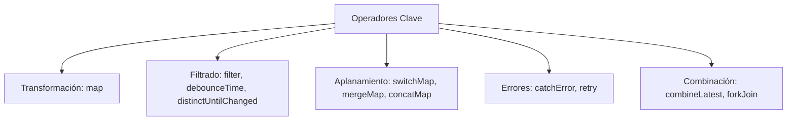

# Módulo 10: RxJS y Programación Reactiva en Angular Clásico

Angular adoptó **RxJS (Reactive Extensions for JavaScript)** desde su concepción. En Angular 14, 15 y 16, prácticamente todos los eventos asíncronos (peticiones HTTP, cambios en formularios reactivos, eventos del enrutador y comunicación entre componentes) son secuencias continuas de datos llamadas **Observables**.

---

## 10.1 Conceptos Fundamentales: Observable, Observer y Suscripción

```mermaid
flowchart LR
    Source["Fuente de Datos (HTTP / Click / WebSocket)"] -->|emite valores| Obs["Observable (Flujo de datos en el tiempo)"]
    Obs -->|pipe(operadores)| Transf["Datos Transformados"]
    Transf -->|subscribe()| Sub["Observer { next, error, complete }"]
```

1. **Observable:** La fuente que emite 0, 1 o múltiples valores a lo largo del tiempo. Es perezoso (*cold* por defecto): no ejecuta ningún trabajo hasta que alguien se suscribe.
2. **Observer:** El consumidor que define qué hacer cuando llega un dato (`next`), cuando ocurre un fallo (`error`) o cuando la secuencia finaliza (`complete`).
3. **Subscription:** La conexión activa entre el Observable y el Observer. Permite liberar memoria mediante `.unsubscribe()`.

```typescript
import { Observable } from 'rxjs';

const miFlujo$ = new Observable<number>(subscriber => {
  subscriber.next(10);
  subscriber.next(20);
  setTimeout(() => {
    subscriber.next(30);
    subscriber.complete();
  }, 1000);
});

// Suscripción:
const sub = miFlujo$.subscribe({
  next: (valor) => console.log('Valor recibido:', valor),
  error: (err) => console.error('Error:', err),
  complete: () => console.log('Flujo completado')
});
```

---

## 10.2 Multicasting con `Subject` y `BehaviorSubject`

Un Observable estándar es unicast (cada suscriptor recibe una ejecución independiente). Para compartir el mismo estado entre múltiples componentes, utilizamos **Subjects**:

| Tipo de Subject | Valor Inicial | Comportamiento con Nuevos Suscriptores | Caso de Uso Típico |
| :--- | :---: | :--- | :--- |
| **`Subject`** | No | Solo recibe los valores emitidos **después** de su suscripción. | Eventos de clic, acciones tipo bus de eventos. |
| **`BehaviorSubject`** | **Sí** | Emite **inmediatamente el último valor actual** al nuevo suscriptor. | **Gestión de estado reactivo** (usuario logueado, carrito). |
| **`ReplaySubject`** | Opcional | Almacena y reemite los últimos $N$ valores emitidos a los nuevos suscriptores. | Caché de notificaciones o logs recientes. |

### Patrón Servicio con `BehaviorSubject` (Estado Reactivo Clásico):

```typescript
// src/app/core/services/auth-state.service.ts
import { Injectable } from '@angular/core';
import { BehaviorSubject, Observable } from 'rxjs';

export interface Usuario {
  id: string;
  email: string;
  rol: 'ADMIN' | 'USER';
}

@Injectable({ providedIn: 'root' })
export class AuthStateService {
  // 1. Fuente privada modificable únicamente por el servicio
  private readonly usuarioSubject = new BehaviorSubject<Usuario | null>(null);

  // 2. Flujo público de solo lectura expuesto a los componentes
  public readonly usuario$: Observable<Usuario | null> = this.usuarioSubject.asObservable();

  public setUsuario(usuario: Usuario): void {
    this.usuarioSubject.next(usuario);
  }

  public cerrarSesion(): void {
    this.usuarioSubject.next(null);
  }

  // Lectura síncrona puntual si es necesaria:
  public get usuarioActual(): Usuario | null {
    return this.usuarioSubject.getValue();
  }
}
```

---

## 10.3 Operadores Pipeables Indispensables

Los operadores se encadenan dentro del método `.pipe()`:



### 1. `switchMap` (El Rey de las Búsquedas y APIs)
Cancela la petición HTTP anterior si el usuario emite un nuevo valor antes de que la primera termine (evita condiciones de carrera / *race conditions*):

```typescript
// Búsqueda en tiempo real conectada a un input:
this.inputControl.valueChanges.pipe(
  debounceTime(300),         // Espera 300ms a que el usuario deje de teclear
  distinctUntilChanged(),   // Solo emite si el texto cambió
  switchMap(termino => this.productosService.buscar(termino)) // Cancela la búsqueda anterior
).subscribe(resultados => {
  this.resultados = resultados;
});
```

### 2. `forkJoin` (Equivalente a `Promise.all`)
Ejecuta múltiples peticiones HTTP en paralelo y emite un array con las respuestas cuando todas hayan finalizado exitosamente:

```typescript
forkJoin({
  perfil: this.http.get<Perfil>('/api/perfil'),
  permisos: this.http.get<string[]>('/api/permisos'),
  notificaciones: this.http.get<number>('/api/notificaciones/unread')
}).subscribe(({ perfil, permisos, notificaciones }) => {
  console.log('Todo cargado simultáneamente:', perfil, permisos, notificaciones);
});
```

### 3. `catchError` (Manejo Robusto de Excepciones)
Intercepta errores en la tubería y retorna un Observable de respaldo para no romper la suscripción:

```typescript
this.http.get<Producto[]>('/api/productos').pipe(
  catchError(error => {
    console.error('Error al consultar productos:', error);
    // Retornamos un array vacío de fallback para que la interfaz no colapse:
    return of([]);
  })
);
```

---

## 10.4 Estrategias para Evitar Fugas de Memoria (*Memory Leaks*)

Olvidar desuscribirse de Observables que no se completan solos genera retención de componentes en memoria, degradando el rendimiento. Existen tres patrones profesionales:

### Patrón 1: `AsyncPipe` en Plantillas (El más recomendado)
El `AsyncPipe` gestiona el ciclo de vida por ti; no necesitas llamar a `.subscribe()` ni a `.unsubscribe()` en TypeScript:
```html
<div *ngIf="usuario$ | async as user">{{ user.email }}</div>
```

### Patrón 2: `takeUntil` con un `Subject` de Destrucción (Angular 14-15)
```typescript
@Component({...})
export class MiComponente implements OnInit, OnDestroy {
  private destroy$ = new Subject<void>();

  ngOnInit(): void {
    miServicio.datos$.pipe(
      takeUntil(this.destroy$) // Se cancela automáticamente cuando destroy$ emita
    ).subscribe(data => { /* ... */ });
  }

  ngOnDestroy(): void {
    this.destroy$.next();
    this.destroy$.complete();
  }
}
```

### Patrón 3: `takeUntilDestroyed` y `DestroyRef` (Novedad de Angular 16)
Angular 16 introdujo **`takeUntilDestroyed`**, que infiere automáticamente el contexto de destrucción del componente sin necesidad de escribir el boilerplate de `ngOnDestroy`:

```typescript
import { Component, inject } from '@angular/core';
import { takeUntilDestroyed } from '@angular/core/rxjs-interop';

@Component({...})
export class NotificacionesComponent {
  private notificacionesService = inject(NotificacionesService);

  constructor() {
    // Al invocarse en el constructor o inicializador de clase,
    // se conecta automáticamente al ciclo de vida del componente:
    this.notificacionesService.alertas$.pipe(
      takeUntilDestroyed()
    ).subscribe(alerta => {
      console.log('Alerta recibida:', alerta);
    });
  }
}
```

---

## 🛠️ Reto Práctico del Módulo

1. Crea un servicio `EstadoGlobalService` con un `BehaviorSubject` privado para un contador.
2. Expón un `contador$` de sólo lectura usando `.asObservable()`.
3. Crea un componente con dos botones ("Incrementar" y "Decrementar") que modifiquen el estado en el servicio.
4. Renderiza el valor del contador en un segundo componente hermano utilizando exclusivamente el **`AsyncPipe`** en el HTML sin ningún `.subscribe()` en el TypeScript.
