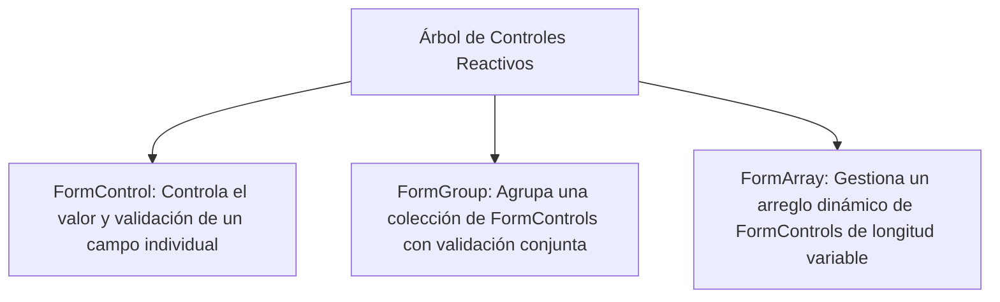

# Módulo 11: Formularios Reactivos y Tipado Estricto (*Typed Forms*)

Angular ofrece dos estrategias para construir formularios:
1. **Template-driven Forms:** Lógica declarada principalmente en la plantilla HTML usando `[(ngModel)]`. Adecuado solo para formularios muy simples o prototipos rápidos.
2. **Reactive Forms:** Lógica declarada y controlada programáticamente en la clase TypeScript mediante un árbol inmutable de controles. Es el estándar para aplicaciones empresariales complejas.

En **Angular 14**, los Reactive Forms recibieron su actualización más importante: **Typed Forms**, proporcionando seguridad de tipos en tiempo de compilación para todos los valores y estados del formulario.

---

## 11.1 Los 3 Pilares de Reactive Forms



---

## 11.2 La Revolución de los *Typed Forms* (Angular 14+)

Antes de Angular 14, `form.value` devolvía un tipo `any` sin control de tipos. Si escribías mal una propiedad o cambiabas su estructura, el compilador no te advertía.

A partir de Angular 14, los formularios son estrictamente tipados por defecto:

```typescript
import { Component, OnInit } from '@angular/core';
import { FormControl, FormGroup, Validators } from '@angular/forms';

// Definición estricta del modelo del formulario:
interface RegistroForm {
  nombre: FormControl<string>;
  edad: FormControl<number | null>;
  email: FormControl<string>;
  aceptaTerminos: FormControl<boolean>;
}

@Component({
  selector: 'app-registro',
  templateUrl: './registro.component.html'
})
export class RegistroComponent implements OnInit {
  public form!: FormGroup<RegistroForm>;

  ngOnInit(): void {
    this.form = new FormGroup<RegistroForm>({
      nombre: new FormControl('', { nonNullable: true, validators: [Validators.required] }),
      edad: new FormControl(null, [Validators.min(18)]),
      email: new FormControl('', { nonNullable: true, validators: [Validators.required, Validators.email] }),
      aceptaTerminos: new FormControl(false, { nonNullable: true, validators: [Validators.requiredTrue] })
    });

    // TypeScript verifica que 'email' existe y es de tipo string:
    const correo: string = this.form.controls.email.value;
  }
}
```

### `NonNullableFormBuilder`
Por defecto, cuando llamas a `form.reset()`, Angular restablece los controles a `null`. Para evitar que un campo de texto pase de `string` a `null`, se utiliza `NonNullableFormBuilder`:

```typescript
import { Component, inject } from '@angular/core';
import { NonNullableFormBuilder, Validators } from '@angular/forms';

@Component({...})
export class RegistroComponent {
  private fb = inject(NonNullableFormBuilder);

  public form = this.fb.group({
    nombre: ['', [Validators.required, Validators.minLength(3)]],
    email: ['', [Validators.required, Validators.email]],
    password: ['', [Validators.required, Validators.minLength(8)]]
  });

  // Al resetear, 'nombre' vuelve a '' (cadena vacía), NUNCA a null:
  resetear(): void {
    this.form.reset();
  }
}
```

---

## 11.3 Vinculación en Plantilla y Validación Visual

Para enlazar el formulario con el HTML se requiere importar **`ReactiveFormsModule`**:

```html
<form [formGroup]="form" (ngSubmit)="enviarFormulario()">
  <!-- Campo Nombre -->
  <div class="campo">
    <label for="nombre">Nombre completo:</label>
    <input id="nombre" type="text" formControlName="nombre" />
    
    <!-- Mensajes de Error reactivos -->
    <div *ngIf="form.controls.nombre.invalid && (form.controls.nombre.dirty || form.controls.nombre.touched)" class="error">
      <span *ngIf="form.controls.nombre.errors?.['required']">El nombre es obligatorio.</span>
      <span *ngIf="form.controls.nombre.errors?.['minlength']">Mínimo 3 caracteres.</span>
    </div>
  </div>

  <!-- Campo Email -->
  <div class="campo">
    <label for="email">Correo electrónico:</label>
    <input id="email" type="email" formControlName="email" />
    <div *ngIf="form.controls.email.invalid && form.controls.email.touched" class="error">
      <span>Introduce un correo electrónico válido.</span>
    </div>
  </div>

  <button type="submit" [disabled]="form.invalid">Registrarse</button>
</form>
```

---

## 11.4 Formularios Dinámicos con `FormArray`

Permite a los usuarios agregar o remover filas dinámicamente (por ejemplo, múltiples números telefónicos o ítems en una factura):

```typescript
import { Component, inject } from '@angular/core';
import { FormArray, FormControl, NonNullableFormBuilder, Validators } from '@angular/forms';

@Component({...})
export class FacturaItemsComponent {
  private fb = inject(NonNullableFormBuilder);

  public form = this.fb.group({
    cliente: ['', Validators.required],
    telefonos: this.fb.array<FormControl<string>>([
      this.fb.control('', Validators.required)
    ])
  });

  get telefonos(): FormArray<FormControl<string>> {
    return this.form.controls.telefonos;
  }

  agregarTelefono(): void {
    this.telefonos.push(this.fb.control('', Validators.required));
  }

  eliminarTelefono(indice: number): void {
    if (this.telefonos.length > 1) {
      this.telefonos.removeAt(indice);
    }
  }
}
```

```html
<div formArrayName="telefonos">
  <h4>Teléfonos de Contacto:</h4>
  <div *ngFor="let tel of telefonos.controls; let i = index">
    <input [formControlName]="i" placeholder="Ej. +34 600..." />
    <button type="button" (click)="eliminarTelefono(i)">Eliminar</button>
  </div>
  <button type="button" (click)="agregarTelefono()">+ Añadir otro teléfono</button>
</div>
```

---

## 🛠️ Reto Práctico del Módulo

1. Crea un formulario reactivo para un formulario de inicio de sesión (`email` y `password`).
2. Configúralo con `NonNullableFormBuilder`.
3. Crea un validador personalizado que impida contraseñas que contengan la palabra "123456" o "password".
4. Deshabilita el botón de envío si el formulario es inválido y muestra mensajes de error sólo si los campos han sido tocados (`touched`).
