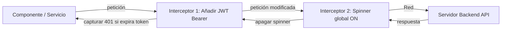

# Módulo 12: `HttpClient` e Interceptores (Clásicos y Funcionales)

El módulo **`HttpClient`** (`@angular/common/http`) simplifica la comunicación con servidores remotos mediante el protocolo HTTP. A diferencia de la API nativa `fetch` de JavaScript, `HttpClient` devuelve **Observables de RxJS**, admite tipado estricto, gestión de interceptores y cancelación automática de peticiones si el componente se destruye.

---

## 12.1 Configuración de `HttpClient`

### Enfoque Clásico con `NgModule` (Angular 14 y anterior):
```typescript
// app.module.ts
import { HttpClientModule } from '@angular/common/http';

@NgModule({
  imports: [HttpClientModule]
})
export class AppModule {}
```

### Enfoque Moderno con Proveedores Funcionales (Angular 15 y 16):
```typescript
// main.ts
import { bootstrapApplication } from '@angular/platform-browser';
import { provideHttpClient, withInterceptors } from '@angular/common/http';
import { AppComponent } from './app/app.component';
import { authInterceptorFn } from './core/interceptors/auth.interceptor';

bootstrapApplication(AppComponent, {
  providers: [
    provideHttpClient(
      withInterceptors([authInterceptorFn]) // Interceptores funcionales
    )
  ]
});
```

---

## 12.2 Peticiones CRUD Tipadas

Los métodos de `HttpClient` son genéricos y aceptan una interfaz TypeScript para tipar la respuesta esperada:

```typescript
// src/app/features/productos/services/productos.service.ts
import { Injectable, inject } from '@angular/core';
import { HttpClient, HttpParams, HttpHeaders } from '@angular/common/http';
import { Observable } from 'rxjs';

export interface Producto {
  id: number;
  nombre: string;
  precio: number;
}

@Injectable({ providedIn: 'root' })
export class ProductosService {
  private http = inject(HttpClient);
  private readonly baseUrl = 'https://api.empresa.com/v1/productos';

  // GET con Query Parameters tipados
  public listar(categoria?: string, limite: number = 10): Observable<Producto[]> {
    let params = new HttpParams().set('limit', limite.toString());
    if (categoria) {
      params = params.set('category', categoria);
    }
    return this.http.get<Producto[]>(this.baseUrl, { params });
  }

  // POST con cuerpo tipado
  public crear(producto: Omit<Producto, 'id'>): Observable<Producto> {
    return this.http.post<Producto>(this.baseUrl, producto);
  }

  // PUT para actualización completa
  public actualizar(id: number, cambios: Partial<Producto>): Observable<Producto> {
    return this.http.put<Producto>(`${this.baseUrl}/${id}`, cambios);
  }

  // DELETE
  public eliminar(id: number): Observable<void> {
    return this.http.delete<void>(`${this.baseUrl}/${id}`);
  }
}
```

---

## 12.3 Interceptores HTTP: La Guardia de Entrada y Salida

Un interceptor captura **todas** las peticiones salientes antes de que lleguen a la red, y **todas** las respuestas entrantes antes de que lleguen a los componentes.



### 1. Interceptores Clásicos Basados en Clases (Angular 14 y anterior)
Implementan la interfaz `HttpInterceptor` y clonan la petición inmutable (`req.clone()`):

```typescript
// src/app/core/interceptors/auth.interceptor.ts
import { Injectable, inject } from '@angular/core';
import { HttpInterceptor, HttpRequest, HttpHandler, HttpEvent } from '@angular/common/http';
import { Observable } from 'rxjs';
import { AuthService } from '../services/auth.service';

@Injectable()
export class AuthInterceptor implements HttpInterceptor {
  private authService = inject(AuthService);

  intercept(req: HttpRequest<unknown>, next: HttpHandler): Observable<HttpEvent<unknown>> {
    const token = this.authService.getToken();

    if (!token) {
      return next.handle(req);
    }

    // Como las peticiones HTTP son inmutables, se deben clonar para agregar headers:
    const authReq = req.clone({
      setHeaders: {
        Authorization: `Bearer ${token}`
      }
    });

    return next.handle(authReq);
  }
}
```

*Registro clásico en `AppModule`:*
```typescript
import { HTTP_INTERCEPTORS } from '@angular/common/http';

@NgModule({
  providers: [
    { provide: HTTP_INTERCEPTORS, useClass: AuthInterceptor, multi: true }
  ]
})
export class AppModule {}
```

---

### 2. Interceptores Funcionales (`HttpInterceptorFn` - Angular 15 y 16)
Angular 15 introdujo interceptores basados en funciones puras, eliminando la necesidad de clases y el token `HTTP_INTERCEPTORS`:

```typescript
// src/app/core/interceptors/auth.interceptor.ts
import { HttpInterceptorFn } from '@angular/common/http';
import { inject } from '@angular/core';
import { AuthService } from '../services/auth.service';

export const authInterceptorFn: HttpInterceptorFn = (req, next) => {
  const authService = inject(AuthService);
  const token = authService.getToken();

  if (token) {
    req = req.clone({
      setHeaders: {
        Authorization: `Bearer ${token}`
      }
    });
  }

  return next(req);
};
```

---

## 12.4 Manejo Global de Errores con `catchError`

Podemos crear un interceptor para atrapar errores HTTP de forma centralizada:

```typescript
// src/app/core/interceptors/error.interceptor.ts
import { HttpInterceptorFn, HttpErrorResponse } from '@angular/common/http';
import { inject } from '@angular/core';
import { Router } from '@angular/router';
import { catchError, throwError } from 'rxjs';

export const errorInterceptorFn: HttpInterceptorFn = (req, next) => {
  const router = inject(Router);

  return next(req).pipe(
    catchError((error: HttpErrorResponse) => {
      if (error.status === 401) {
        console.warn('Sesión expirada o no autorizada. Redirigiendo a /login...');
        router.navigate(['/login']);
      } else if (error.status === 500) {
        alert('Error interno en el servidor. Por favor intenta más tarde.');
      }
      return throwError(() => error);
    })
  );
};
```

---

## 🛠️ Reto Práctico del Módulo

1. Crea un servicio que consulte la API pública de pruebas `https://jsonplaceholder.typicode.com/posts`.
2. Define una interfaz `Post` con `id`, `title` y `body`.
3. Crea un interceptor funcional que añada un encabezado `X-Custom-Client: Angular-16-App` a todas las peticiones salientes.
4. Inspecciona en la pestaña *Network* de las DevTools del navegador que el encabezado viaje correctamente en la solicitud.
