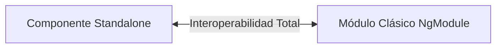

# Módulo 15: La Transición a *Standalone Components* (Angular 14 y 15)

Durante una década, el concepto de `NgModule` fue la piedra angular de Angular. Sin embargo, para proyectos medianos y grandes suponía una carga cognitiva alta (*boilerplate*), complicaba el árbol de dependencias y dificultaba la adopción para desarrolladores que venían de otros ecosistemas como React o Vue.

En **Angular 14** (como *Developer Preview*) y consolidado de forma **estable y recomendada en Angular 15**, Google introdujo los **Standalone Components**: artefactos autónomos que pueden ejecutarse, enrutarse y empaquetarse sin necesidad de pertenecer a ningún `NgModule`.

---

## 15.1 Anatomía de un Componente Standalone

Para hacer que un componente sea autónomo, se añade la propiedad **`standalone: true`** en su decorador y se declaran directamente sus dependencias en su propia lista **`imports`**:

```typescript
// src/app/features/productos/components/tarjeta-producto.component.ts
import { Component, Input } from '@angular/core';
import { CommonModule } from '@angular/common'; // Requerido para usar *ngIf, *ngFor
import { RouterModule } from '@angular/router'; // Requerido para usar routerLink
import { BadgeComponent } from '../../../shared/components/badge.component'; // Otro componente Standalone

@Component({
  selector: 'app-tarjeta-producto',
  standalone: true, // Declara que este componente no necesita ningún NgModule
  imports: [
    CommonModule,
    RouterModule,
    BadgeComponent
  ],
  template: `
    <div class="card">
      <app-badge [texto]="'Nuevo'"></app-badge>
      <h3>{{ titulo }}</h3>
      <a [routerLink]="['/detalles', id]">Ver más</a>
    </div>
  `
})
export class TarjetaProductoComponent {
  @Input() id!: number;
  @Input() titulo!: string;
}
```

> [!NOTE]
> Las directivas y los pipes también pueden ser independientes: `@Directive({ standalone: true })` y `@Pipe({ standalone: true })`.

---

## 15.2 Arranque de Aplicaciones 100% Standalone con `bootstrapApplication`

En Angular 15+, ya no se requiere crear un `AppModule` en `src/main.ts`. La aplicación se arranca directamente especificando el componente raíz y sus proveedores globales con **`bootstrapApplication`**:

```typescript
// src/main.ts
import { bootstrapApplication } from '@angular/platform-browser';
import { provideRouter } from '@angular/router';
import { provideHttpClient, withInterceptors } from '@angular/common/http';
import { provideAnimations } from '@angular/platform-browser/animations';

import { AppComponent } from './app/app.component';
import { routes } from './app/app.routes';
import { authInterceptorFn } from './app/core/interceptors/auth.interceptor';

bootstrapApplication(AppComponent, {
  providers: [
    provideRouter(routes),
    provideHttpClient(withInterceptors([authInterceptorFn])),
    provideAnimations()
  ]
}).catch(err => console.error(err));
```

---

## 15.3 Interoperabilidad: Convivencia entre lo Clásico y lo Moderno

Angular fue diseñado para permitir una migración gradual sin necesidad de reescribir proyectos existentes:



### 1. Usar un Componente Standalone dentro de un `NgModule` clásico
Simplemente añádelo en la sección **`imports`** del `NgModule` (nunca en `declarations`):

```typescript
@NgModule({
  declarations: [ComponenteClasico],
  imports: [
    CommonModule,
    TarjetaProductoComponent // Componente Standalone importado como si fuera un módulo
  ]
})
export class MiModuloClasico {}
```

### 2. Usar librerías basadas en `NgModule` dentro de un Componente Standalone
Importa el módulo en el arreglo `imports` del componente Standalone:

```typescript
@Component({
  selector: 'app-formulario',
  standalone: true,
  imports: [
    ReactiveFormsModule, // Módulo tradicional de formularios
    MatButtonModule      // Módulo de Angular Material clásico
  ],
  template: `...`
})
export class FormularioComponent {}
```

---

## 15.4 *Directive Composition API* (`hostDirectives` - Angular 15)

Antes de Angular 15, la única forma de dotar a un componente de comportamientos adicionales era mediante herencia de clases (la cual no escala bien) o forzando al usuario a escribir múltiples directivas en el HTML (`<app-boton appResaltar appTooltip>`).

Angular 15 introdujo **`hostDirectives`**, permitiendo componer directivas directamente en el host del componente:

```typescript
// Directivas Standalone reutilizables:
@Directive({ standalone: true })
export class ColorResaltadoDirective { /* ... */ }

@Directive({ standalone: true })
export class FocoAccesibleDirective { /* ... */ }

// Composición limpia en el componente:
@Component({
  selector: 'app-boton-magico',
  standalone: true,
  hostDirectives: [
    ColorResaltadoDirective,
    FocoAccesibleDirective
  ],
  template: `<button><ng-content></ng-content></button>`
})
export class BotonMagicoComponent {}
```

---

## 15.5 Migración Automática con el CLI

Si tienes una aplicación en Angular 14 o 15 basada en `NgModule`, el equipo de Angular construyó un comando automatizado que convierte el proyecto a Standalone paso a paso:

```bash
ng generate @angular/core:standalone
```

El asistente te guiará por tres fases:
1. Convertir todos los componentes, directivas y pipes a `standalone: true`.
2. Remover declaraciones innecesarias de los `NgModule`.
3. Migrar el arranque a `bootstrapApplication()` y eliminar `AppModule`.

---

## 🛠️ Reto Práctico del Módulo

1. Crea un componente Standalone `UserAvatarComponent` con el flag `--standalone`: `ng g c shared/components/avatar --standalone`.
2. Configura sus `imports` para incluir `CommonModule`.
3. Importa `UserAvatarComponent` directamente en otro componente Standalone sin declarar ningún `NgModule`.
4. Comprueba en la terminal que el árbol de compilación no genera advertencias y la recarga en vivo funciona al instante.
