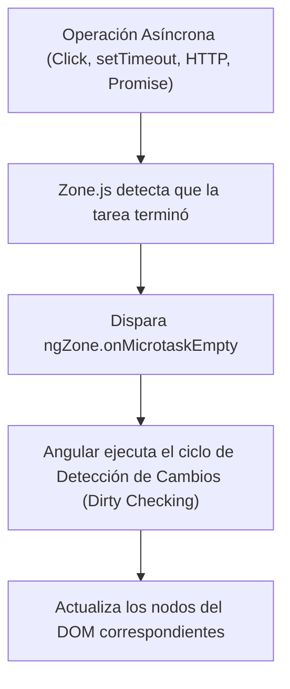
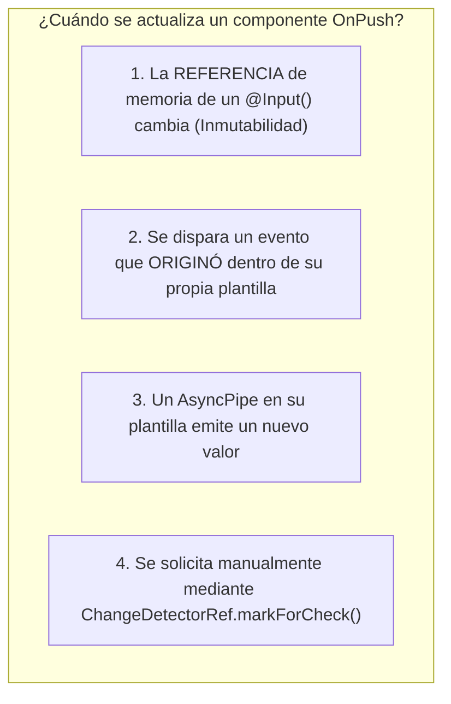

# Módulo 16: Detección de Cambios con Zone.js y Estrategia `OnPush`

Para que una interfaz de usuario refleje los cambios de estado en tiempo real, el framework necesita saber **cuándo** se modificó una variable y **qué partes del DOM** deben actualizarse.

En Angular tradicional (v2 a v16), este mecanismo depende enteramente de **Zone.js** y del ciclo de verificación de diferencias (*Dirty Checking*).

---

## 16.1 ¿Cómo Sabe Angular Cuándo Ocurrió un Cambio? El Rol de Zone.js

JavaScript en el navegador no tiene un evento nativo para decir "una variable de clase cambió de valor". Para solucionar esto, Angular incluye **`zone.js`** en sus *polyfills*.

`Zone.js` intercepta y "parchea" (*monkey patching*) todas las APIs asíncronas del navegador:



### Eventos que activan la detección de cambios:
1. **Eventos de usuario en el DOM:** `click`, `keyup`, `submit`, `change`.
2. **Temporizadores:** `setTimeout()`, `setInterval()`.
3. **Peticiones de red:** `XMLHttpRequest`, `fetch()`, `HttpClient`.
4. **Promesas y microtareas:** `Promise.resolve()`.

---

## 16.2 El Costo de `ChangeDetectionStrategy.Default`

Por defecto, todos los componentes tienen la estrategia `Default`. Cuando **cualquier** evento asíncrono ocurre en **cualquier** rincón de la aplicación (incluso un simple `setInterval` de un reloj en el footer):

> **Angular recorre TODO el árbol de componentes de arriba a abajo (*Top-Down*)**, evaluando cada expresión de plantilla en cada componente para ver si el valor cambió.

En aplicaciones pequeñas esto es imperceptible, pero en interfaces empresariales con miles de componentes o tablas de datos masivas, provoca sobrecarga de CPU y lentitud.

---

## 16.3 La Estrategia Óptima: `ChangeDetectionStrategy.OnPush`

Al activar `OnPush`, le decimos a Angular: *"Desconecta este componente de las revisiones automáticas indiscriminadas. Solo verifícalo cuando sea estrictamente necesario"*:

```typescript
import { Component, Input, ChangeDetectionStrategy } from '@angular/core';

@Component({
  selector: 'app-tarjeta-metrica',
  template: `<div>{{ metrica.nombre }}: {{ metrica.valor }}</div>`,
  changeDetection: ChangeDetectionStrategy.OnPush // Activación de OnPush
})
export class TarjetaMetricaComponent {
  @Input() metrica!: { nombre: string; valor: number };
}
```



### La Regla de Oro: ¡Inmutabilidad Obligatoria!
Si mutas un objeto directamente, la referencia de memoria en JavaScript no cambia y el componente `OnPush` **no se actualizará**:

```typescript
// ❌ MUTACIÓN DIRECTA: La referencia no cambia, OnPush NO reacciona
this.metrica.valor = 500;

// ✅ OBJETO INMUTABLE: Nueva referencia de memoria, OnPush se actualiza al instante
this.metrica = { ...this.metrica, valor: 500 };
```

---

## 16.4 Control Manual con `ChangeDetectorRef`

Cuando necesitas controlar manualmente la sincronización:

```typescript
import { Component, ChangeDetectorRef, inject } from '@angular/core';

@Component({...})
export class MonitorComponent {
  private cdr = inject(ChangeDetectorRef);

  actualizarEstado(): void {
    // 1. markForCheck(): Marca el componente y sus ancestros para ser revisados en el próximo ciclo
    this.cdr.markForCheck();

    // 2. detectChanges(): Fuerza una detección inmediata y síncrona en este componente y sus hijos
    this.cdr.detectChanges();

    // 3. detach(): Desconecta el componente del árbol de detección de cambios (para renderizados ultra masivos)
    this.cdr.detach();

    // 4. reattach(): Vuelve a conectar el componente al árbol
    this.cdr.reattach();
  }
}
```

---

## 16.5 Ejecución Fuera de Angular: `NgZone.runOutsideAngular`

Si tienes una animación por JavaScript (`requestAnimationFrame`) o un evento `mousemove` que se ejecuta 60 veces por segundo, activar el ciclo de Angular en cada frame destrozará el rendimiento.

Podemos ejecutar el código **fuera de Zone.js** y volver a entrar solo al terminar:

```typescript
import { Component, OnInit, NgZone, inject } from '@angular/core';

@Component({...})
export class LienzoCanvasComponent implements OnInit {
  private ngZone = inject(NgZone);

  ngOnInit(): void {
    // Corre fuera de la zona de Angular: NINGUNA detección de cambios se disparará
    this.ngZone.runOutsideAngular(() => {
      window.addEventListener('mousemove', (e) => {
        this.dibujarEnCanvas(e.clientX, e.clientY);
      });
    });
  }

  terminarEdicion(): void {
    // Volvemos a entrar a la zona para actualizar la UI:
    this.ngZone.run(() => {
      this.mostrarNotificacion = true;
    });
  }

  private dibujarEnCanvas(x: number, y: number): void { /* ... */ }
}
```

---

## 🛠️ Reto Práctico del Módulo

1. Crea un componente con `changeDetection: ChangeDetectionStrategy.OnPush`.
2. Pásale un array de nombres como `@Input()`.
3. Intenta agregar un elemento usando `.push('Nuevo')` y observa que la pantalla no reacciona.
4. Corrige el problema creando un nuevo array inmutable `[...this.nombres, 'Nuevo']` y comprueba que la UI se actualiza inmediatamente.
