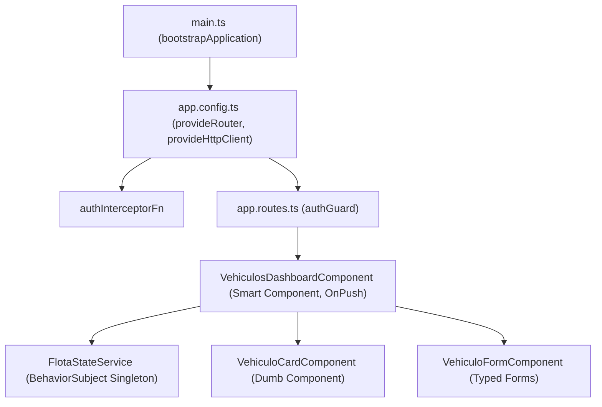

# Módulo 18: Proyecto Integrador: Panel de Gestión de Flotas (LogiFleet)

En este proyecto integrador construirás una aplicación empresarial completa en **Angular 15/16** consolidando todos los patrones avanzados del bloque clásico y de transición:

1. **Arquitectura 100% Standalone** sin `NgModule` (`bootstrapApplication`, `provideRouter`, `provideHttpClient`).
2. **Seguridad funcional:** `authGuard` y `authInterceptorFn` con token JWT.
3. **Gestión de estado reactivo con `BehaviorSubject`** y programación reactiva pura.
4. **Formularios con tipado estricto (`Typed Forms`)** y `NonNullableFormBuilder`.
5. **Máximo rendimiento:** `ChangeDetectionStrategy.OnPush`, `trackBy` y `AsyncPipe`.

---

## 1. Arquitectura y Estructura del Proyecto



```text
src/app/
├── app.component.ts
├── app.routes.ts
├── core/
│   ├── guards/auth.guard.ts
│   ├── interceptors/auth.interceptor.ts
│   └── services/auth.service.ts
└── features/flota/
    ├── models/vehiculo.model.ts
    ├── services/flota-state.service.ts
    ├── pipes/estado-vehiculo.pipe.ts
    └── components/
        ├── dashboard/flota-dashboard.component.ts
        ├── vehiculo-card/vehiculo-card.component.ts
        └── vehiculo-form/vehiculo-form.component.ts
```

---

## 2. Modelo y Servicio de Estado Reactivo

```typescript
// features/flota/models/vehiculo.model.ts
export type EstadoVehiculo = 'ACTIVO' | 'EN_MANTENIMIENTO' | 'INACTIVO';

export interface Vehiculo {
  id: string;
  matricula: string;
  modelo: string;
  kilometraje: number;
  estado: EstadoVehiculo;
  conductorAsignado?: string;
}
```

```typescript
// features/flota/services/flota-state.service.ts
import { Injectable } from '@angular/core';
import { BehaviorSubject, Observable } from 'rxjs';
import { map } from 'rxjs/operators';
import { Vehiculo } from '../models/vehiculo.model';

@Injectable({ providedIn: 'root' })
export class FlotaStateService {
  private readonly vehiculosSubject = new BehaviorSubject<Vehiculo[]>([
    { id: '1', matricula: '7845-XYZ', modelo: 'Volvo FH16', kilometraje: 145000, estado: 'ACTIVO', conductorAsignado: 'Mateo Ruiz' },
    { id: '2', matricula: '9921-KLM', modelo: 'Scania R500', kilometraje: 210000, estado: 'EN_MANTENIMIENTO' },
    { id: '3', matricula: '3310-BCD', modelo: 'Mercedes Actros', kilometraje: 89000, estado: 'ACTIVO', conductorAsignado: 'Sofía Lara' }
  ]);

  public readonly vehiculos$: Observable<Vehiculo[]> = this.vehiculosSubject.asObservable();

  // Selectores derivados reactivos
  public readonly totalVehiculos$ = this.vehiculos$.pipe(map(v => v.length));
  public readonly activos$ = this.vehiculos$.pipe(map(v => v.filter(item => item.estado === 'ACTIVO').length));

  public agregarVehiculo(nuevo: Omit<Vehiculo, 'id'>): void {
    const vehiculoConId: Vehiculo = {
      ...nuevo,
      id: crypto.randomUUID()
    };
    // Operación inmutable que emite una nueva referencia de array:
    this.vehiculosSubject.next([...this.vehiculosSubject.getValue(), vehiculoConId]);
  }

  public cambiarEstado(id: string, nuevoEstado: Vehiculo['estado']): void {
    const actualizados = this.vehiculosSubject.getValue().map(v => 
      v.id === id ? { ...v, estado: nuevoEstado } : v
    );
    this.vehiculosSubject.next(actualizados);
  }

  public eliminar(id: string): void {
    const filtrados = this.vehiculosSubject.getValue().filter(v => v.id !== id);
    this.vehiculosSubject.next(filtrados);
  }
}
```

---

## 3. Formulario Reactivo Tipado (`Typed Forms`)

```typescript
// features/flota/components/vehiculo-form/vehiculo-form.component.ts
import { Component, Output, EventEmitter, inject } from '@angular/core';
import { CommonModule } from '@angular/common';
import { ReactiveFormsModule, NonNullableFormBuilder, Validators, FormControl } from '@angular/forms';
import { Vehiculo, EstadoVehiculo } from '../../models/vehiculo.model';

interface VehiculoForm {
  matricula: FormControl<string>;
  modelo: FormControl<string>;
  kilometraje: FormControl<number>;
  estado: FormControl<EstadoVehiculo>;
  conductorAsignado: FormControl<string>;
}

@Component({
  selector: 'app-vehiculo-form',
  standalone: true,
  imports: [CommonModule, ReactiveFormsModule],
  template: `
    <form [formGroup]="form" (ngSubmit)="onSubmit()" class="form-card">
      <h3>Alta de Nuevo Vehículo</h3>

      <div class="campo">
        <label>Matrícula:</label>
        <input formControlName="matricula" placeholder="Ej. 1234-ABC" />
        <small *ngIf="form.controls.matricula.invalid && form.controls.matricula.touched" class="error">
          Matrícula requerida (mínimo 6 caracteres).
        </small>
      </div>

      <div class="campo">
        <label>Modelo / Marca:</label>
        <input formControlName="modelo" placeholder="Ej. Volvo FH" />
      </div>

      <div class="campo">
        <label>Kilometraje Actual:</label>
        <input type="number" formControlName="kilometraje" min="0" />
      </div>

      <div class="campo">
        <label>Estado Inicial:</label>
        <select formControlName="estado">
          <option value="ACTIVO">Activo</option>
          <option value="EN_MANTENIMIENTO">En Mantenimiento</option>
          <option value="INACTIVO">Inactivo</option>
        </select>
      </div>

      <button type="submit" [disabled]="form.invalid">Registrar en Flota</button>
    </form>
  `
})
export class VehiculoFormComponent {
  private fb = inject(NonNullableFormBuilder);

  @Output() vehiculoCreado = new EventEmitter<Omit<Vehiculo, 'id'>>();

  public form = this.fb.group<VehiculoForm>({
    matricula: this.fb.control('', [Validators.required, Validators.minLength(6)]),
    modelo: this.fb.control('', Validators.required),
    kilometraje: this.fb.control(0, [Validators.required, Validators.min(0)]),
    estado: this.fb.control<EstadoVehiculo>('ACTIVO', Validators.required),
    conductorAsignado: this.fb.control('')
  });

  onSubmit(): void {
    if (this.form.valid) {
      this.vehiculoCreado.emit(this.form.getRawValue());
      this.form.reset({ estado: 'ACTIVO', kilometraje: 0 });
    }
  }
}
```

---

## 4. Componente Visual de Tarjeta (`OnPush`)

```typescript
// features/flota/components/vehiculo-card/vehiculo-card.component.ts
import { Component, Input, Output, EventEmitter, ChangeDetectionStrategy } from '@angular/core';
import { CommonModule } from '@angular/common';
import { Vehiculo } from '../../models/vehiculo.model';

@Component({
  selector: 'app-vehiculo-card',
  standalone: true,
  imports: [CommonModule],
  changeDetection: ChangeDetectionStrategy.OnPush,
  template: `
    <div class="card" [class.mantenimiento]="vehiculo.estado === 'EN_MANTENIMIENTO'">
      <div class="card-header">
        <h4>{{ vehiculo.modelo }}</h4>
        <span class="badge">{{ vehiculo.matricula }}</span>
      </div>

      <p>Kilómetros: <strong>{{ vehiculo.kilometraje | number }} km</strong></p>
      <p>Estado: <span class="estado">{{ vehiculo.estado }}</span></p>
      <p *ngIf="vehiculo.conductorAsignado">Conductor: {{ vehiculo.conductorAsignado }}</p>

      <div class="acciones">
        <button (click)="cambiarEstado.emit('EN_MANTENIMIENTO')">Mantenimiento</button>
        <button (click)="cambiarEstado.emit('ACTIVO')">Activar</button>
        <button class="btn-delete" (click)="eliminar.emit(vehiculo.id)">Eliminar</button>
      </div>
    </div>
  `
})
export class VehiculoCardComponent {
  @Input() vehiculo!: Vehiculo;
  @Output() cambiarEstado = new EventEmitter<Vehiculo['estado']>();
  @Output() eliminar = new EventEmitter<string>();
}
```

---

## 5. Dashboard Principal (`Smart Component`)

```typescript
// features/flota/components/dashboard/flota-dashboard.component.ts
import { Component, inject, ChangeDetectionStrategy } from '@angular/core';
import { CommonModule } from '@angular/common';
import { FlotaStateService } from '../../services/flota-state.service';
import { VehiculoCardComponent } from '../vehiculo-card/vehiculo-card.component';
import { VehiculoFormComponent } from '../vehiculo-form/vehiculo-form.component';
import { Vehiculo, EstadoVehiculo } from '../../models/vehiculo.model';

@Component({
  selector: 'app-flota-dashboard',
  standalone: true,
  imports: [CommonModule, VehiculoCardComponent, VehiculoFormComponent],
  changeDetection: ChangeDetectionStrategy.OnPush,
  template: `
    <div class="dashboard-container">
      <header class="metricas-header">
        <h2>Panel de Control LogiFleet</h2>
        <div class="kpis">
          <span>Total Flota: {{ total$ | async }}</span>
          <span>Activos: {{ activos$ | async }}</span>
        </div>
      </header>

      <div class="layout-grid">
        <section class="lista-vehiculos">
          <div *ngIf="vehiculos$ | async as vehiculos">
            <app-vehiculo-card
              *ngFor="let item of vehiculos; trackBy: trackById"
              [vehiculo]="item"
              (cambiarEstado)="onCambiarEstado(item.id, $event)"
              (eliminar)="onEliminar(item.id)"
            ></app-vehiculo-card>
          </div>
        </section>

        <aside class="columna-formulario">
          <app-vehiculo-form (vehiculoCreado)="onCrearVehiculo($event)"></app-vehiculo-form>
        </aside>
      </div>
    </div>
  `
})
export class FlotaDashboardComponent {
  private flotaState = inject(FlotaStateService);

  public vehiculos$ = this.flotaState.vehiculos$;
  public total$ = this.flotaState.totalVehiculos$;
  public activos$ = this.flotaState.activos$;

  trackById(index: number, item: Vehiculo): string {
    return item.id;
  }

  onCrearVehiculo(nuevo: Omit<Vehiculo, 'id'>): void {
    this.flotaState.agregarVehiculo(nuevo);
  }

  onCambiarEstado(id: string, nuevoEstado: EstadoVehiculo): void {
    this.flotaState.cambiarEstado(id, nuevoEstado);
  }

  onEliminar(id: string): void {
    this.flotaState.eliminar(id);
  }
}
```

---

## 6. Rúbrica de Autoevaluación

- [ ] **Arquitectura Standalone:** No se utiliza ningún `NgModule`; la aplicación inicializa con `bootstrapApplication`.
- [ ] **Tipado Estricto de Formularios:** Los controles son creados con `NonNullableFormBuilder` y no aceptan valores `null` accidentales.
- [ ] **Detección de Cambios Optimizada:** Los componentes de presentación tienen `ChangeDetectionStrategy.OnPush` y las listas implementan `trackBy`.
- [ ] **Flujo Unidireccional:** El estado solo muta en `FlotaStateService` emitiendo nuevas copias inmutables del array mediante `BehaviorSubject.next()`.
- [ ] **Liberación de Memoria:** No hay suscripciones manuales colgadas; toda la vista se resuelve mediante el `AsyncPipe`.
