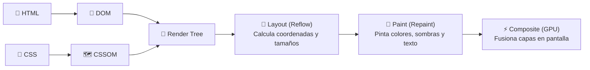
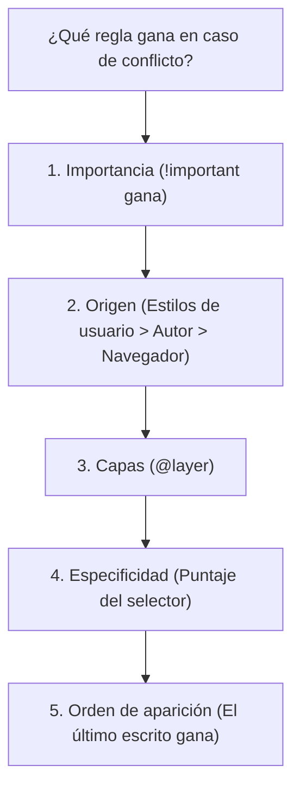
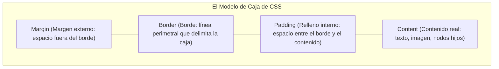
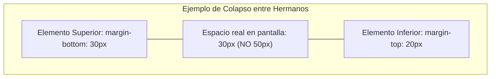

# Módulo 1: Fundamentos y Modelo de Caja

Para dominar CSS, primero debemos desmitificar cómo piensa el navegador web. CSS no es un lenguaje de programación tradicional: es un **lenguaje de hojas de estilo declarativo** que le dice al motor de renderizado cómo transformar un árbol de información (HTML) en píxeles visuales en una pantalla.

---

## 1.1 El Cómputo Visual: El Pipeline Crítico de Renderizado

Cuando abres una página web, el motor del navegador (Blink en Chrome, Gecko en Firefox, WebKit en Safari) realiza una secuencia estricta de pasos:



1. **DOM (Document Object Model):** El navegador parsea el HTML y crea un árbol de nodos.
2. **CSSOM (CSS Object Model):** Lee todas las hojas de estilo y construye un mapa de reglas asociadas a cada nodo.
3. **Render Tree:** Combina el DOM y el CSSOM descartando los elementos que no deben verse (como `<head>` o elementos con `display: none`).
4. **Layout (Reflow):** El navegador calcula el ancho, alto y posición geométrica exacta de cada caja en la pantalla.
5. **Paint (Repaint):** Rellena los píxeles con colores, imágenes, bordes y sombras.
6. **Composite:** La tarjeta gráfica (GPU) une las diferentes capas para proyectar la imagen final al usuario.

---

## 1.2 Formas de Vincular CSS

Existen tres formas de aplicar CSS a un documento HTML:

1. **En línea (`inline`):** Directo en el atributo `style` del elemento (`<h1 style="color: red;">`). Tiene una especificidad altísima, ensucia el HTML y es imposible de reutilizar. **Evítalo en proyectos reales.**
2. **Interno (`internal`):** Dentro de una etiqueta `<style>` en el `<head>`. Útil para pruebas de concepto o emails HTML, pero no se cachea entre páginas.
3. **Externo (`external` - El Estándar Profesional):** Un archivo `.css` independiente enlazado en el `<head>`. El navegador lo cachea en memoria, se reutiliza en todo el sitio y separa la estructura del diseño:

```html
<head>
  <link rel="stylesheet" href="/css/estilos.css">
</head>
```

---

## 1.3 La Cascada y la Especificidad

CSS significa *Cascading Style Sheets* (Hojas de Estilo en Cascada). Cuando dos o más reglas compiten por darle estilo al mismo elemento, el navegador resuelve el conflicto mediante el **Algoritmo de la Cascada**:



### El Sistema de Puntos de Especificidad

Cada selector tiene un peso matemático. Gana el que sume más puntos en sus categorías:

| Selector | Nivel | Puntos | Ejemplo |
| :--- | :---: | :---: | :--- |
| **Estilo Inline** | Primer nivel | `(1, 0, 0, 0)` | `<div style="...">` |
| **ID** | Segundo nivel | `(0, 1, 0, 0)` | `#header` |
| **Clase / Pseudo-clase / Atributo** | Tercer nivel | `(0, 0, 1, 0)` | `.btn`, `:hover`, `[type="text"]` |
| **Elemento (Etiqueta) / Pseudo-elemento** | Cuarto nivel | `(0, 0, 0, 1)` | `h1`, `p`, `::before` |
| **Universal / Combinadores** | Sin peso | `(0, 0, 0, 0)` | `*`, `>`, `+`, `~` |

```css
/* Especificidad: 0-0-0-1 (1 punto) */
p { color: black; }

/* Especificidad: 0-0-1-0 (10 puntos) - GANA sobre el anterior */
.texto { color: blue; }

/* Especificidad: 0-1-1-0 (110 puntos) - GANA sobre ambos */
#principal .texto { color: green; }
```

### Herencia de Propiedades
* **Propiedades que SÍ heredan por defecto:** Las relacionadas con texto y tipografía (`color`, `font-family`, `font-size`, `line-height`, `text-align`).
* **Propiedades que NO heredan:** Las relacionadas con la caja y geometría (`width`, `height`, `margin`, `padding`, `border`, `background`).
* Puedes forzar la herencia con `inherit` o resetear al valor inicial del navegador con `initial`.

---

## 1.4 El Modelo de Caja (*Box Model*) a Fondo

En la web, **absolutamente todo es una caja rectangular**, incluso si visualmente tiene bordes redondeados o apariencia circular.



### El Problema Histórico de `box-sizing: content-box`
Por defecto, el navegador calcula el tamaño de las cajas con `content-box`. Bajo este modelo, las propiedades `width` y `height` aplican **únicamente al contenido**. Si agregas `padding` o `border`, estos se suman externamente:

$$\text{Ancho Total} = \text{width} + \text{padding-left} + \text{padding-right} + \text{border-left} + \text{border-right}$$

*Ejemplo de conflicto:* Si defines un elemento con `width: 200px`, `padding: 20px` y `border: 5px`, el ancho físico real en pantalla será de **250px** ($200 + 20 + 20 + 5 + 5$). Esto provoca desbordamientos y rompe cuadrículas responsivas con facilidad.

### La Solución Universal: `box-sizing: border-box`
Con `border-box`, el valor de `width` y `height` representa la **dimensión total visible de la caja** (incluyendo contenido, padding y bordes). El navegador descuenta automáticamente el espacio del relleno y del borde hacia el interior:

$$\text{Ancho del Contenido} = \text{width declarado} - (\text{padding} + \text{border})$$

```css
/* El reset obligatorio en todo proyecto web profesional */
*, *::before, *::after {
  box-sizing: border-box;
  margin: 0;
  padding: 0;
}
```

---

## 1.5 Dimensiones a Fondo: `width` y `height`

Controlar el tamaño de las cajas exige entender la diferencia entre dimensiones extrínsecas (impuestas por el desarrollador) e intrínsecas (definidas por el propio contenido).

### 1. `width: auto` frente a `width: 100%`
Es un error común creer que `width: auto` y `width: 100%` son equivalentes en elementos de bloque:
- **`width: auto` (Predeterminado):** La caja se expande para ocupar todo el ancho disponible de su contenedor padre, **restando márgenes, paddings y bordes**. Nunca genera scroll horizontal.
- **`width: 100%`:** La caja fuerza su ancho exactamente al 100% del contenedor padre. Si el elemento tiene un margen externo (`margin: 10px`), desbordará el contenedor generando scroll horizontal indeseado ($100\% + 20\text{px}$).

### 2. Dimensiones Mínimas, Máximas y Fluidas
Para crear componentes responsivos, se prioriza el uso de límites elásticos sobre tamaños fijos:
- **`max-width: 100%`:** La regla de oro para imágenes y elementos multimedia responsivos: permite que el elemento se encoja si la pantalla es pequeña, pero no crecerá más allá de su tamaño intrínseco.
- **`min-width` / `min-height`:** Garantiza un umbral mínimo de legibilidad o área interactiva sin importar qué tan vacío esté el elemento.

```css
.contenedor-lectura {
  width: 100%;
  max-width: 720px; /* Evita líneas de texto demasiado largas en monitores grandes */
  min-height: 400px; /* Mantiene presencia visual incluso sin datos */
  margin-inline: auto;
}
```

### 3. Palabras Clave Intrínsecas Modernas
CSS moderno permite que el navegador calcule tamaños con base en el contenido real:
- **`min-content`:** El tamaño mínimo posible que el contenido puede ocupar sin desbordarse (generalmente el ancho de la palabra o elemento hijo más largo).
- **`max-content`:** El tamaño necesario para mostrar todo el contenido en una sola línea continua, sin realizar saltos de línea automáticos.
- **`fit-content`:** Utiliza `max-content` si hay espacio disponible, pero se comprime fluidamente como `auto` si el contenedor se estrecha.

### 4. El Problema Clásico de `height: 100%`
Muchos desarrolladores se frustran al notar que `height: 100%` no produce ningún cambio en pantalla. 
- **¿Por qué ocurre?** En el flujo normal, la altura de un bloque es calculada a partir de su contenido (`height: auto`). Un porcentaje requiere una base fija conocida: si el padre tiene `height: auto`, el $100\%$ de "auto" resulta en un valor indeterminado, por lo que el navegador lo ignora.
- **Solución moderna:** Usar unidades del viewport dinámicas (`min-height: 100dvh`), o asegurarse de que toda la cadena de ancestros (`html`, `body`) tenga `height: 100%`.

---

## 1.6 Relleno Interno (`padding`) y Notación Abreviada (*Shorthand*)

El **`padding`** es el colchón de espacio en blanco entre el borde del elemento y su contenido. Hereda el color de fondo (`background-color`) del elemento.

### La Regla del Reloj (*Clockwise*)
La propiedad abreviada `padding` (y también `margin`) acepta de uno a cuatro valores que se interpretan siguiendo el sentido horario de las agujas del reloj:

```css
/* 1 valor: Aplica a los 4 lados (arriba, derecha, abajo, izquierda) */
padding: 16px;

/* 2 valores: [arriba/abajo]  [derecha/izquierda] */
padding: 12px 24px;

/* 3 valores: [arriba]  [derecha/izquierda]  [abajo] */
padding: 10px 20px 30px;

/* 4 valores: [arriba] [derecha] [abajo] [izquierda] (Regla TRouBLe: Top, Right, Bottom, Left) */
padding: 10px 15px 20px 5px;
```

### Propiedades Lógicas Modernas
En lugar de depender exclusivamente de coordenadas físicas (`top`, `bottom`, `left`, `right`), el estándar moderno de CSS promueve el uso de **propiedades lógicas**, las cuales se adaptan automáticamente a idiomas con dirección de lectura vertical o de derecha a izquierda (RTL, como árabe o hebreo):

| Propiedad Física | Propiedad Lógica Equivalente | Descripción |
| :--- | :--- | :--- |
| `padding-top` + `padding-bottom` | **`padding-block`** | Espacio en el eje de bloque (vertical en español) |
| `padding-left` + `padding-right` | **`padding-inline`** | Espacio en el eje en línea (horizontal en español) |
| `padding-top` | **`padding-block-start`** | Inicio del bloque (arriba) |
| `padding-bottom` | **`padding-block-end`** | Fin del bloque (abajo) |
| `padding-left` | **`padding-inline-start`** | Inicio del flujo de texto (izquierda en LTR) |
| `padding-right` | **`padding-inline-end`** | Fin del flujo de texto (derecha en LTR) |

```css
/* Redacción moderna, semántica y adaptable: */
.tarjeta {
  padding-block: 2rem;   /* Arriba y abajo */
  padding-inline: 1.5rem; /* Izquierda y derecha */
}
```

---

## 1.7 Márgenes Externos (`margin`) y Colapso de Márgenes

El **`margin`** define la distancia externa entre el borde de un elemento y las cajas que lo rodean. Al contrario del padding, el margen siempre es transparente y no adopta el fondo del elemento.

### 1. Centrado Horizontal con `margin: auto`
Cuando un elemento de bloque tiene un `width` (o `max-width`) menor al 100% de su contenedor, asignar margen automático a los lados distribuye el espacio sobrante equitativamente en ambos costados:

```css
.caja-centrada {
  width: min(90%, 800px);
  margin-inline: auto; /* Sintaxis moderna para margin: 0 auto; */
}
```

### 2. Márgenes Negativos
A diferencia del padding (que nunca puede ser negativo), CSS admite valores negativos en los márgenes. Un margen negativo desplaza la caja en dirección contraria o jala a los elementos adyacentes hacia sí misma:

```css
.imagen-desbordada {
  /* Rompe los límites del contenedor y se estira 20px más a la izquierda y derecha */
  margin-inline: -20px;
}
```

### 3. El Fenómeno del Colapso de Márgenes (*Margin Collapsing*)
Uno de los comportamientos que más confunden a los desarrolladores es el colapso de márgenes verticales:

> **Regla de oro del colapso:** Cuando dos márgenes verticales se tocan, **no se suman**. En su lugar, se combinan en un único margen cuyo tamaño es igual al **mayor de los dos**.



#### Escenarios Clave de Colapso:
1. **Entre elementos hermanos adyacentes:** El `margin-bottom` del primer párrafo y el `margin-top` del segundo se colapsan. Si uno mide `30px` y el otro `20px`, la distancia final será de `30px`.
2. **Entre elemento padre y primer/último hijo:** Si un contenedor padre no tiene borde ni padding, el `margin-top` de su primer elemento hijo "escapa" del padre y se transfiere al exterior del contenedor padre.
3. **Márgenes negativos combinados con positivos:** Si compiten un margen de `40px` y uno de `-15px`, el navegador realiza una suma algebraica: $40 - 15 = 25\text{px}$.

#### ¿Cuándo NUNCA ocurre el colapso de márgenes?
* En márgenes horizontales (`margin-left` y `margin-right` jamás colapsan).
* En elementos dentro de contenedores **Flexbox** o **Grid**.
* En elementos con posicionamiento absoluto (`position: absolute` o `fixed`).
* Cuando el padre tiene `padding` o `border` que impida que los márgenes se toquen físicamente.
* Cuando el padre genera un nuevo *Block Formatting Context* (`display: flow-root;` o `overflow: hidden;`).

---

## 1.8 Impacto del Modelo de Caja según `display`

El comportamiento de `width`, `height`, `margin` y `padding` cambia drásticamente según la propiedad `display` del elemento:

| Propiedad / Característica | `display: block` (`<div>`, `<p>`) | `display: inline` (`<span>`, `<a>`) | `display: inline-block` (`<button>`, `<input>`) |
| :--- | :--- | :--- | :--- |
| **Genera salto de línea** | Sí (ocupa todo el ancho disponible) | No (fluye con el texto de la línea) | No (se alinea con el texto circundante) |
| **Respeta `width` y `height`** | **Sí** | **No** (se ignora completamente) | **Sí** |
| **`padding` horizontal** | Sí | Sí (empuja a los vecinos a los lados) | Sí |
| **`padding` vertical** | Sí | Se pinta visualmente, pero **no empuja** las líneas vecinas | Sí (empuja el layout de manera correcta) |
| **`margin` vertical** | Sí | **Ignorado** por completo | Sí |
| **`margin` horizontal** | Sí | Sí | Sí |

> [!WARNING]
> Si intentas aplicar `width: 200px` o `margin-block: 20px` a una etiqueta `<a>` o `<span>` sin cambiar su display a `inline-block`, `block` o `flex`, el navegador descartará silenciosamente esas declaraciones.

---

## 1.9 Unidades de Medida Modernas

Para construir interfaces fluidas y accesibles, debemos elegir las unidades adecuadas:

### 1. Unidades Relativas a la Tipografía
* **`rem` (*Root EM* - La Reina de la Accesibilidad):** Relativo al tamaño de fuente del elemento raíz `<html>` (por defecto `16px`). Si el usuario cambia el tamaño de texto en las preferencias de su sistema por discapacidad visual, todo el sitio escala suavemente.
* **`em`:** Relativo al tamaño de fuente del elemento padre inmediato. Ideal para espaciados internos de botones e iconos que deban escalar proporcionalmente con el texto.

### 2. Unidades de Viewport Modernas
Las pantallas de smartphones presentan barras de navegación que aparecen y desaparecen al hacer scroll, lo que solía romper `100vh`:
* **`vh` / `vw`:** 1% del alto / ancho total de la ventana.
* **`dvh` / `dvw` (*Dynamic Viewport*):** Se adapta en tiempo real a la barra del navegador cuando se oculta o se muestra.
* **`svh` (*Small Viewport*):** Considera la pantalla cuando las barras del navegador están abiertas.
* **`lvh` (*Large Viewport*):** Considera la pantalla completa cuando las barras se esconden.

---

## 🛠️ Reto Práctico del Módulo

**Ejercicio: Tarjeta de Producto con Modelo de Caja Perfecto**

Construye una tarjeta de producto en HTML y CSS que cumpla con los siguientes estándares:
1. Aplica el reseteo universal con `box-sizing: border-box`.
2. Asigna un ancho fijo de `320px` al contenedor de la tarjeta, con un `padding-inline` de `1.5rem`, `padding-block` de `2rem` y un borde sólido de `1px`. Comprueba en el inspector de elementos que el ancho total siga siendo exactamente `320px`.
3. Experimenta provocando un colapso de márgenes vertical entre el título `<h3>` y un párrafo `<p>`, e inspecciona en las herramientas de desarrollo cómo el navegador unifica el espacio.
4. Diseña un botón interno utilizando `display: inline-block` con `padding: 0.6em 1.2em;`: modifica el `font-size` del botón y observa cómo el botón crece proporcionalmente gracias a las unidades relativas `em`.
