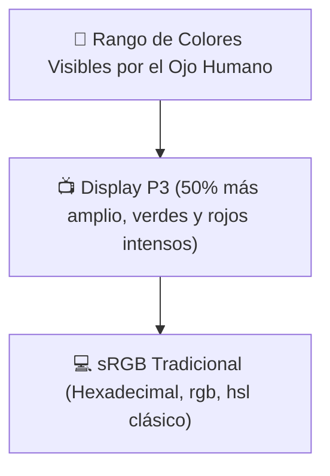

# Módulo 2: Colorimetría Moderna y Gradientes

El color es una de las herramientas de comunicación visual más poderosas del diseño web. Durante más de dos décadas, los desarrolladores estuvimos limitados al espacio de color **sRGB** mediante códigos hexadecimales y `rgb()`. Sin embargo, la llegada de pantallas OLED, Retina y HDR ha desatado una verdadera revolución en la forma en que CSS maneja el color.

---

## 2.1 La Limitación de sRGB vs Espacios de Gama Amplia (Display P3)

El espacio de color tradicional de la web (**sRGB**) solo puede representar una fracción de los colores que el ojo humano es capaz de ver. Las pantallas modernas de smartphones, laptops y televisores soportan la gama **Display P3**, que ofrece un **50% más de colores vivos y saturados** (especialmente en verdes y rojos vibrantes).



---

## 2.2 Modelos de Color y Sintaxis Moderna

En CSS moderno, la sintaxis de definición de colores se ha estandarizado **eliminando las comas** y separando el canal alfa (transparencia) con una barra diagonal `/`:

```css
/* 1. Hexadecimal con transparencia (8 dígitos): */
.caja-hex {
  background-color: #3b82f680; /* 80 equivale a 50% de opacidad */
}

/* 2. RGB con sintaxis moderna sin comas: */
.caja-rgb {
  background-color: rgb(59 130 246 / 0.8); /* 80% de opacidad */
}

/* 3. HSL (Hue / Saturation / Lightness): */
.caja-hsl {
  background-color: hsl(217deg 91% 60% / 1);
}
```

---

## 2.3 La Revolución de OKLCH: Uniformidad Perceptual

Aunque HSL fue un avance para los humanos porque separa el matiz (*Hue*) del brillo (*Lightness*), tiene un defecto grave: **no es perceptualmente uniforme**.

En HSL, tanto el amarillo puro como el azul puro tienen `lightness: 50%`. Sin embargo, para el cerebro humano, el amarillo se percibe brillante y claro, mientras que el azul se percibe oscuro y pesado. Esto provoca que al cambiar el tono en HSL, el contraste y la accesibilidad se rompan.

### ¿Por qué OKLCH es el futuro?
**OKLCH (Luminosidad, Croma, Tono)** resuelve este problema:
* **L (Luminosity):** Del `0%` (negro) al `100%` (blanco). Mismo valor = exactamente el mismo brillo perceptual para el ojo.
* **C (Chroma):** La intensidad y pureza del color (saturación).
* **H (Hue):** El ángulo de color en la rueda de 0 a 360 grados.

```css
:root {
  /* Azul accesible */
  --color-primario: oklch(60% 0.22 250);

  /* Amarillo que conserva exactamente el mismo contraste que el azul: */
  --color-alerta: oklch(60% 0.22 95);
}
```

> [!TIP]
> **Ventaja de OKLCH en Sistemas de Diseño:**
> Si diseñas una paleta accesible para personas con daltonismo o baja visión, mantener la misma luminosidad `L` en OKLCH te garantiza que el ratio de contraste contra el fondo no cambiará al alternar de color.

---

## 2.4 La Función Mágica `color-mix()`

Tradicionalmente, para oscurecer un botón al pasar el cursor (`:hover`), teníamos que calcular y declarar un segundo color a mano o usar un preprocesador como SASS. 

Hoy, CSS nativo incluye **`color-mix()`** para mezclar colores en tiempo real:

```css
.boton {
  background-color: var(--color-primario);
  color: white;
  transition: background-color 0.2s;
}

/* Al pasar el ratón, mezclamos el color primario con 20% de negro: */
.boton:hover {
  background-color: color-mix(in oklch, var(--color-primario) 80%, black);
}

/* Para un botón deshabilitado o semitransparente: */
.boton:disabled {
  background-color: color-mix(in oklch, var(--color-primario) 30%, transparent);
}
```

---

## 2.5 Gradientes Modernos: Linear, Radial y Conic

Un degradado en CSS no es un color sólido; se trata técnicamente como una **imagen generada matemáticamente**:

### 1. Gradiente Lineal (`linear-gradient`)
Acepta una dirección en grados o palabras clave (`to right`, `135deg`):

```css
.fondo-lineal {
  background: linear-gradient(135deg, oklch(65% 0.2 240), oklch(50% 0.25 320));
}
```

### 2. Gradiente Radial (`radial-gradient`)
Emerge desde un punto central hacia afuera en forma de elipse o círculo:

```css
.resplandor {
  background: radial-gradient(circle at center, rgba(59, 130, 246, 0.5) 0%, transparent 70%);
}
```

### 3. Gradiente Cónico (`conic-gradient`)
Gira alrededor de un punto central como las manecillas de un reloj. Es la herramienta nativa perfecta para crear **gráficos de pastel (pie charts)** o bordes luminosos giratorios sin JavaScript:

```css
/* Gráfico de pastel: 70% completado, 30% restante */
.grafico-progreso {
  width: 120px;
  height: 120px;
  border-radius: 50%;
  background: conic-gradient(#3b82f6 0% 70%, #e5e7eb 70% 100%);
}
```

---

## 🛠️ Reto Práctico del Módulo

**Ejercicio: Paleta de Componentes con OKLCH y `color-mix`**

Crea una tarjeta de alerta interactiva:
1. Define un color base en `:root` usando **OKLCH**: `--brand: oklch(55% 0.2 260);`.
2. Genera el color de fondo de la tarjeta mezclando `--brand` al `10%` con blanco mediante `color-mix()`.
3. Aplica un borde de `2px` usando el `--brand` original.
4. Diseña un botón interno cuyo color de fondo sea `--brand`, y utiliza `color-mix()` en el estado `:hover` para oscurecerlo un `15%` de forma suave y sin crear variables extras.
