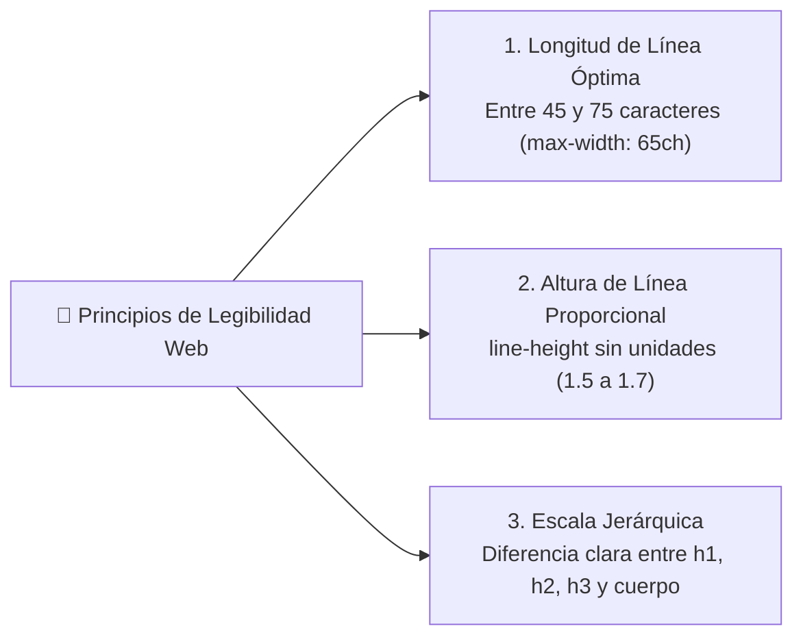

# Módulo 3: Tipografía Web y Legibilidad

La tipografía representa más del 90% de la información en internet. Diseñar una buena tipografía no se limita a elegir una fuente bonita: consiste en dominar la **escala visual, el ritmo vertical y la legibilidad** para que el usuario pueda leer sin fatiga visual.

---

## 3.1 Las Reglas de Oro de la Legibilidad en Pantalla



### 1. La Unidad `ch`: El Ancho del Carácter '0'
El error más común en diseño web es dejar que un párrafo de texto se extienda a todo el ancho de un monitor panorámico. Leer líneas de 200 caracteres cansa la vista. 

En CSS usamos la unidad **`ch`** (el ancho del carácter `0` en la fuente actual) para limitar los textos a una longitud de lectura cómoda:

```css
p {
  max-width: 65ch; /* Longitud de lectura ideal (entre 45 y 75 caracteres) */
  line-height: 1.6; /* 160% de la altura de la fuente */
}
```

### 2. `line-height` sin Unidades: La Regla Proporcional
**Nunca uses píxeles para `line-height`** (ej. `line-height: 24px`). Si un título hijo hereda ese valor y tiene `font-size: 32px`, las líneas de texto se chocarán y se montarán unas sobre otras.

```css
/* ✅ Correcto: Un número multiplicador sin unidad */
body {
  line-height: 1.5; /* Escala automáticamente si la fuente cambia */
}

h1, h2, h3 {
  line-height: 1.2; /* Títulos grandes requieren interlineados más compactos */
}
```

---

## 3.2 Carga de Fuentes con `@font-face` y `font-display`

Al utilizar tipografías personalizadas (Google Fonts, Adobe Fonts o archivos locales), el navegador debe descargar el archivo antes de pintar el texto.

```css
@font-face {
  font-family: 'MiFuenteCustom';
  src: url('/fonts/mifuente.woff2') format('woff2'); /* Formato moderno ultra comprimido */
  font-weight: 400;
  font-style: normal;
  font-display: swap; /* ⚡ Estrategia de renderizado anti-parpadeo */
}
```

### ¿Qué hace `font-display: swap`?
Evita el indeseable **FOIT (Flash of Invisible Text)**, donde la página queda completamente en blanco mientras se descarga la tipografía:
* Con `swap`, el navegador muestra inmediatamente una fuente del sistema de respaldo (*fallback*).
* En cuanto la fuente personalizada termina de descargarse, se intercambia suavemente (*swap*) sin bloquear la lectura.

---

## 3.3 Fuentes Variables (*Variable Fonts*)

Tradicionalmente, si querías una tipografía con grosores 300, 400, 600 y 700 en normal e itálica, tenías que obligar al usuario a descargar 8 archivos pesados diferentes.

Una **Fuente Variable** contiene todos los pesos, anchos e inclinaciones en **un solo archivo ultraligero**:

```css
@font-face {
  font-family: 'InterVariable';
  src: url('/fonts/Inter-Variable.woff2') format('woff2-variations');
  font-weight: 100 900; /* Admite cualquier grosor continuo entre 100 y 900 */
}

/* Podemos usar valores no estándar como 450 o 550 para afinar el diseño: */
.texto-seminegrita {
  font-weight: 550;
}
```

---

## 3.4 Titulares Equilibrados: `text-wrap: balance` y `pretty`

Hasta hace muy poco, en pantallas de ancho variable los títulos solían terminar con una sola palabra huérfana en la última línea (*palabras viudas*), arruinando la armonía visual.

CSS moderno introdujo dos propiedades revolucionarias:

```css
/* 1. text-wrap: balance (Para títulos cortos h1-h4) */
/* El navegador calcula automáticamente los saltos de línea para que todas tengan longitud similar: */
h1, h2 {
  text-wrap: balance;
}

/* 2. text-wrap: pretty (Para párrafos y cuerpo de texto) */
/* Evita que quede una sola palabra solitaria al final del párrafo: */
p {
  text-wrap: pretty;
}
```

---

## 🛠️ Reto Práctico del Módulo

**Ejercicio: Tipografía Editorial para un Artículo de Blog**

Diseña los estilos tipográficos para un artículo web aplicando las mejores prácticas:
1. Define una pila de fuentes del sistema moderna (*System Font Stack*): `font-family: system-ui, -apple-system, BlinkMacSystemFont, 'Segoe UI', Roboto, sans-serif;`.
2. Establece un `font-size` base en `<html>` de `100%` (respetando los `16px` del usuario) y usa `rem` para la escala: `h1 (2.5rem)`, `h2 (1.8rem)`, `p (1.1rem)`.
3. Limita el contenedor del artículo a `max-width: 68ch;` y céntralo con `margin-inline: auto`.
4. Aplica `text-wrap: balance` a los encabezados y `line-height: 1.6` a los párrafos para lograr un ritmo de lectura perfecto.
