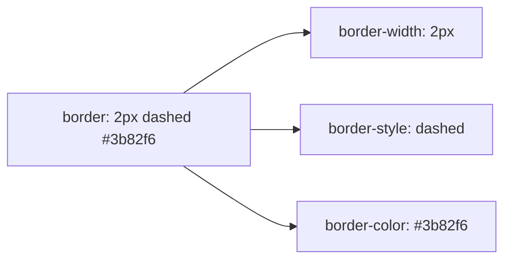
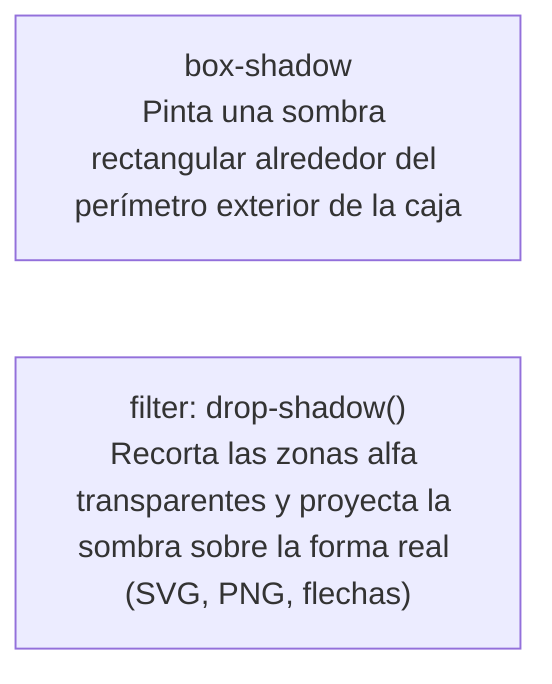

# Módulo 4: Fondos, Bordes y Sombras

Los fondos, bordes y sombras son los componentes visuales que definen el aspecto sensorial de una interfaz de usuario: textura, profundidad, jerarquía y tridimensionalidad. En este módulo aprenderás a dominar cada subpropiedad de `background` y `border`, su impacto en el modelo de caja y técnicas avanzadas como *Glassmorphism* y sombras multicapa.

---

## 4.1 La Anatomía Completa de `background`

La propiedad `background` es una propiedad abreviada (*shorthand*) extraordinariamente potente que engloba hasta 8 subpropiedades independientes:

| Subpropiedad | Función | Valores Comunes |
| :--- | :--- | :--- |
| **`background-color`** | Color base de relleno | Nombres, Hex, RGB, HSL, `oklch()`, `transparent` |
| **`background-image`** | Imagen de fondo o gradiente | `url('...')`, `linear-gradient(...)`, `radial-gradient(...)` |
| **`background-position`** | Ubicación inicial de la imagen | `center`, `top left`, `50% 20%`, `right 10px bottom 20px` |
| **`background-size`** | Escala geométrica del fondo | `auto`, `cover`, `contain`, `100% auto`, `200px 150px` |
| **`background-repeat`** | Repetición en caso de sobrante | `no-repeat`, `repeat`, `repeat-x`, `repeat-y`, `round`, `space` |
| **`background-attachment`** | Comportamiento frente al scroll | `scroll` (normal), `fixed` (parallax), `local` (scroll interno) |
| **`background-origin`** | Área donde inicia el posicionamiento | `padding-box` (por defecto), `border-box`, `content-box` |
| **`background-clip`** | Área límite donde se recorta el fondo | `border-box`, `padding-box`, `content-box`, `text` |

### 1. El Dilema `cover` vs `contain`
Al usar `background-size`:
- **`cover`:** Escala la imagen para que llene todo el contenedor sin dejar espacios vacíos, recortando los bordes que excedan el aspect ratio si es necesario.
- **`contain`:** Escala la imagen para que sea 100% visible en su totalidad dentro del contenedor, dejando márgenes vacíos (bandas) si las proporciones no coinciden.

```css
.hero-banner {
  background-image: url('/img/hero.webp');
  background-position: center;
  background-size: cover;
  background-repeat: no-repeat;
  background-attachment: fixed; /* Efecto parallax nativo en desktop */
}
```

### 2. Sintaxis del Shorthand `background`
Cuando combinas propiedades en una sola línea, la posición y el tamaño deben separarse con una barra inclinada (`position / size`):

```css
/* Sintaxis: [color] [image] [position / size] [repeat] [attachment] */
.banner {
  background: #0f172a url('/img/patron.svg') center / cover no-repeat fixed;
}
```

### 3. Recorte de Fondo en Texto (`background-clip: text`)
Una de las técnicas más atractivas del diseño moderno es rellenar un titular con un degradado de colores:

```css
.titular-degradado {
  background: linear-gradient(135deg, #6366f1, #ec4899);
  background-clip: text;
  -webkit-background-clip: text; /* Requerido para compatibilidad con WebKit/Blink */
  color: transparent;            /* El texto se vuelve transparente para mostrar el degradado detrás */
  font-weight: 800;
  font-size: 3rem;
}
```

### 4. Apilar Múltiples Fondos
Puedes declarar múltiples capas de fondo separadas por comas. El navegador las dibuja de arriba hacia abajo (la primera declarada se renderiza en el plano superior):

```css
.tarjeta-portada {
  background: 
    /* Capa 1 (arriba): Gradiente para oscurecer y dar legibilidad */
    linear-gradient(to top, rgba(0, 0, 0, 0.85) 0%, transparent 60%),
    /* Capa 2 (abajo): Imagen de fondo */
    url('/img/paisaje.jpg') center / cover no-repeat;
}
```

---

## 4.2 La Anatomía Completa de `border`

El **`border`** delimita la caja visual. Se compone de tres propiedades fundamentales:



### 1. Estilos de Borde (`border-style`)
Sin un estilo definido, el borde tiene un ancho predeterminado de cero o es invisible (`none`). Los valores soportados son:
- `solid`: Línea continua lisa.
- `dashed`: Línea segmentada a trazos.
- `dotted`: Línea punteada de círculos.
- `double`: Dos líneas paralelas con espacio intermedio (requiere al menos `3px` de grosor).
- `groove`, `ridge`, `inset`, `outset`: Estilos con relieves tridimensionales calculados a partir de sombras de color.

### 2. Bordes por Costados y Propiedades Lógicas
Puedes especificar bordes para lados concretos físicamente (`border-top`, `border-bottom`, `border-left`, `border-right`) o con propiedades lógicas modernas:
- `border-block-start`: Borde superior (en español/inglés).
- `border-block-end`: Borde inferior.
- `border-inline-start`: Borde izquierdo en escritura de izquierda a derecha (ideal para barras de acento en citas).

```css
.cita-destacada {
  border-inline-start: 4px solid #6366f1; /* Borde izquierdo dinámico */
  padding-inline-start: 1rem;
}
```

### 3. El Clásico Truco de los Triángulos Puros en CSS
Aprovechando que las esquinas de los bordes contiguos se unen en un ángulo diagonal de 45 grados, si estableces un elemento con `width: 0` y `height: 0`, los bordes forman triángulos perfectos:

```css
.triangulo-abajo {
  width: 0;
  height: 0;
  border-left: 10px solid transparent;
  border-right: 10px solid transparent;
  border-top: 15px solid #ef4444; /* El color de la flecha */
}
```

### 4. `border-radius` Avanzado y Formas
- **Píldora perfecta:** `border-radius: 9999px;` (ideal para tags y botones interactivos).
- **Círculo perfecto:** Requiere que la caja tenga dimensiones cuadradas exactas (`width` y `height` idénticos o `aspect-ratio: 1`) con `border-radius: 50%`.
- **Radios elípticos:** Sintaxis `border-radius: 50px / 25px;` para controlar el radio horizontal y vertical independientemente.

---

## 4.3 Comparativa Crítica: `border` vs `outline` vs `box-shadow`

Es vital comprender cómo impacta cada uno en el cálculo del layout para evitar saltos indeseados en pantalla (*layout shift*):

| Característica | `border` | `outline` | `box-shadow` (`spread`) |
| :--- | :--- | :--- | :--- |
| **Ocupa espacio en el Box Model** | **Sí** (altera el layout si cambia dinámicamente) | **No** (se proyecta flotando en otra capa) | **No** (se proyecta fuera del flujo) |
| **Acepta `border-radius`** | Sí (se curva con la caja) | Sí (en navegadores modernos) | Sí (se curva automáticamente) |
| **Separación respecto a la caja** | No | Sí, mediante **`outline-offset`** | Sí, mediante coordenadas `X` e `Y` |
| **Uso idóneo** | Delimitación estructural de elementos | Accesibilidad para foco de teclado (`:focus-visible`) | Anillos de selección decorativos o capas flotantes |

```css
/* ✅ El anillo de foco perfecto para accesibilidad sin alterar el tamaño del botón: */
button:focus-visible {
  outline: 2px solid #2563eb;
  outline-offset: 3px;
}
```

---

## 4.4 Sombras Realistas: La Técnica Multicapa (*Smooth Shadows*)

Una sola sombra dura (`box-shadow: 0 4px 6px black;`) luce tosca y artificial. La iluminación en el mundo real se dispersa en múltiples ángulos. La técnica profesional moderna consiste en **estratificar múltiples capas de sombra**:

```css
.tarjeta-elevada {
  background: white;
  border-radius: 12px;
  box-shadow:
    0 1px 2px rgba(0, 0, 0, 0.04),
    0 4px 8px rgba(0, 0, 0, 0.06),
    0 12px 24px rgba(0, 0, 0, 0.08); /* Sombra difusa y profunda */
  transition: transform 0.2s ease, box-shadow 0.2s ease;
}

.tarjeta-elevada:hover {
  transform: translateY(-4px);
  box-shadow:
    0 2px 4px rgba(0, 0, 0, 0.06),
    0 8px 16px rgba(0, 0, 0, 0.08),
    0 24px 36px rgba(0, 0, 0, 0.12);
}
```

---

## 4.5 `box-shadow` frente a `filter: drop-shadow()`



```css
/* ❌ Proyecta un rectángulo negro sobre el bounding box invisible de un SVG: */
.icono-svg {
  box-shadow: 0 4px 10px rgba(0, 0, 0, 0.3);
}

/* ✅ Proyecta la sombra fielmente sobre los trazos geométricos del dibujo: */
.icono-svg {
  filter: drop-shadow(0 4px 6px rgba(0, 0, 0, 0.25));
}
```

---

## 4.6 Efecto Cristal (*Glassmorphism*) con `backdrop-filter`

El efecto de cristal esmerilado translúcido se logra combinando un fondo semitransparente con desenfoque de fondo:

```css
.panel-cristal {
  background: rgba(255, 255, 255, 0.15); /* Color semitransparente */
  backdrop-filter: blur(12px);            /* Desenfoca el contenido que queda por detrás */
  -webkit-backdrop-filter: blur(12px);    /* Soporte para WebKit / iOS Safari */
  border: 1px solid rgba(255, 255, 255, 0.25); /* Borde sutil para reflejar la luz */
  border-radius: 16px;
  box-shadow: 0 8px 32px rgba(0, 0, 0, 0.1);
}
```

---

## 🛠️ Reto Práctico del Módulo

**Ejercicio: Tarjeta Flotante con Glassmorphism y Acabados Profesionales**

Construye una tarjeta de presentación personal en HTML y CSS:
1. Dale al contenedor padre un fondo de pantalla envolvente utilizando `background: url(...) center / cover no-repeat;`.
2. Estiliza la tarjeta centrada con **Glassmorphism** (`backdrop-filter: blur(14px)` y un borde fino semitransparente).
3. Añade un avatar circular perfecto (`width: 80px`, `height: 80px`, `border-radius: 50%`) con un borde acentuado de `3px`.
4. Utiliza `background-clip: text` para crear un nombre o titular con un gradiente llamativo.
5. Emplea la técnica de **sombras multicapa** para dotar a la tarjeta de una elevación tridimensional orgánica sobre el fondo.
