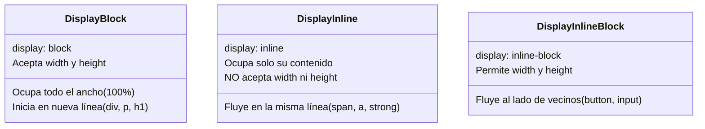
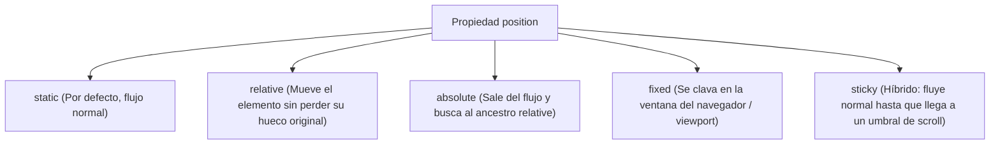

# Módulo 5: Display y Posicionamiento

Antes de adentrarnos en sistemas de rejilla modernos como Flexbox y Grid, es imprescindible dominar las dos propiedades clásicas que controlan el espacio y el comportamiento de las cajas en pantalla: **`display`** (cómo se comporta un elemento respecto a sus vecinos) y **`position`** (cómo y dónde se ubica en el plano bidimensional).

---

## 5.1 El Flujo Normal del Documento (*Normal Flow*)

Por defecto, los navegadores leen el HTML de arriba a abajo y de izquierda a derecha:
* Los elementos de **bloque** se apilan verticalmente como ladrillos (uno debajo de otro).
* Los elementos de **línea** fluyen horizontalmente como palabras dentro de una oración.

---

## 5.2 Los Valores Básicos de `display`



### `display: none` vs `visibility: hidden`
Una de las diferencias más importantes en rendimiento y accesibilidad:
* **`display: none`:** El elemento se **elimina por completo del Render Tree**. No ocupa espacio físico, los vecinos se reacomodan para llenar el hueco y los lectores de pantalla lo ignoran.
* **`visibility: hidden`:** El elemento se vuelve invisible, pero **sigue ocupando su espacio físico original intacto** en la pantalla.

---

## 5.3 Posicionamiento Estratégico (`position`)

Determina si una caja permanece en el flujo natural o si "vuela" a coordenadas exactas usando `top`, `bottom`, `left` y `right`:



### 1. `position: relative`
Desplaza el elemento respecto a su posición original sin que los demás elementos se enteren (su espacio físico original queda reservado como si no se hubiera movido). 
Su uso más importante en la industria es **actuar como "ancla" para hijos con `position: absolute`**.

### 2. `position: absolute`
El elemento se sale por completo del flujo normal (no ocupa espacio para sus vecinos). Se posiciona en relación al **ancestro posicionado más cercano** (cualquier padre con `relative`, `absolute` o `fixed`). Si no hay ninguno, se posiciona respecto al `<html>`.

```css
/* El patrón estrella: Contenedor Ancla + Satélite */
.contenedor-tarjeta {
  position: relative; /* ⚓ El ancla */
}

.etiqueta-oferta {
  position: absolute; /* 🛸 El satélite */
  top: 10px;
  right: 10px;
  background: #ef4444;
  color: white;
  padding: 4px 8px;
  border-radius: 4px;
}
```

### 3. `position: fixed`
El elemento se sale del flujo y queda clavado en el **viewport de la pantalla**. Aunque el usuario haga kilómetros de scroll, el elemento permanece visible exactamente en las mismas coordenadas (ideal para barras de navegación o botones flotantes de WhatsApp).

### 4. `position: sticky`
Se comporta como `relative` mientras haces scroll normal, pero en cuanto alcanza la coordenada indicada (ej. `top: 0`), se "pega" como si fuera `fixed` hasta que su contenedor padre sale de la pantalla.

> [!CAUTION]
> **La trampa mortal de `position: sticky`:**
> Si cualquiera de los elementos padres o ancestros tiene `overflow: hidden`, `overflow: auto` o `overflow: scroll`, el comportamiento `sticky` dejará de funcionar.

---

## 5.4 `z-index` y Contextos de Apilamiento (*Stacking Contexts*)

¿Alguna vez pusiste `z-index: 999999` y aun así el elemento quedó detrás de otro? Esto ocurre por los **Contextos de Apilamiento**.

Piensa en los contextos de apilamiento como carpetas en tu computadora: un archivo dentro de la carpeta B nunca podrá estar "por encima" de un archivo en la carpeta A si la carpeta A está por encima de toda la carpeta B.

### ¿Qué crea un nuevo Contexto de Apilamiento?
1. El elemento raíz `<html>`.
2. Un elemento con `position: relative/absolute` y un `z-index` distinto de `auto`.
3. Un elemento con `opacity` menor a `1`.
4. Un elemento con `transform`, `filter`, `perspective` o `clip-path`.
5. Un elemento con `isolation: isolate;` (la solución moderna para resetear contextos de apilamiento sin trucos raros).

---

## 🛠️ Reto Práctico del Módulo

**Ejercicio: Barra de Navegación Sticky con Badge de Notificaciones**

Construye una cabecera de página completa:
1. Crea un `<header>` con `position: sticky; top: 0;` y fondo semitransparente con `backdrop-filter: blur(8px)`.
2. Diseña un icono de campana de notificaciones.
3. Colócale un badge rojo circular con el número `3` usando `position: relative` en el icono y `position: absolute` en el badge (`top: -6px; right: -6px;`).
4. Añade un botón flotante de "Volver arriba" con `position: fixed; bottom: 20px; right: 20px;`.
