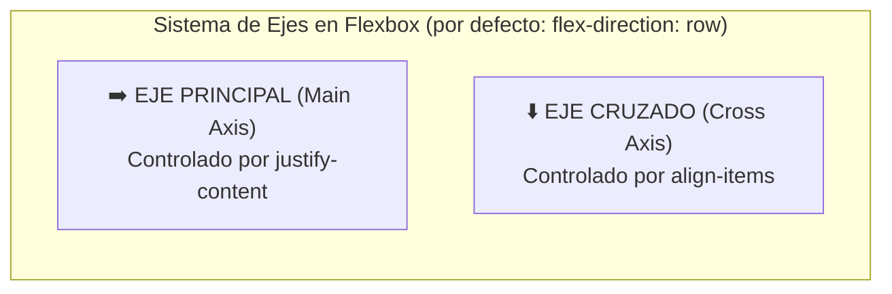
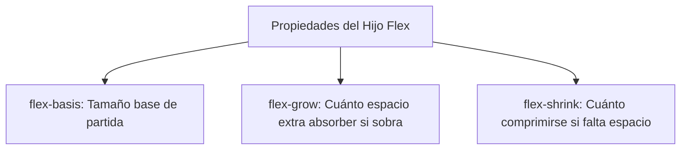

# Módulo 6: Flexbox a Fondo: Alineación Unidimensional

Antes de la llegada de **Flexbox (Flexible Box Layout)**, centrar verticalmente un elemento en CSS requería trucos extraños con tablas, márgenes negativos o hacks con `float`. Flexbox revolucionó el diseño web proporcionando un sistema intuitivo y predecible para alinear y distribuir elementos en **una sola dimensión** (fila o columna).

---

## 6.1 La Regla de Oro: Los Dos Ejes

Todo en Flexbox se rige por la relación entre dos ejes perpendiculares:



> [!IMPORTANT]
> **La regla mnemotécnica definitiva:**
> * **`justify-content`** controla SIEMPRE el **Eje Principal**.
> * **`align-items`** controla SIEMPRE el **Eje Cruzado**.
> Si cambias `flex-direction` a `column`, los ejes rotan: ahora el eje principal es vertical (altura) y el eje cruzado es horizontal (ancho).

---

## 6.2 Propiedades del Contenedor (Padre)

Para activar Flexbox, declaramos `display: flex` en el elemento contenedor:

```css
.contenedor {
  display: flex;
  flex-direction: row; /* row | row-reverse | column | column-reverse */
}
```

### 1. `justify-content` (Distribución en el Eje Principal)
* `flex-start`: Elementos pegados al inicio.
* `flex-end`: Pegados al final.
* `center`: Centrados.
* `space-between`: Primer y último elemento pegados a los bordes; espacio restante repartido uniformemente en medio.
* `space-around`: Espacio idéntico a ambos lados de cada elemento.
* `space-evenly`: Distancia exactamente igual entre bordes y elementos.

### 2. `align-items` (Alineación en el Eje Cruzado)
* `stretch` (Por defecto): Los hijos se estiran para ocupar todo el alto disponible del contenedor.
* `center`: Centrados verticalmente.
* `flex-start` / `flex-end`: Alineados arriba o abajo.
* `baseline`: Alineados en base a la línea tipográfica del texto.

### 3. `gap`: Despídete de los Márgenes Rotos
Tradicionalmente se usaba `margin-right` en los hijos y había que quitarlo en el último hijo con `:last-child`. Con **`gap`**, el navegador calcula la separación uniforme exclusivamente **entre** los elementos:

```css
.menu {
  display: flex;
  gap: 1.5rem; /* row-gap y column-gap simultáneos */
}
```

### 4. `flex-wrap`: Envoltura Multilínea
Por defecto (`flex-wrap: nowrap`), Flexbox apretará a todos los hijos en una sola línea aunque se deformen. Con `wrap`, los hijos bajan a una nueva línea cuando no caben:

```css
.galeria {
  display: flex;
  flex-wrap: wrap;
  gap: 1rem;
}
```

---

## 6.3 Propiedades de los Hijos (Items Flex)

El verdadero poder de Flexbox aparece cuando los elementos hijos deciden individualmente cómo responder al espacio disponible:



* **`flex-basis`:** El tamaño ideal inicial del elemento antes de repartir el espacio libre (`flex-basis: 200px`).
* **`flex-grow`:** Un factor que indica qué proporción del espacio sobrante absorberá. Si todos tienen `flex-grow: 1`, se reparten el espacio equitativamente. Si uno tiene `flex-grow: 2`, absorberá el doble de espacio extra que sus hermanos.
* **`flex-shrink`:** Determina la capacidad del elemento para encogerse cuando no hay espacio suficiente. Con `flex-shrink: 0`, garantizas que el elemento **nunca se deforme ni se encoja** (ideal para avatares o iconos).

### El Atajo Estándar: `flex: grow shrink basis`
En el desarrollo profesional casi nunca se escriben las tres por separado:

```css
.sidebar {
  flex: 0 0 260px; /* No crece, no se encoge, mide exactamente 260px */
}

.contenido {
  flex: 1 1 auto;  /* Crece y se encoge dinámicamente ocupando todo el resto */
}
```

### `align-self`: Rebeldía Individual
Permite que un único hijo rompa la regla `align-items` fijada por el padre:

```css
.item-especial {
  align-self: flex-end; /* Este elemento se va abajo, ignorando al padre */
}
```

---

## 6.4 Patrones Frecuentes de la Industria

### 1. El Santo Grial: Centrado Absoluto en 2 Líneas
```css
.centrado-total {
  display: flex;
  justify-content: center;
  align-items: center;
}
```

### 2. El Footer Pegado al Fondo con `margin-top: auto`
Si tu página tiene poco contenido y el pie de página flota a mitad de pantalla, Flexbox lo resuelve sin hacks:

```css
body {
  display: flex;
  flex-direction: column;
  min-height: 100vh;
}

footer {
  margin-top: auto; /* Empuja el footer automáticamente al fondo de la pantalla */
}
```

---

## 🛠️ Reto Práctico del Módulo

**Ejercicio: Barra de Navegación Profesional y Tarjetas Homogéneas**

1. Construye un `<nav>` profesional con Flexbox:
   * Logo a la izquierda.
   * Enlaces de navegación en el centro.
   * Botón de "Iniciar Sesión" a la derecha.
   * Todo centrado verticalmente con espaciado uniforme usando `gap`.
2. Crea una hilera de 3 tarjetas de precios con Flexbox. Asegúrate de que las tres tengan exactamente la misma altura (`align-items: stretch`), y haz que el botón de compra al final de cada tarjeta quede perfectamente alineado abajo usando `margin-top: auto`.
