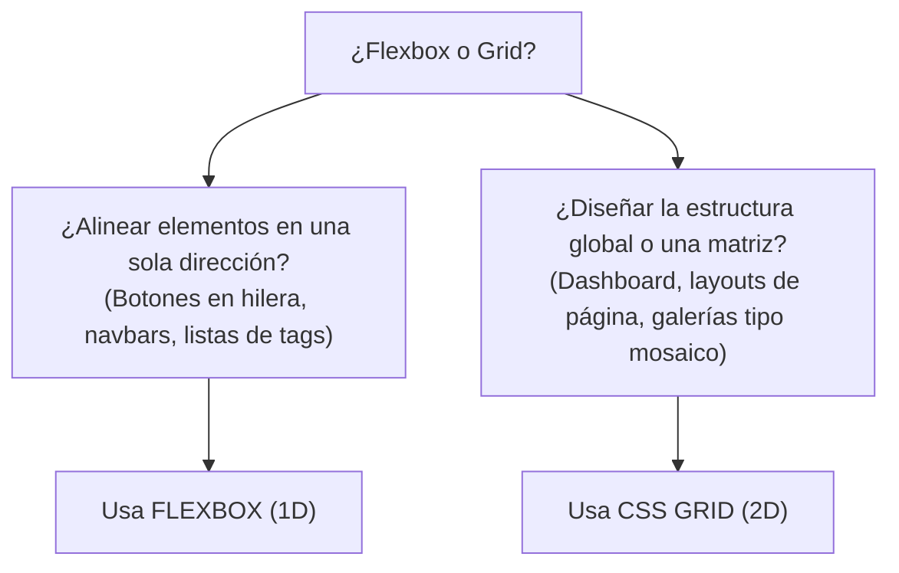
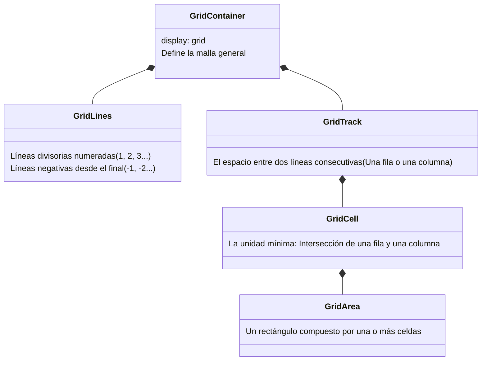
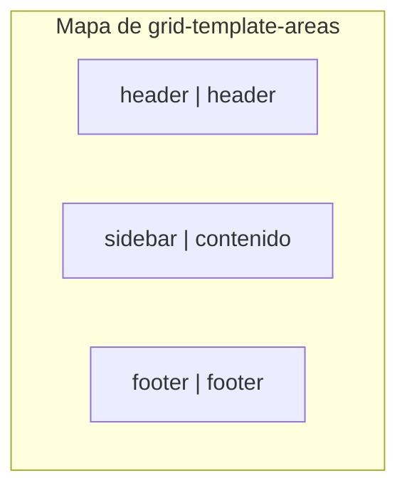

# Módulo 7: CSS Grid: Estructura Bidimensional

Mientras que Flexbox fue diseñado para alinear elementos a lo largo de un solo eje (una fila **o** una columna), **CSS Grid** es el primer sistema de maquetación en la historia de la web diseñado desde cero para trabajar en **dos dimensiones simultáneamente** (filas **y** columnas al mismo tiempo).

---

## 7.1 Flexbox vs CSS Grid: ¿Cuándo usar cuál?

Una de las preguntas más habituales es cuándo conviene usar Flexbox y cuándo Grid:



> [!TIP]
> **La regla de oro del desarrollo moderno:**
> Usa **CSS Grid** para la arquitectura general de la página o para grillas matriciales, y usa **Flexbox** en el interior de los componentes individuales para alinear sus contenidos.

---

## 7.2 Anatomía Fundamental de CSS Grid



---

## 7.3 Definición de Pistas y la Unidad de Fracción (`fr`)

Para activar Grid, aplicamos `display: grid` en el contenedor padre:

```css
.contenedor-grid {
  display: grid;
  grid-template-columns: 250px 1fr 300px;
  grid-template-rows: auto 1fr auto;
  gap: 1.5rem;
}
```

### ¿Qué es la unidad `fr` (*Fractional Unit*)?
La unidad `fr` representa una **fracción proporcional del espacio libre sobrante** después de calcular las columnas de tamaño fijo en píxeles. 

En el ejemplo anterior:
* Columna 1 mide `250px` fijos.
* Columna 3 mide `300px` fijos.
* Columna 2 (`1fr`) absorbe **el 100% de todo el ancho restante disponible en la pantalla**.

### La Función `repeat()`
Evita repetir valores idénticos a mano:

```css
/* En vez de: grid-template-columns: 1fr 1fr 1fr 1fr; */
.rejilla-cuatro {
  display: grid;
  grid-template-columns: repeat(4, 1fr); /* 4 columnas perfectamente iguales */
  gap: 1rem;
}
```

---

## 7.4 Posicionamiento Basado en Líneas

Los elementos hijos dentro de un grid pueden expandirse (*span*) a través de varias filas o columnas usando los números de las líneas divisorias:

```css
.tarjeta-destacada {
  /* Inicia en la línea 1 y termina en la línea 3 (ocupa 2 columnas): */
  grid-column: 1 / 3;

  /* O usando la palabra clave 'span': */
  grid-column: span 2; /* Ocupa 2 columnas a partir de su posición */
  grid-row: span 2;    /* Ocupa 2 filas hacia abajo */
}

/* Ocupar todo el ancho de la rejilla de principio a fin usando la línea -1: */
.banner-ancho-total {
  grid-column: 1 / -1; /* Desde la primera línea hasta la última */
}
```

---

## 7.5 Áreas Nombradas con `grid-template-areas`

Esta es una de las características más visuales y elegantes de CSS. Te permite **dibujar el mapa del sitio con palabras directas** en tu hoja de estilos:

```css
.app-layout {
  display: grid;
  grid-template-columns: 260px 1fr;
  grid-template-rows: 70px 1fr 60px;
  grid-template-areas:
    "header  header"
    "sidebar contenido"
    "footer  footer";
  min-height: 100vh;
}

/* Conectamos cada elemento HTML con su área asignada: */
.cabecera  { grid-area: header; }
.barra-lat { grid-area: sidebar; }
.principal { grid-area: contenido; }
.pie-pag   { grid-area: footer; }
```



---

## 🛠️ Reto Práctico del Módulo

**Ejercicio: Dashboard de Control con Áreas Nombradas**

Construye la maqueta para un panel de administración:
1. Define un contenedor `.dashboard` de altura completa (`min-height: 100vh`).
2. Utiliza `grid-template-areas` para diseñar:
   * Una barra superior (`header`) que ocupe todo el ancho.
   * Una barra lateral izquierda (`sidebar`) de `240px`.
   * Un área central de trabajo (`main`).
   * Un panel lateral derecho para widgets (`aside`) de `300px`.
3. Asigna las clases correspondientes con `grid-area`.
4. Comprueba en el inspector de CSS Grid de tu navegador (F12) cómo se visualizan las líneas y los nombres de las áreas dibujadas.
