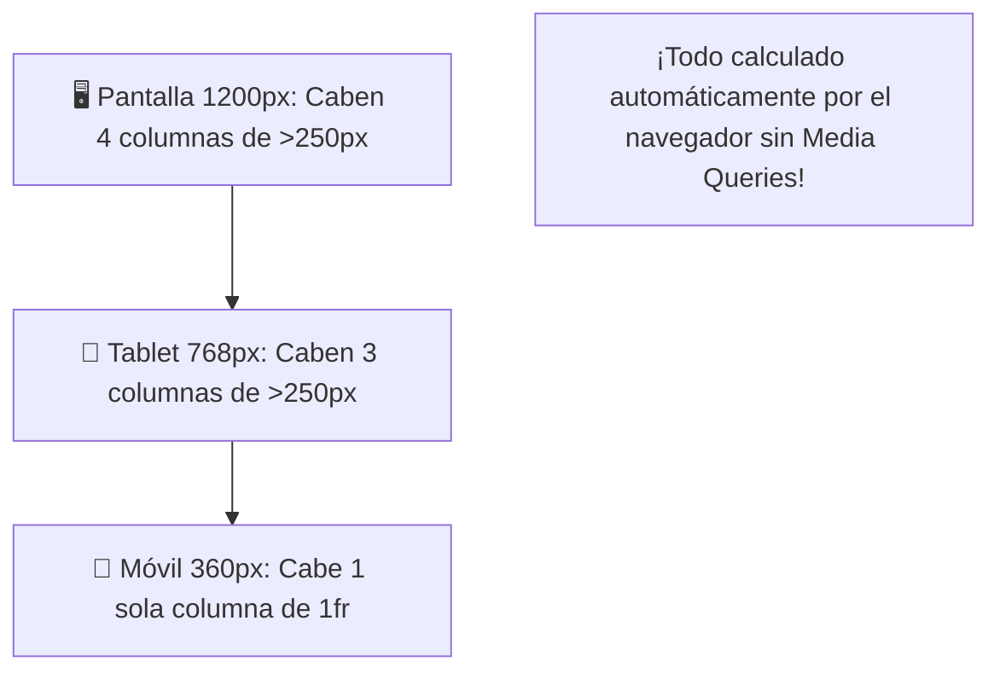
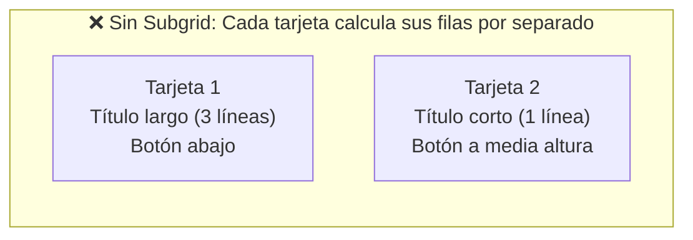
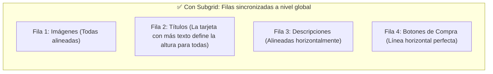

# Módulo 8: Grid Avanzado, Auto-fit y Subgrid

En este módulo aprenderás las técnicas más sofisticadas de CSS Grid: cómo crear rejillas que se adaptan automáticamente a cualquier tamaño de pantalla sin escribir una sola media query, y cómo usar **Subgrid** para resolver el histórico problema de alinear el contenido interno de múltiples tarjetas.

---

## 8.1 Rejillas Automáticas con `auto-fit` y `minmax()`

En el diseño tradicional, para hacer que una galería pase de 4 columnas en escritorio a 2 en tablet y a 1 en móvil, tenías que escribir múltiples `@media (min-width: ...)`. 

Con CSS Grid moderno, este patrón lo resuelve todo en **una sola línea mágica**:

```css
.galeria-automatica {
  display: grid;
  /* Repite tantas columnas como quepan; mínimo 250px, máximo 1 fracción */
  grid-template-columns: repeat(auto-fit, minmax(250px, 1fr));
  gap: 1.5rem;
}
```



---

## 8.2 `auto-fit` vs `auto-fill`: ¿Cuál es la Diferencia?

Cuando tienes pocos elementos (por ejemplo, solo 2 tarjetas en una pantalla gigante de 1920px), la diferencia entre ambos es evidente:

```css
/* Opción A: auto-fit (La que quieres el 95% de las veces) */
grid-template-columns: repeat(auto-fit, minmax(250px, 1fr));
/* Las 2 tarjetas se ESTIRAN horizontalmente para llenar todo el ancho sobrante */

/* Opción B: auto-fill */
grid-template-columns: repeat(auto-fill, minmax(250px, 1fr));
/* Las 2 tarjetas miden exactamente 250px y se reservan huecos invisibles a la derecha */
```

---

## 8.3 El Problema Histórico de las Tarjetas Desiguales

Observa este caso común en tiendas en línea: una fila de 3 tarjetas de productos donde cada tarjeta tiene una imagen, un título, un párrafo de descripción y un botón de compra.

Si el Producto 1 tiene un título de 3 líneas y el Producto 2 tiene un título de 1 sola línea:
* El párrafo del Producto 2 queda más arriba que el del Producto 1.
* Los botones de compra quedan desalineados a alturas diferentes, dando una apariencia visual rota y poco profesional.



---

## 8.4 La Gran Revolución: `subgrid`

Antes de **Subgrid**, los hijos de un elemento de la rejilla no tenían forma de conectarse con las líneas del grid padre. Con `subgrid`, un componente hijo puede **adoptar las filas o columnas de la rejilla principal**:

```css
/* 1. La rejilla principal define las columnas y las filas de los componentes: */
.catalogo-productos {
  display: grid;
  grid-template-columns: repeat(auto-fit, minmax(280px, 1fr));
  gap: 2rem;
}

/* 2. Cada tarjeta abarca 4 filas de la rejilla maestra: */
.tarjeta-producto {
  display: grid;
  grid-row: span 4;           /* Ocupa 4 filas */
  grid-template-rows: subgrid; /* ⚡ Se sincroniza con la malla de sus vecinas */
}

/* Los elementos internos caen automáticamente en filas sincronizadas:
   Fila 1: Imagen
   Fila 2: Título (todas las tarjetas de la fila tendrán la misma altura de título)
   Fila 3: Descripción
   Fila 4: Botón de compra (todos perfectamente alineados al milímetro)
*/
```



---

## 8.5 Flujo Denso con `grid-auto-flow: dense`

En una galería de fotos tipo mosaico donde algunas fotos ocupan 2 columnas y otras 1, el navegador por defecto puede dejar huecos vacíos si un elemento grande no cabe en la fila actual.

Al activar **`dense`**, le ordenas al algoritmo que busque elementos más pequeños que vengan después en el HTML y los coloque hacia atrás para rellenar los espacios en blanco:

```css
.mosaico-galeria {
  display: grid;
  grid-template-columns: repeat(auto-fill, minmax(150px, 1fr));
  grid-auto-flow: dense; /* 🧩 Rellena huecos inteligentemente */
  gap: 10px;
}

.foto-horizontal { grid-column: span 2; }
.foto-vertical   { grid-row: span 2; }
```

---

## 🛠️ Reto Práctico del Módulo

**Ejercicio: Catálogo de Tarjetas con Subgrid y Auto-fit**

1. Crea un catálogo de 4 tarjetas de planes de precios (Básico, Pro, Empresa, Enterprise).
2. Usa `grid-template-columns: repeat(auto-fit, minmax(260px, 1fr))` para que el layout sea 100% responsivo sin media queries.
3. Configura cada tarjeta con `grid-row: span 4` y `grid-template-rows: subgrid`.
4. En una de las tarjetas escribe una descripción con 4 párrafos de texto y en las otras solo una frase corta.
5. Observa cómo todos los botones de "Suscribirse" en la base de las tarjetas permanecen **rigurosamente alineados en la misma línea horizontal**.
