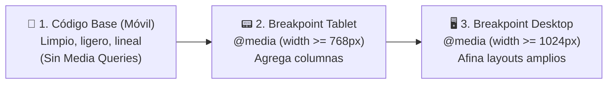

# Módulo 9: Diseño Responsivo y Mobile-First

El diseño web responsivo (*Responsive Web Design*) garantiza que una interfaz sea funcional, accesible y visualmente atractiva en cualquier dispositivo: desde un reloj inteligente o un teléfono móvil de 320 píxeles hasta monitores ultra-panorámicos 4K.

---

## 9.1 La Filosofía Mobile-First: ¿Por qué Empezar por el Móvil?

Históricamente, los desarrolladores diseñaban primero para computadoras de escritorio y luego usaban `@media (max-width: ...)` para "ocultar o parchar" cosas para móvil (*Desktop-First*). Hoy la industria trabaja de forma opuesta: **Mobile-First** (Móvil Primero).



### Ventajas Técnicas de Mobile-First:
1. **Rendimiento:** Los teléfonos móviles con procesadores y conexiones más lentas solo cargan y procesan el CSS base simple, sin tener que sobreescribir estilos pesados de escritorio.
2. **Código Progresivo:** Con `@media (min-width: ...)`, solo **añades** complejidad conforme crece la pantalla, en lugar de resetear y desarmar layouts complejos con `max-width`.

---

## 9.2 El Meta Tag `viewport`: El Interruptor Obligatorio

Si olvidas incluir esta etiqueta en la cabecera `<head>` de tu archivo HTML, **ninguna media query funcionará en smartphones reales**:

```html
<meta name="viewport" content="width=device-width, initial-scale=1.0">
```

* `width=device-width`: Le indica al navegador que el ancho de la página coincida con el ancho físico real de la pantalla del dispositivo.
* `initial-scale=1.0`: Establece el nivel de zoom inicial al 100%.

---

## 9.3 Media Queries: De la Sintaxis Antigua a la Moderna

Tradicionalmente se utilizaban expresiones poco intuitivas como `min-width` y `max-width`. En CSS moderno (Media Queries Nivel 4), los navegadores soportan la **sintaxis de operadores matemáticos**, mucho más legible:

```css
/* ❌ Sintaxis tradicional: */
@media (min-width: 768px) and (max-width: 1024px) {
  /* ... */
}

/* ✅ Sintaxis Moderna Estándar (Operadores lógicos): */
@media (768px <= width <= 1024px) {
  .tarjeta {
    display: flex;
  }
}

/* De móvil en adelante: */
@media (width >= 768px) {
  .menu {
    display: flex; /* Se muestra en fila en tablet y escritorio */
  }
}
```

---

## 9.4 Breakpoints Estratégicos del Contenido

Un error habitual es obsesionarse con los anchos exactos de modelos de teléfono (`390px` para iPhone, `412px` para Samsung). Los dispositivos cambian cada año.

Diseña para los **puntos de rotura naturales de tu contenido**:

| Dispositivo Común | Rango Orientativo | Propósito en el Layout |
| :--- | :--- | :--- |
| **Móviles** | `< 768px` | Layouts a una sola columna; menús colapsados o hamburguesa. |
| **Tablets** | `>= 768px` | Rejillas de 2 columnas; barras de navegación visibles. |
| **Escritorios (Laptops)** | `>= 1024px` | Dashboards con sidebars laterales; rejillas de 3 o 4 columnas. |
| **Monitores Grandes** | `>= 1440px` | Ancho máximo acotado (`max-width: 1400px`) centrado para evitar estiramiento. |

---

## 9.5 Medios Fluidos: Imágenes y Videos Responsivos

Los archivos multimedia no son fluidos por defecto: si una imagen mide `1200px` de ancho, romperá la pantalla de un móvil produciendo un indeseable scroll horizontal.

```css
/* Regla de oro para todos los elementos multimedia: */
img, picture, video, canvas, svg {
  display: block;
  max-width: 100%; /* Nunca sobresale de su contenedor */
  height: auto;     /* Mantiene la proporción original */
}
```

### Ajuste de Imágenes con `object-fit`
Controla cómo una imagen llena su contenedor cuando tiene un ancho y alto predefinidos:

```css
.foto-portada {
  width: 100%;
  height: 300px;
  object-fit: cover; /* 📷 Recorta los bordes sin deformar ni estirar la imagen */
  object-position: center;
}
```

---

## 🛠️ Reto Práctico del Módulo

**Ejercicio: Sección Hero Mobile-First con Menú Adaptativo**

Construye una sección de portada aplicando rigurosamente la metodología Mobile-First:
1. En móvil (estilos base sin media queries):
   * Los enlaces del menú se apilan verticalmente dentro de un panel con fondo oscuro.
   * El texto y la imagen de la portada van en una sola columna vertical.
2. Añade una media query moderna `@media (width >= 768px)`:
   * Convierte los enlaces del menú en una hilera horizontal con `display: flex; gap: 2rem;`.
   * Coloca el texto a la izquierda y la imagen a la derecha en 2 columnas equilibradas usando CSS Grid (`grid-template-columns: 1fr 1fr;`).
3. Añade `@media (width >= 1200px)` para centrar el contenido y limitar el ancho a `max-width: 1100px; margin-inline: auto;`.
