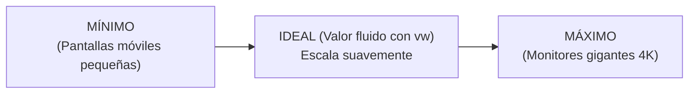

# Módulo 10: Diseño Fluido y Funciones Matemáticas

Durante años, el diseño responsivo consistió en saltos bruscos: la pantalla medía 767px y de pronto, al llegar a 768px, las fuentes y los márgenes cambiaban de golpe debido a una media query. El **Diseño Fluido (*Fluid Design*)** y las funciones matemáticas nativas de CSS permiten que una interfaz escale suave y continuamente a medida que cambia el tamaño de la ventana.

---

## 10.1 La Función de Cálculo Universal: `calc()`

La función `calc()` permite realizar cálculos matemáticos en tiempo de ejecución, **mezclando unidades de distinta naturaleza** (por ejemplo, restar píxeles fijos a porcentajes o unidades de viewport):

```css
.contenedor-completo {
  /* Ocupa todo el alto de la pantalla MENOS los 70px de la barra de navegación: */
  height: calc(100vh - 70px);
}

.columna-tercio {
  /* Un tercio del ancho menos el espacio del gap: */
  width: calc(100% / 3 - 1rem);
}
```

> [!CAUTION]
> **Espaciado obligatorio en los operadores:**
> En `calc()`, **los operadores `+` y `-` deben tener un espacio en blanco a ambos lados** (`calc(100% - 20px)`). Si escribes `calc(100%-20px)`, el navegador no lo interpretará como resta, sino como un número negativo inválido.

---

## 10.2 Funciones de Límite: `min()` y `max()`

Permiten establecer techos y suelos numéricos dinámicos sin necesidad de media queries:

### 1. `min(valor1, valor2)`: Selecciona el menor de los dos
Actúa como un ancho elástico con un límite máximo (un atajo elegante para `max-width`):

```css
.contenedor-central {
  /* Mide el 100% menos 2rem de margen, pero NUNCA superará los 1200px: */
  width: min(100% - 2rem, 1200px);
  margin-inline: auto;
}
```

### 2. `max(valor1, valor2)`: Selecciona el mayor de los dos
Garantiza un tamaño mínimo de seguridad para elementos o espaciados:

```css
.boton {
  /* Mide el 10% del ancho de la pantalla, pero NUNCA menos de 140px: */
  width: max(10vw, 140px);
}
```

---

## 10.3 La Función Estrella: `clamp()`

`clamp()` combina `min()` y `max()` en una sola expresión limpia con tres parámetros:

$$\text{clamp}(\text{MÍNIMO}, \text{IDEAL}, \text{MÁXIMO})$$



```css
:root {
  /* La fuente nunca bajará de 1.25rem (20px) ni subirá de 3rem (48px).
     Entre ambos extremos, crecerá al ritmo del 4% del ancho de pantalla (4vw) */
  --titulo-fluido: clamp(1.25rem, 4vw + 0.5rem, 3rem);

  /* Espaciado de sección que crece de 24px a 80px: */
  --padding-seccion: clamp(1.5rem, 5vw, 5rem);
}

h1 {
  font-size: var(--titulo-fluido);
}

section {
  padding-block: var(--padding-seccion);
}
```

### ¿Por qué `clamp()` es superior a tener 10 Media Queries?
1. **Suavidad visual:** No hay "brincos" o parpadeos cuando el usuario gira su teléfono o redimensiona su ventana en el escritorio.
2. **Menos código:** Reemplaza docenas de líneas de código repetitivo con una sola regla declarativa.
3. **Mantenibilidad:** Toda tu escala tipográfica se define en una sola variable en `:root`.

---

## 10.4 La Fórmula del Candado CSS (*CSS Locks*)

Para afinar con precisión quirúrgica el valor ideal y hacer que una fuente comience a escalar exactamente en una resolución $W_{min}$ (ej. `360px`) y alcance su tamaño máximo exacto en $W_{max}$ (ej. `1200px`), se utiliza la fórmula de interpolación lineal:

$$\text{Ideal} = V_{min} + (V_{max} - V_{min}) \times \frac{\text{100vw} - W_{min}}{W_{max} - W_{min}}$$

Afortunadamente, hoy existen generadores en línea (como *Utopia.fyi* o *Modern Fluid Typography*) que calculan esta expresión automáticamente para tu proyecto.

---

## 🛠️ Reto Práctico del Módulo

**Ejercicio: Sistema Tipográfico y Layout 100% Fluido**

Diseña una página de aterrizaje (*Landing Page*) sin utilizar **ninguna media query para tamaños de fuente ni anchos de contenedor**:
1. Declara en `:root` variables fluidas con `clamp()` para:
   * `--font-h1`: De `2rem` (en móviles) a `4.5rem` (en monitores grandes).
   * `--font-body`: De `1rem` a `1.25rem`.
   * `--espacio-contenedor`: De `1rem` a `4rem`.
2. Centra el contenedor principal utilizando `width: min(100% - 2rem, 1150px); margin-inline: auto;`.
3. Abre las herramientas de desarrollador (F12) y redimensiona manualmente la ventana arrastrando el borde: observa cómo los títulos y los espaciados crecen y se encogen de manera fluida y armónica.
