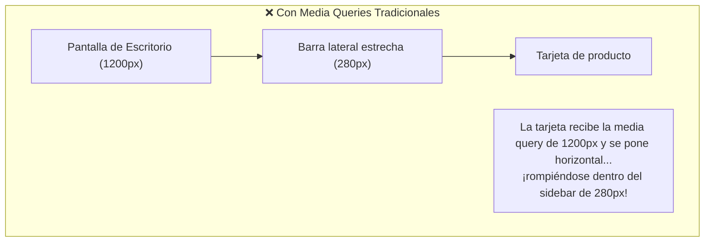
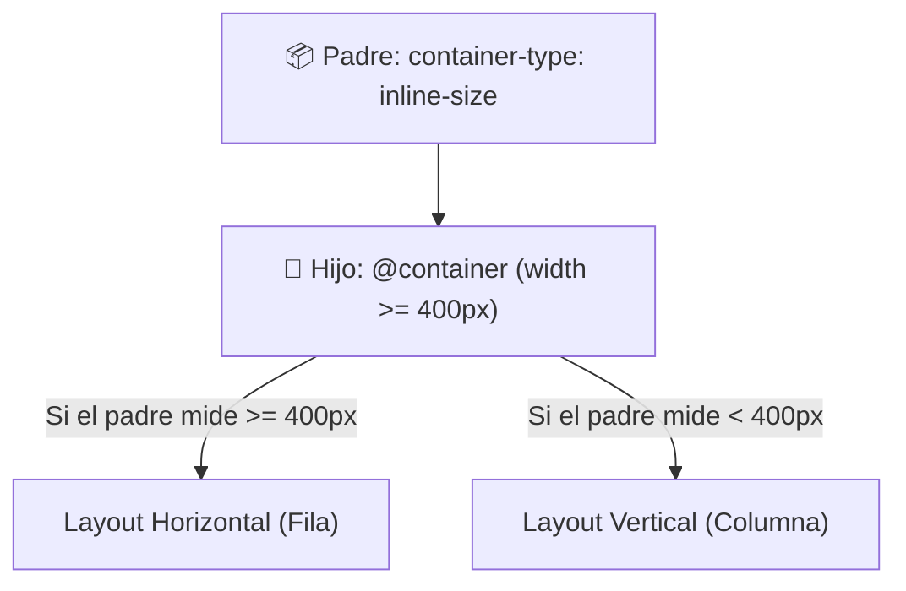

# Módulo 11: Container Queries (`@container`)

Durante más de 12 años, los desarrolladores nos quejamos de una limitación frustrante de las Media Queries: **solo pueden consultar el ancho de la ventana completa del navegador (`viewport`)**. 

Las **Container Queries** representan el mayor avance del diseño modular en la historia de CSS: permiten que un componente responda y altere su diseño según el **ancho de su propio contenedor padre**.

---

## 11.1 El Dilema de la Tarjeta en el Sidebar

Imagina que creas un componente reutilizable de tarjeta de producto (`.tarjeta`):
* En pantallas grandes (>= 1024px), quieres que la tarjeta muestre la foto a la izquierda y el texto a la derecha (horizontal).
* En pantallas pequeñas (< 768px), quieres que la foto esté arriba y el texto abajo (vertical).



Con las Media Queries clásicas, no puedes reutilizar el mismo componente dentro de un sidebar estrecho en una pantalla de escritorio sin inventar clases especiales tipo `.tarjeta--sidebar`.

---

## 11.2 ¿Cómo Funcionan las Container Queries?

Con Container Queries, **el componente es 100% autónomo**: no le importa si está en un teléfono móvil, en un sidebar lateral de 250px o en el centro de un dashboard de 1200px. Pregunta directamente: *"¿Cuánto espacio tengo en mi caja padre?"*.



---

## 11.3 Paso 1: Declarar el Contenedor con `container-type`

Para que un elemento pueda ser consultado por sus hijos, debemos definirlo como un contexto de contención:

```css
.contenedor-padre {
  /* Habilita consultas sobre el eje horizontal (ancho): */
  container-type: inline-size;
  
  /* Opcional: Asignar un nombre específico al contenedor: */
  container-name: mi-tarjeta-box;
}
```

* **`inline-size`:** El valor más utilizado. Le indica al navegador que supervise los cambios en el ancho del elemento sin causar ciclos infinitos de recálculo de altura.

---

## 11.4 Paso 2: Escribir la Regla `@container`

Dentro del componente hijo, escribimos las reglas condicionales usando `@container`:

```css
/* 1. Estilos Base (Para cuando el contenedor mide menos de 450px): */
.tarjeta {
  display: flex;
  flex-direction: column; /* Apilado vertical */
  gap: 1rem;
  padding: 1rem;
}

/* 2. Cuando el CONTENEDOR PADRE mide 450px o más: */
@container (width >= 450px) {
  .tarjeta {
    flex-direction: row; /* Se transforma en horizontal */
    align-items: center;
  }

  .tarjeta__imagen {
    width: 140px;
    height: 140px;
  }
}

/* 3. Cuando el CONTENEDOR PADRE mide 700px o más: */
@container (width >= 700px) {
  .tarjeta {
    padding: 2.5rem;
  }

  .tarjeta__titulo {
    font-size: 1.8rem;
  }
}
```

---

## 11.5 Unidades de Contenedor (*Container Query Units*)

Así como tenemos `vw` y `vh` para el viewport global, CSS introdujo unidades relativas al tamaño del contenedor padre:

* **`cqw` (*Container Query Width*):** 1% del ancho del contenedor padre.
* **`cqh` (*Container Query Height*):** 1% del alto del contenedor padre.
* **`cqi` (*Container Query Inline*):** 1% del tamaño del eje en línea (ancho en idiomas horizontales).

```css
/* El tamaño de la fuente escala según el ancho de la tarjeta, no de la pantalla: */
.tarjeta__titulo {
  font-size: clamp(1rem, 5cqi, 2rem);
}
```

---

## 🛠️ Reto Práctico del Módulo

**Ejercicio: Componente de Perfil Polimórfico y Auto-Adaptable**

Construye un componente de tarjeta de perfil de usuario (`.perfil-card`):
1. Diseña la tarjeta con foto de avatar, nombre, biografía corta y botón de "Seguir".
2. Declara un contenedor con `container-type: inline-size;`.
3. Inserta dos instancias idénticas del mismo HTML en la página:
   * La primera instancia dentro de una columna estrecha de `300px` (como un sidebar).
   * La segunda instancia dentro de un área amplia de `800px` (como el cuerpo principal).
4. Aplica una regla `@container (width >= 500px)` para que la tarjeta en el área amplia se muestre en formato horizontal con el botón a la derecha, mientras que la tarjeta del sidebar permanezca vertical de forma completamente automática.
