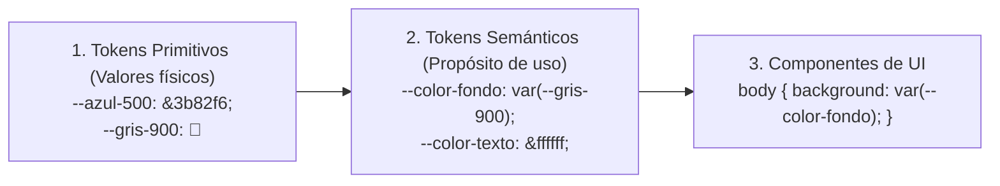

# Módulo 12: Variables CSS (Custom Properties) y Modo Oscuro

Las **Variables CSS (*Custom Properties*)** son una de las características más transformadoras de la web moderna. A diferencia de las variables estáticas de preprocesadores como SASS (que desaparecen tras compilar), las variables CSS viven en el navegador, **participan en la cascada, se heredan en el DOM y pueden modificarse dinámicamente con JavaScript en tiempo real**.

---

## 12.1 Variables CSS vs Variables de SASS

| Característica | Variables de SASS (`$color`) | Variables CSS (`--color`) |
| :--- | :--- | :--- |
| **Tiempo de Vida** | Solo en tiempo de compilación. | **Vivas en el navegador (Runtime).** |
| **Herencia en el DOM** | No conocen el árbol de elementos. | **Heredan de padres a hijos.** |
| **Modo Oscuro** | Obliga a duplicar clases enteras. | **Solo cambias los valores en una línea.** |
| **Interacción con JS** | Imposible leer o cambiar en vivo. | **Lectura y escritura instantánea con JS.** |

---

## 12.2 Declaración, Ámbito (*Scope*) y Respaldo (*Fallback*)

Las variables se definen con dos guiones (`--`) y se consumen con la función `var()`:

```css
/* 1. Ámbito Global: Accesibles en todo el documento */
:root {
  --color-primario: #3b82f6;
  --radio-borde: 8px;
  --espaciado-base: 1rem;
}

/* 2. Ámbito Local: Solo visible dentro del componente y sus hijos */
.tarjeta-destacada {
  --color-primario: #f59e0b; /* Sobrescribe la variable localmente */
}

/* 3. Consumo con valor de respaldo (Fallback) si la variable no existe: */
.boton {
  background-color: var(--color-primario, #10b981); /* Usa verde si no hay variable */
  border-radius: var(--radio-borde);
  padding: var(--espaciado-base);
}
```

---

## 12.3 La Arquitectura de Tokens Semánticos

Para no volverte loco al crear temas o mantener sitios grandes, organiza tus variables en **dos capas**:



Al cambiar de modo claro a oscuro, **nunca tocas los componentes**: solo redefines los tokens semánticos.

---

## 12.4 Modo Oscuro Moderno: `color-scheme` y `light-dark()`

Tradicionalmente, para soportar modo oscuro teníamos que duplicar selectores dentro de una media query:

```css
/* ❌ Forma tradicional verbosa: */
:root {
  --fondo: #ffffff;
  --texto: #111827;
}

@media (prefers-color-scheme: dark) {
  :root {
    --fondo: #111827;
    --texto: #f9fafb;
  }
}
```

### La Forma Moderna de CSS: `light-dark()`
La nueva función nativa **`light-dark(claro, oscuro)`** resuelve el modo oscuro en una sola línea declarativa:

```css
:root {
  /* 1. Le decimos al navegador que soportamos ambos esquemas de color: */
  color-scheme: light dark;

  /* 2. Asignamos ambos valores de forma simultánea: */
  --color-fondo: light-dark(#ffffff, #0f172a);
  --color-texto: light-dark(#1e293b, #f8fafc);
  --color-borde: light-dark(#e2e8f0, #334155);
}

body {
  background-color: var(--color-fondo);
  color: var(--color-texto);
}
```

### Alternador Manual con Atributos (`[data-theme="dark"]`)
Si deseas que el usuario pueda alternar manualmente el tema con un botón mediante un atributo en el `<html>`:

```css
html[data-theme="light"] {
  color-scheme: light; /* Fuerza el valor de light en light-dark() */
}

html[data-theme="dark"] {
  color-scheme: dark;  /* Fuerza el valor de dark en light-dark() */
}
```

---

## 12.5 Interacción Dinámica con JavaScript

Como las variables CSS existen en el DOM, JavaScript puede leerlas y modificarlas en milisegundos para crear efectos interactivos:

```javascript
// Efecto de reflector o linterna siguiendo el cursor del ratón:
window.addEventListener('mousemove', (e) => {
  document.documentElement.style.setProperty('--cursor-x', `${e.clientX}px`);
  document.documentElement.style.setProperty('--cursor-y', `${e.clientY}px`);
});
```

```css
.efecto-linterna {
  background: radial-gradient(
    circle 200px at var(--cursor-x, 50%) var(--cursor-y, 50%),
    rgba(59, 130, 246, 0.3),
    transparent
  );
}
```

---

## 🛠️ Reto Práctico del Módulo

**Ejercicio: Sistema de Diseño con Tokens y Switch de Modo Oscuro**

1. Define en `:root` una capa de tokens semánticos utilizando la función nativa `light-dark()`:
   * `--bg-app`
   * `--bg-card`
   * `--text-primary`
   * `--border-color`
2. Maqueta una tarjeta informativa utilizando exclusivamente estas variables semánticas.
3. Añade en JavaScript un botón simple que alterne el atributo `data-theme="dark"` y `data-theme="light"` en la etiqueta `<html>`.
4. Comprueba cómo toda la tarjeta cambia de apariencia al instante sin necesidad de escribir una sola regla CSS redundante para la clase `.dark`.
