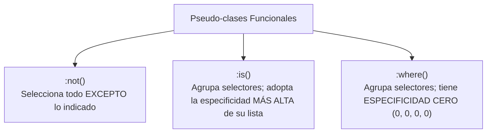
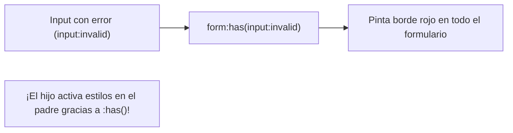

# Módulo 13: Selectores Avanzados y Pseudo-clases

Escribir clases para absolutamente todo en el HTML ensucia el código y complica el mantenimiento. Un desarrollador avanzado resuelve la mayoría de las interacciones y estados visuales directamente en CSS mediante **selectores de atributo, pseudo-clases funcionales y el revolucionario selector relacional `:has()`**.

---

## 13.1 Selectores de Atributo

Permiten apuntar a elementos basándose en la presencia o el valor de sus atributos HTML:

```css
/* 1. Elementos que posean el atributo 'disabled': */
[disabled] {
  opacity: 0.5;
  cursor: not-allowed;
}

/* 2. Coincidencia exacta: */
input[type="email"] {
  border-color: #3b82f6;
}

/* 3. Inicia con (^=): Enlaces seguros externos */
a[href^="https://"]::after {
  content: " ↗";
}

/* 4. Termina con ($=): Descargas de archivos PDF */
a[href$=".pdf"]::before {
  content: "📄 ";
}

/* 5. Contiene (*=): Cualquier enlace que apunte a YouTube */
a[href*="youtube.com"] {
  color: #ef4444;
}
```

---

## 13.2 Pseudo-clases Estructurales

Seleccionan elementos según su posición relativa dentro del árbol de hermanos:

```css
/* Primer y último elemento: */
li:first-child { font-weight: bold; }
li:last-child { border-bottom: none; }

/* Efecto cebra en tablas con nth-child: */
tr:nth-child(even) { background-color: #f8fafc; }
tr:nth-child(odd)  { background-color: #ffffff; }

/* Fórmulas matemáticas (3n + 1: posiciones 1, 4, 7, 10...): */
.item:nth-child(3n + 1) {
  clear: both;
}

/* Elementos completamente vacíos (sin texto ni hijos): */
.alerta:empty {
  display: none;
}
```

### `nth-child` vs `nth-of-type`
* `nth-child(2)`: Cuenta la posición absoluta entre **todos los hermanos** sin importar la etiqueta.
* `nth-of-type(2)`: Cuenta la posición considerando **únicamente los hermanos del mismo tipo de etiqueta**.

---

## 13.3 Los Agrupadores Modernos: `:not()`, `:is()` y `:where()`



### 1. `:not()`: Negación
```css
/* Aplica estilo a todos los botones EXCEPTO a los que tengan la clase .btn-primario: */
button:not(.btn-primario) {
  background-color: transparent;
  border: 1px solid gray;
}
```

### 2. `:is()`: Limpieza de Código sin Repetición
```css
/* ❌ Antes (código repetitivo): */
header h1, header h2, header h3,
article h1, article h2, article h3 {
  line-height: 1.2;
}

/* ✅ Con :is(): */
:is(header, article) :is(h1, h2, h3) {
  line-height: 1.2;
}
```

### 3. `:where()`: La Herramienta de Reseteo (Especificidad Cero)
`:where()` tiene una propiedad única: **su especificidad es siempre 0-0-0-0**. Es la herramienta favorita para crear librerías de componentes y resets de CSS, porque cualquier clase posterior puede sobrescribirlo fácilmente sin pelear con la especificidad:

```css
/* Tiene especificidad 0: */
:where(h1, h2, h3) {
  margin-top: 0;
}

/* Una simple clase 'p' lo sobrescribe sin esfuerzo: */
.titulo-destacado {
  margin-top: 2rem;
}
```

---

## 13.4 La Gran Revolución: `:has()` (El Selector del Padre)

Durante 25 años, una de las mayores quejas de CSS era que un elemento solo podía seleccionar a sus hijos o hermanos posteriores, **nunca a su padre ni a sus hermanos previos**. 

**`:has()`** es el **selector relacional**. Le permite a un elemento padre cambiar de estilo en base a lo que contienen sus hijos:

```css
/* 1. Estiliza el formulario completo si CUALQUIERA de sus inputs es inválido: */
form:has(input:invalid) {
  border-left: 4px solid #ef4444;
}

/* 2. Modifica el diseño de la tarjeta SOLO si tiene una imagen adentro: */
.tarjeta:has(.tarjeta__imagen) {
  display: grid;
  grid-template-columns: 120px 1fr;
}

/* 3. El sueño de los menús desplegables sin JavaScript: */
/* Si el checkbox oculto está marcado, muestra el menú lateral: */
body:has(#menu-toggle:checked) .menu-lateral {
  transform: translateX(0);
}
```



---

## 🛠️ Reto Práctico del Módulo

**Ejercicio: Formulario Dinámico y Autocontenido con `:has()`**

Construye un formulario de encuesta sin una sola línea de JavaScript:
1. Crea un formulario con 3 preguntas con opciones tipo `radio`.
2. Aplica estilos con `:where()` para el reseteo básico de márgenes.
3. Utiliza `label:has(input:checked)` para que el contenedor `<label>` cambie de fondo a un color azul suave y tenga un borde resaltado cuando su opción esté seleccionada.
4. Utiliza `form:has(button:hover)` para que el formulario completo proyecte una sombra más intensa cuando el usuario pase el cursor sobre el botón de envío.
