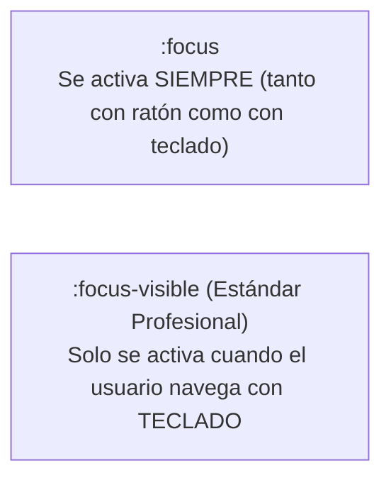

# Módulo 14: Formularios, Diálogos y Estados Interactivos

Los formularios y los diálogos modales son los componentes donde el usuario ingresa información crítica (pagos, autenticación, registros). En este módulo aprenderás a estilizar controles de formulario de forma accesible y a utilizar los nuevos estándares nativos de la web para modales y ventanas emergentes.

---

## 14.1 Personalización Rápida con `accent-color`

Históricamente, personalizar el color de checkboxes, botones de radio o barras de rango (`input[type="range"]`) requería ocultar el control nativo y crear decenas de divs falsos.

La propiedad nativa **`accent-color`** permite teñir todos los controles nativos con el color de tu marca en una sola línea:

```css
:root {
  accent-color: #3b82f6; /* Tiñe checkboxes, radios, ranges y progress bars */
}
```

Para una personalización radical, usamos `appearance: none;` para apagar el estilo del sistema operativo y construir el control desde cero con CSS puro.

---

## 14.2 Accesibilidad: `:focus` vs `:focus-visible`

Uno de los mayores errores en desarrollo web es escribir `outline: none;` para eliminar el anillo azul del navegador al hacer clic con el ratón. Esto destruye la accesibilidad para las personas que navegan con el teclado (tecla `Tab`).



```css
/* ❌ Destruye la accesibilidad: */
button:focus {
  outline: none;
}

/* ✅ El estándar profesional de la industria: */
button:focus-visible {
  outline: 2px solid #3b82f6;
  outline-offset: 3px;
  border-radius: 4px;
}
```

Con `:focus-visible`, quien hace clic con el ratón no ve ningún anillo molesto, pero quien navega con el teclado ve un indicador de foco claro e impecable.

---

## 14.3 Validación Nativa: `:user-invalid` y Floating Labels

Las pseudo-clases tradicionales `:invalid` tenían un grave defecto de UX: en cuanto cargaba la página, el input vacío ya se marcaba con borde rojo de error, asustando al usuario.

Las nuevas pseudo-clases **`:user-valid` y `:user-invalid`** solo activan el estilo **después de que el usuario interactuó con el campo y se desenfocó**:

```css
/* Solo marca error si el usuario intentó escribir y lo dejó mal: */
input:user-invalid {
  border-color: #ef4444;
  background-color: #fef2f2;
}

input:user-valid {
  border-color: #10b981;
}
```

### Efecto de Etiquetas Flotantes (*Floating Labels*) con `:placeholder-shown`
Podemos saber si un input está vacío comprobando si su placeholder está visible:

```css
.campo-flotante {
  position: relative;
}

.campo-flotante label {
  position: absolute;
  top: 12px;
  left: 14px;
  transition: transform 0.2s, font-size 0.2s;
  pointer-events: none;
}

/* Cuando el usuario hace foco o cuando ya escribió algo (placeholder NO visible): */
.campo-flotante input:focus ~ label,
.campo-flotante input:not(:placeholder-shown) ~ label {
  transform: translateY(-20px) scale(0.85);
  color: #3b82f6;
}
```

---

## 14.4 Diálogos Nativos: `<dialog>`, `[popover]` y `::backdrop`

Hoy en día ya no necesitas instalar librerías pesadas de JavaScript para crear modales o menús flotantes. Los navegadores incluyen soporte nativo con la etiqueta `<dialog>` y la API de `popover`:

```html
<!-- Modal nativo en HTML -->
<dialog id="mi-modal">
  <h2>Confirmar Acción</h2>
  <p>¿Estás seguro de que deseas eliminar este registro?</p>
  <button onclick="document.getElementById('mi-modal').close()">Cerrar</button>
</dialog>
```

### Estilizar el Fondo Oscurecido con `::backdrop`
El pseudo-elemento `::backdrop` representa la capa oscura que se coloca automáticamente entre la página y el diálogo modal:

```css
dialog {
  border: none;
  border-radius: 12px;
  padding: 2rem;
  box-shadow: 0 25px 50px -12px rgba(0, 0, 0, 0.25);
}

/* Fondo oscurecido con desenfoque: */
dialog::backdrop {
  background: rgba(0, 0, 0, 0.6);
  backdrop-filter: blur(6px);
}
```

---

## 🛠️ Reto Práctico del Módulo

**Ejercicio: Formulario de Pago con Modal de Confirmación**

1. Diseña un formulario con campos para Número de Tarjeta, Expiración y CVV.
2. Utiliza los atributos HTML `required` y `pattern="[0-9]{16}"`.
3. Estiliza los estados con `:focus-visible` y `:user-invalid` para alertar en rojo si el formato es erróneo.
4. Implementa un modal nativo con `<dialog>` que se abra al enviar el formulario mostrando el mensaje de "¡Pago Exitoso!", estilizando su fondo con `::backdrop` desenfocado.
