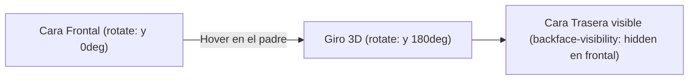

# Módulo 15: Transiciones y Transformaciones 2D/3D

Las animaciones en el diseño web no son simples adornos estéticos: son una herramienta esencial de la **Experiencia de Usuario (UX)**. Indican que un botón fue presionado, guían la atención hacia un cambio de estado y aportan una sensación física de calidad a la interfaz.

---

## 15.1 Transiciones Suaves (`transition`)

Una transición le dice al navegador: *"Cuando este valor cambie, no lo cambies de golpe en 0 milisegundos; tómate un tiempo para hacer una animación suave"*.

```css
.boton {
  background-color: #3b82f6;
  color: white;

  /* Atajo: propiedad | duración | curva de velocidad | retraso */
  transition: background-color 0.25s ease-in-out, transform 0.15s ease;
}

.boton:hover {
  background-color: #1d4ed8;
  transform: translateY(-2px);
}

.boton:active {
  transform: translateY(0) scale(0.98); /* Efecto de pulsación física */
}
```

> [!CAUTION]
> **Nunca escribas `transition: all 0.3s;` en producción:**
> `all` obliga al navegador a vigilar y calcular cambios en las más de 300 propiedades CSS existentes. Especifica siempre las propiedades exactas que deseas animar (ej. `transform, opacity, background-color`).

---

## 15.2 Transformaciones 2D y las Nuevas Propiedades Individuales

La propiedad `transform` modifica la posición, tamaño o ángulo de un elemento **sin mover ni desplazar a las cajas vecinas**:

* **`translate(x, y)`:** Desplaza en los ejes X y Y.
* **`scale(factor)`:** Escala el tamaño (`1.1` = 10% más grande).
* **`rotate(angulo)`:** Gira el elemento (`45deg`, `0.5turn`).
* **`skew(angulo)`:** Inclina o deforma en perspectiva.

### La Sintaxis Moderna de Propiedades Individuales
Tradicionalmente teníamos que escribir `transform: translate(10px) scale(1.1) rotate(5deg)`. En CSS moderno, puedes controlar cada propiedad por separado sin sobrescribir las demás:

```css
.tarjeta-zoom {
  /* Propiedades individuales nativas: */
  translate: 0 0;
  scale: 1;
  rotate: 0deg;
  transition: scale 0.3s ease, translate 0.3s ease;
}

.tarjeta-zoom:hover {
  scale: 1.05;          /* Solo modificas la escala */
  translate: 0 -8px;    /* Solo modificas la elevación */
}
```

---

## 15.3 Perspectiva y Transformaciones 3D: Efecto *Card Flip*

Para que las transformaciones se vean en tres dimensiones, el contenedor padre debe tener **`perspective`** (la distancia virtual entre el ojo del usuario y la pantalla):

```css
.escenario-3d {
  perspective: 1000px; /* Profundidad tridimensional */
}

.tarjeta-giratoria {
  width: 300px;
  height: 200px;
  position: relative;
  transform-style: preserve-3d; /* Permite que los hijos vivan en el espacio 3D */
  transition: rotate 0.8s cubic-bezier(0.4, 0, 0.2, 1);
}

.escenario-3d:hover .tarjeta-giratoria {
  rotate: y 180deg; /* Gira sobre el eje vertical */
}

/* Las caras delantera y trasera: */
.cara {
  position: absolute;
  inset: 0;
  backface-visibility: hidden; /* Oculta la cara cuando queda de espaldas */
  border-radius: 12px;
}

.cara-frontal {
  background: #3b82f6;
}

.cara-trasera {
  background: #1e293b;
  rotate: y 180deg; /* Nace volteada para verse al girar */
}
```



---

## 15.4 Accesibilidad Obligatoria: `prefers-reduced-motion`

Algunas personas sufren de trastornos vestibulares, epilepsia o mareo por movimiento ante animaciones excesivas en pantalla. Los sistemas operativos (Windows, macOS, iOS, Android) permiten activar la opción *"Reducir el movimiento"*.

En CSS, es un requisito ético y de accesibilidad respetar esta preferencia:

```css
/* Si el usuario activó la reducción de movimiento en su sistema: */
@media (prefers-reduced-motion: reduce) {
  *, *::before, *::after {
    animation-duration: 0.01ms !important;
    animation-iteration-count: 1 !important;
    transition-duration: 0.01ms !important;
    scroll-behavior: auto !important;
  }
}
```

---

## 🛠️ Reto Práctico del Módulo

**Ejercicio: Tarjeta de Presentación Interactiva 3D**

Construye una tarjeta de presentación con giro tridimensional:
1. Crea un contenedor con `perspective: 1000px;`.
2. Dentro, crea la tarjeta con `transform-style: preserve-3d;`.
3. La cara frontal debe contener tu nombre, rol y avatar.
4. La cara trasera debe contener tus enlaces a GitHub, LinkedIn y tecnologías favoritas.
5. Al pasar el cursor (`:hover`), la tarjeta debe girar suavemente `180deg` sobre el eje Y revelando la cara trasera con `backface-visibility: hidden`.
