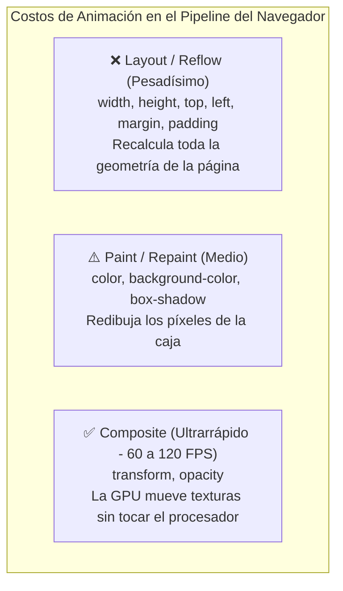

# Módulo 16: Animaciones con Keyframes y Rendimiento

Mientras que las transiciones requieren un cambio de estado disparado por el usuario (como un `:hover`), las **animaciones con `@keyframes`** pueden ejecutarse automáticamente, repetirse en bucle infinito y recorrer múltiples etapas intermedias de diseño.

---

## 16.1 Anatomía de una Animación con `@keyframes`

Una animación se compone de dos partes:
1. La regla **`@keyframes`**: Donde defines los fotogramas clave en porcentajes (`0%` a `100%`).
2. La propiedad **`animation`**: Donde aplicas esa coreografía al elemento HTML.

```css
/* 1. Definición de la coreografía: */
@keyframes flotarYBrillar {
  0% {
    transform: translateY(0);
    opacity: 0.6;
  }
  50% {
    transform: translateY(-10px);
    opacity: 1;
  }
  100% {
    transform: translateY(0);
    opacity: 0.6;
  }
}

/* 2. Aplicación sobre el elemento: */
.elemento-animado {
  /* nombre | duración | curva | retraso | repeticiones | dirección */
  animation: flotarYBrillar 3s ease-in-out infinite;
}
```

### La Clave de `animation-fill-mode: forwards`
Por defecto, cuando una animación termina, el elemento regresa abruptamente a sus estilos iniciales. Con `forwards`, el elemento **retiene los estilos del último fotograma (`100%`)**:

```css
.alerta-entrada {
  animation: deslizarEntrada 0.5s ease forwards;
}
```

---

## 16.2 El Costo Computacional: La Regla de los 60 FPS

Para que una animación se sienta fluida, el navegador debe generar **60 fotogramas por segundo (FPS)** (un fotograma cada 16.6 milisegundos).



> [!CAUTION]
> **La regla de oro del rendimiento:**
> En producción, **anima únicamente `transform` y `opacity`**. Si necesitas animar el movimiento de una caja, nunca cambies `left: 100px;`; usa `transform: translateX(100px);`. De lo contrario, provocarás caídas bruscas de fotogramas (*Jank / Layout Thrashing*), sobrecalentando la batería del móvil del usuario.

---

## 16.3 La Propiedad `will-change` (Úsala con Cuidado)

`will-change` le avisa al navegador con anticipación: *"Oye, este elemento va a cambiar de posición pronto; prepárale una capa separada en la tarjeta gráfica (GPU)"*:

```css
.menu-lateral-pesado {
  will-change: transform, opacity;
}
```

### ⚠️ El Peligro de abusar de `will-change`:
No le pongas `will-change` a todos los elementos de tu CSS. Cada capa en la GPU consume memoria de video (VRAM). Si saturas la memoria, el navegador se volverá mucho más lento que si no hubieras puesto nada.

---

## 16.4 Caso Real: Skeleton Loader a 60 FPS

Un patrón indispensable en Frontend es el efecto de carga esqueleto (*Skeleton Screen*) que brilla mientras se descargan datos de una API:

```css
@keyframes brilloSkeleton {
  0% {
    background-position: -200% 0;
  }
  100% {
    background-position: 200% 0;
  }
}

.skeleton {
  background: linear-gradient(
    90deg,
    #e2e8f0 25%,
    #f8fafc 50%,
    #e2e8f0 75%
  );
  background-size: 200% 100%;
  animation: brilloSkeleton 1.8s infinite linear;
  border-radius: 6px;
}

.skeleton-titulo {
  height: 24px;
  width: 60%;
  margin-bottom: 12px;
}

.skeleton-texto {
  height: 16px;
  width: 90%;
}
```

---

## 🛠️ Reto Práctico del Módulo

**Ejercicio: Spinner de Carga y Tarjeta Skeleton**

1. Diseña un spinner circular de carga utilizando un `border` con un lado de color diferente y anímalo girando infinitamente `360deg` a 60 FPS con `transform: rotate()`.
2. Maqueta una tarjeta con imagen falsa, título y dos líneas de texto usando la técnica de **Skeleton Loader**.
3. Abre la pestaña **Rendering** de las DevTools de tu navegador (F12) y activa la opción **"Paint flashing"**: comprueba que al animar con `transform` u `opacity` no se disparen repintados verdes innecesarios en toda la pantalla.
