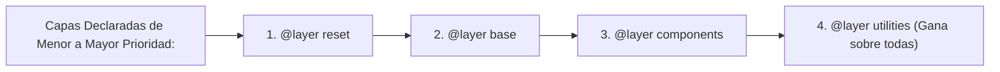

# Módulo 17: CSS Moderno: Nesting, `@layer` y `@supports`

Durante años dependíamos de herramientas de compilación pesadas como SASS, PostCSS o Less para tener características básicas como anidamiento o control de capas de estilos. Hoy, la especificación oficial de CSS incluye estas capacidades de forma **100% nativa en todos los navegadores modernos**.

---

## 17.1 Anidamiento Nativo (*Native CSS Nesting*)

Ya no necesitas un preprocesador para anidar selectores siguiendo la estructura del HTML. El símbolo **`&`** representa al selector padre:

```css
.tarjeta {
  background-color: white;
  padding: 1.5rem;
  border-radius: 8px;

  /* Hijos directos o descendientes anidados: */
  h2 {
    color: #1e293b;
    margin-bottom: 0.5rem;
  }

  /* Pseudo-clases del padre con el ampersand (&): */
  &:hover {
    box-shadow: 0 10px 15px rgba(0, 0, 0, 0.1);
  }

  /* Modificadores con BEM o clases compuestas: */
  &.tarjeta--destacada {
    border: 2px solid #3b82f6;
  }

  /* Elementos internos específicos: */
  & .boton-accion {
    margin-top: 1rem;
  }
}
```

---

## 17.2 Control de la Cascada con Capas: `@layer`

¿Alguna vez importaste una librería externa de componentes (como Bootstrap o una librería de iconos) y tuviste que llenar tu código de `!important` porque las clases de la librería tenían selectores con IDs o especificidad altísima?

Las **Capas de Cascada (`@layer`)** son la solución definitiva a las guerras de especificidad:



### La Regla de Oro de `@layer`:
**Una regla en una capa superior SIEMPRE gana sobre una regla en una capa inferior**, sin importar cuántos IDs o clases tenga el selector de la capa inferior:

```css
/* 1. Declaramos el orden explícito de prioridad al inicio del archivo: */
@layer reset, base, componentes, utilidades;

/* Capa de Componentes (incluso con ID pesado): */
@layer componentes {
  #alerta-principal.mensaje-urgente {
    background-color: red; /* Especificidad: 0-1-1-0 */
  }
}

/* Capa de Utilidades (con una simple clase ligera): */
@layer utilidades {
  .bg-verde {
    background-color: green; /* Especificidad: 0-0-1-0 */
  }
}
```

> 💡 **Resultado:** Aunque el selector con ID tiene más puntos de especificidad, **gana `.bg-verde`** porque la capa `utilidades` fue declarada después de la capa `componentes`. La especificidad tradicional solo compite *dentro* de la misma capa.

---

## 17.3 Detección de Soporte con `@supports`

Permite comprobar si el navegador del usuario soporta una propiedad o valor antes de aplicarlo, proveyendo un camino de respaldo seguro (*Progressive Enhancement*):

```css
/* Layout básico de respaldo con Flexbox para navegadores antiguos: */
.galeria {
  display: flex;
  flex-wrap: wrap;
}

/* Si el navegador soporta Subgrid, aplicamos la rejilla avanzada: */
@supports (grid-template-rows: subgrid) {
  .galeria {
    display: grid;
    grid-template-columns: repeat(3, 1fr);
  }
  .galeria__item {
    grid-row: span 3;
    grid-template-rows: subgrid;
  }
}

/* Comprobar soporte para selectores modernos: */
@supports selector(:has(a)) {
  .menu:has(.activo) {
    border-color: blue;
  }
}
```

---

## 17.4 Propiedades Lógicas: Preparados para Cualquier Idioma

Escribir `margin-left` asume que el texto siempre se lee de izquierda a derecha. Si tu sitio se traduce a árabe o hebreo (RTL - *Right to Left*), el diseño se rompe.

Las **propiedades lógicas** describen el espacio según el flujo del texto:

| Propiedad Física Clásica | Propiedad Lógica Moderna |
| :--- | :--- |
| `margin-left` / `margin-right` | **`margin-inline: 1rem;`** |
| `padding-top` / `padding-bottom` | **`padding-block: 1.5rem;`** |
| `width` | **`inline-size: 100%;`** |
| `height` | **`block-size: 500px;`** |
| `border-left` | **`border-inline-start: 2px solid blue;`** |

Si cambias `<html dir="rtl">`, ¡todo tu espaciado, márgenes y bordes se invierten automáticamente sin tocar una sola línea de CSS!

---

## 🛠️ Reto Práctico del Módulo

**Ejercicio: Arquitectura Profesional Basada en `@layer`**

Escribe una hoja de estilos completa organizada en 3 capas:
1. `@layer base`: Define estilos para etiquetas puras (`h1`, `p`, `button`) con colores y tipografía.
2. `@layer components`: Diseña un componente `.card` utilizando **Nesting nativo** (con estilos anidados para títulos y pseudo-clases `&:hover`).
3. `@layer utilities`: Crea clases de utilidad rápida como `.text-center` y `.hidden`.
4. Verifica en el inspector de estilos de las DevTools (F12) cómo el navegador agrupa las reglas visualmente dentro de sus respectivas pestañas `@layer`.
