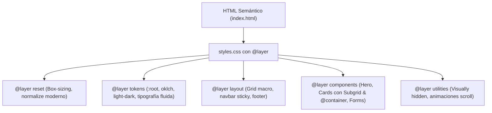

# Módulo 20: Proyecto Integrador: Landing & Dashboard Modular

En este proyecto integrador construirás una interfaz completa y moderna (Landing Page de producto SaaS con catálogo dinámico y panel de métricas) aplicando todos los conocimientos avanzados adquiridos a lo largo del curso:

1. **Arquitectura con `@layer`** (reset, tokens, layout, components, utilities).
2. **Sistema de diseño con CSS Custom Properties** (`light-dark()`, espacios fluidos, OKLCH).
3. **Layout maestro con CSS Grid y Subgrid** para alineación perfecta entre tarjetas.
4. **Componentes adaptables con Container Queries** (`@container`).
5. **Micro-interacciones y estados con `:has()`, `:focus-visible` y `accent-color`**.
6. **Animaciones vinculadas al scroll (`animation-timeline: scroll()`) y transiciones de vista**.

---

## 1. Arquitectura y Requerimientos



### Objetivos Técnicos:
- **Cero frameworks o dependencias externas:** 100% CSS nativo moderno.
- **Dark/Light Mode automático y manual:** Utilizando `light-dark()` y el selector `:has(:checked)`.
- **Alineación de catálogo:** Tarjetas de producto que utilicen `subgrid` en cabecera, contenido y precio/botón para alinearse equitativamente sin importar el texto.
- **Cards adaptables:** Tarjetas que cambian de diseño (vertical a horizontal) según el ancho de su contenedor, no del viewport.
- **Rendimiento óptimo:** Animaciones limitadas exclusivamente a `transform` y `opacity`.

---

## 2. Estructura HTML Semántica (`index.html`)

```html
<!DOCTYPE html>
<html lang="es">
<head>
  <meta charset="UTF-8" />
  <meta name="viewport" content="width=device-width, initial-scale=1.0" />
  <title>NexusSaaS - Plataforma Cloud</title>
  <link rel="stylesheet" href="styles.css" />
</head>
<body>
  <!-- Barra de progreso de lectura vinculada al scroll -->
  <div class="scroll-progress-bar" aria-hidden="true"></div>

  <!-- Header & Navegación -->
  <header class="site-header">
    <div class="header-container wrapper">
      <a href="#" class="logo">Nexus<span>Cloud</span></a>
      <nav class="main-nav">
        <ul>
          <li><a href="#caracteristicas">Características</a></li>
          <li><a href="#planes">Planes</a></li>
          <li><a href="#contacto">Contacto</a></li>
        </ul>
      </nav>

      <!-- Selector de Modo Oscuro con CSS :has() -->
      <label class="theme-switch" aria-label="Cambiar tema">
        <input type="checkbox" id="theme-toggle" />
        <span class="theme-icon"></span>
      </label>
    </div>
  </header>

  <main>
    <!-- Hero Section -->
    <section class="hero wrapper">
      <div class="hero-content">
        <span class="badge">Nuevo Release v3.0</span>
        <h1 class="hero-title">Escala tu infraestructura frontend sin fricción</h1>
        <p class="hero-desc">
          Monitoreo en tiempo real, despliegue global perimetral y análisis predictivo
          diseñado para equipos que se mueven rápido.
        </p>
        <div class="hero-actions">
          <button class="btn btn-primary">Iniciar prueba gratuita</button>
          <button class="btn btn-secondary">Explorar documentación</button>
        </div>
      </div>
      <div class="hero-preview">
        <div class="glass-card">
          <div class="card-metric">
            <span class="label">Latencia Global</span>
            <span class="value">14ms</span>
          </div>
          <div class="card-metric">
            <span class="label">Uptime SLA</span>
            <span class="value">99.99%</span>
          </div>
        </div>
      </div>
    </section>

    <!-- Catálogo con Subgrid y Container Queries -->
    <section id="planes" class="pricing-section wrapper">
      <h2 class="section-title">Nuestros Planes</h2>
      <p class="section-subtitle">Elige el nivel de escalabilidad ideal para tu arquitectura.</p>

      <div class="pricing-grid">
        <!-- Card 1 -->
        <div class="pricing-card-wrapper">
          <article class="pricing-card">
            <header class="card-header">
              <h3>Developer</h3>
              <p class="desc">Para prototipos y proyectos personales en desarrollo rápido.</p>
            </header>
            <div class="card-body">
              <span class="price">$0<span>/mes</span></span>
              <ul class="features">
                <li>3 Proyectos incluidos</li>
                <li>Despliegues estáticos ilimitados</li>
                <li>Soporte comunitario</li>
              </ul>
            </div>
            <footer class="card-footer">
              <button class="btn btn-secondary">Comenzar gratis</button>
            </footer>
          </article>
        </div>

        <!-- Card 2 (Destacada) -->
        <div class="pricing-card-wrapper">
          <article class="pricing-card highlighted">
            <header class="card-header">
              <span class="popular-tag">Más Popular</span>
              <h3>Pro Team</h3>
              <p class="desc">Para startups y equipos en producción que necesitan alta disponibilidad, analítica y múltiples entornos colaborativos.</p>
            </header>
            <div class="card-body">
              <span class="price">$49<span>/mes</span></span>
              <ul class="features">
                <li>Proyectos ilimitados</li>
                <li>Edge computing global</li>
                <li>SLA del 99.95%</li>
                <li>Soporte 24/7 prioritario</li>
              </ul>
            </div>
            <footer class="card-footer">
              <button class="btn btn-primary">Adquirir Pro</button>
            </footer>
          </article>
        </div>

        <!-- Card 3 -->
        <div class="pricing-card-wrapper">
          <article class="pricing-card">
            <header class="card-header">
              <h3>Enterprise</h3>
              <p class="desc">Infraestructura dedicada, seguridad avanzada y cumplimiento SOC2.</p>
            </header>
            <div class="card-body">
              <span class="price">$199<span>/mes</span></span>
              <ul class="features">
                <li>Clústeres dedicados</li>
                <li>SLA del 99.99% garantizado</li>
                <li>Auditorías y SSO SAML</li>
              </ul>
            </div>
            <footer class="card-footer">
              <button class="btn btn-secondary">Contactar ventas</button>
            </footer>
          </article>
        </div>
      </div>
    </section>

    <!-- Formulario Moderno con validaciones y :has() -->
    <section id="contacto" class="contact-section wrapper">
      <div class="form-container">
        <h2>Suscríbete al boletín técnico</h2>
        <form class="newsletter-form">
          <div class="form-field">
            <input type="text" id="name" placeholder=" " required minlength="3" />
            <label for="name">Nombre completo</label>
            <span class="field-error">Ingresa al menos 3 caracteres</span>
          </div>

          <div class="form-field">
            <input type="email" id="email" placeholder=" " required />
            <label for="email">Correo electrónico corporativo</label>
            <span class="field-error">Ingresa un correo electrónico válido</span>
          </div>

          <button type="submit" class="btn btn-primary">Registrarse</button>
        </form>
      </div>
    </section>
  </main>

  <footer class="site-footer">
    <div class="wrapper">
      <p>&copy; 2026 NexusCloud Inc. Diseñado con CSS3 Moderno nativo.</p>
    </div>
  </footer>
</body>
</html>
```

---

## 3. Hoja de Estilos Completa (`styles.css`)

```css
/* ==========================================================================
   1. DECLARACIÓN DE CAPAS (CASCADE LAYERS)
   ========================================================================== */
@layer reset, tokens, layout, components, utilities;

/* ==========================================================================
   2. LAYER: RESET & NORMALIZACIÓN
   ========================================================================== */
@layer reset {
  *, *::before, *::after {
    box-sizing: border-box;
    margin: 0;
    padding: 0;
  }

  html {
    -webkit-text-size-adjust: 100%;
    scroll-behavior: smooth;
    tab-size: 4;
  }

  body {
    min-height: 100dvh;
    line-height: 1.6;
    text-rendering: optimizeLegibility;
    -webkit-font-smoothing: antialiased;
    font-family: system-ui, -apple-system, BlinkMacSystemFont, 'Segoe UI', Roboto, sans-serif;
  }

  img, picture, video, canvas, svg {
    display: block;
    max-width: 100%;
  }

  input, button, textarea, select {
    font: inherit;
    color: inherit;
  }

  button {
    cursor: pointer;
    background: none;
    border: none;
  }

  ul, ol {
    list-style: none;
  }
}

/* ==========================================================================
   3. LAYER: TOKENS & THEMING
   ========================================================================== */
@layer tokens {
  :root {
    color-scheme: light dark;

    /* Colores base con OKLCH */
    --brand-hue: 260;
    --primary: oklch(0.60 0.22 var(--brand-hue));
    --primary-hover: oklch(0.50 0.24 var(--brand-hue));
    --primary-light: oklch(0.92 0.06 var(--brand-hue));

    /* Theming dinámico con light-dark() */
    --bg-page: light-dark(#f8fafc, #0b0f19);
    --bg-surface: light-dark(#ffffff, #111827);
    --bg-glass: light-dark(rgba(255, 255, 255, 0.75), rgba(17, 24, 39, 0.75));
    --border-color: light-dark(oklch(0.88 0.01 260), oklch(0.28 0.02 260));
    
    --text-main: light-dark(oklch(0.20 0.02 260), oklch(0.95 0.01 260));
    --text-muted: light-dark(oklch(0.45 0.02 260), oklch(0.70 0.02 260));

    /* Sombras */
    --shadow-sm: 0 1px 2px rgba(0, 0, 0, 0.05);
    --shadow-md: 0 4px 6px -1px rgba(0, 0, 0, 0.1), 0 2px 4px -2px rgba(0, 0, 0, 0.1);
    --shadow-lg: 0 20px 25px -5px rgba(0, 0, 0, 0.15), 0 8px 10px -6px rgba(0, 0, 0, 0.1);

    /* Tipografía y Espaciado Fluido */
    --font-size-hero: clamp(2rem, 1.2rem + 3.5vw, 3.75rem);
    --font-size-h2: clamp(1.75rem, 1.2rem + 2vw, 2.5rem);
    --space-section: clamp(3rem, 1.5rem + 5vw, 6rem);
    --space-gap: clamp(1rem, 0.5rem + 2vw, 2rem);
    --radius-md: 12px;
    --radius-lg: 20px;
  }

  /* Cambio de tema manual mediante :has() */
  html:has(#theme-toggle:checked) {
    color-scheme: dark;
  }

  body {
    background-color: var(--bg-page);
    color: var(--text-main);
    transition: background-color 0.3s ease, color 0.3s ease;
  }
}

/* ==========================================================================
   4. LAYER: LAYOUT
   ========================================================================== */
@layer layout {
  .wrapper {
    width: min(100% - 2.5rem, 1200px);
    margin-inline: auto;
  }

  .site-header {
    position: sticky;
    top: 0;
    z-index: 100;
    background-color: var(--bg-glass);
    backdrop-filter: blur(12px);
    -webkit-backdrop-filter: blur(12px);
    border-bottom: 1px solid var(--border-color);
  }

  .header-container {
    display: flex;
    justify-content: space-between;
    align-items: center;
    padding-block: 1rem;

    .logo {
      font-weight: 800;
      font-size: 1.35rem;
      text-decoration: none;
      color: var(--text-main);

      span {
        color: var(--primary);
      }
    }

    .main-nav ul {
      display: flex;
      gap: 1.5rem;

      a {
        text-decoration: none;
        color: var(--text-muted);
        font-weight: 500;
        transition: color 0.2s ease;

        &:hover {
          color: var(--primary);
        }
      }
    }
  }

  main {
    display: flex;
    flex-direction: column;
    gap: var(--space-section);
    padding-block-end: var(--space-section);
  }

  .site-footer {
    border-top: 1px solid var(--border-color);
    padding-block: 2.5rem;
    text-align: center;
    color: var(--text-muted);
    font-size: 0.9rem;
  }
}

/* ==========================================================================
   5. LAYER: COMPONENTS
   ========================================================================== */
@layer components {
  /* Botones Reutilizables */
  .btn {
    display: inline-flex;
    align-items: center;
    justify-content: center;
    padding: 0.75rem 1.5rem;
    border-radius: var(--radius-md);
    font-weight: 600;
    transition: transform 0.2s ease, box-shadow 0.2s ease, background-color 0.2s ease;

    &:active {
      transform: scale(0.98);
    }

    &:focus-visible {
      outline: 2px solid var(--primary);
      outline-offset: 3px;
    }

    &.btn-primary {
      background-color: var(--primary);
      color: #ffffff;
      box-shadow: 0 4px 14px oklch(0.60 0.22 var(--brand-hue) / 0.4);

      &:hover {
        background-color: var(--primary-hover);
        box-shadow: 0 6px 20px oklch(0.60 0.22 var(--brand-hue) / 0.6);
      }
    }

    &.btn-secondary {
      background-color: var(--bg-surface);
      color: var(--text-main);
      border: 1px solid var(--border-color);

      &:hover {
        background-color: var(--border-color);
      }
    }
  }

  /* Theme Switcher */
  .theme-switch {
    display: grid;
    place-items: center;
    cursor: pointer;

    input {
      position: absolute;
      opacity: 0;
      pointer-events: none;
    }

    .theme-icon::before {
      content: '☀️';
      font-size: 1.25rem;
    }

    &:has(input:checked) .theme-icon::before {
      content: '🌙';
    }
  }

  /* Hero Section */
  .hero {
    display: grid;
    grid-template-columns: 1fr;
    gap: var(--space-gap);
    padding-block-start: clamp(2rem, 1rem + 3vw, 4rem);
    align-items: center;

    @media (width >= 860px) {
      grid-template-columns: 1.2fr 0.8fr;
    }

    .badge {
      display: inline-block;
      padding: 0.35rem 0.85rem;
      border-radius: 9999px;
      font-size: 0.8rem;
      font-weight: 700;
      background-color: var(--primary-light);
      color: var(--primary);
      margin-bottom: 1rem;
    }

    .hero-title {
      font-size: var(--font-size-hero);
      line-height: 1.1;
      font-weight: 800;
      letter-spacing: -0.02em;
      margin-bottom: 1.25rem;
    }

    .hero-desc {
      font-size: clamp(1rem, 0.95rem + 0.3vw, 1.2rem);
      color: var(--text-muted);
      margin-bottom: 2rem;
      max-width: 55ch;
    }

    .hero-actions {
      display: flex;
      flex-wrap: wrap;
      gap: 1rem;
    }
  }

  /* Glass Card Metrics */
  .glass-card {
    background: var(--bg-glass);
    border: 1px solid var(--border-color);
    padding: 2.5rem;
    border-radius: var(--radius-lg);
    box-shadow: var(--shadow-lg);
    backdrop-filter: blur(16px);
    display: flex;
    flex-direction: column;
    gap: 1.5rem;

    .card-metric {
      display: flex;
      justify-content: space-between;
      align-items: baseline;
      border-bottom: 1px dashed var(--border-color);
      padding-bottom: 0.75rem;

      .label {
        color: var(--text-muted);
        font-weight: 500;
      }

      .value {
        font-size: 1.75rem;
        font-weight: 800;
        color: var(--primary);
      }
    }
  }

  /* Pricing Grid con Subgrid y Container Queries */
  .pricing-section {
    text-align: center;

    .section-title {
      font-size: var(--font-size-h2);
      font-weight: 800;
    }

    .section-subtitle {
      color: var(--text-muted);
      margin-block: 0.5rem 2.5rem;
    }
  }

  .pricing-grid {
    display: grid;
    grid-template-columns: repeat(auto-fit, minmax(280px, 1fr));
    gap: var(--space-gap);
    text-align: left;
  }

  /* Definición de Contenedor */
  .pricing-card-wrapper {
    container-type: inline-size;
  }

  /* Tarjeta con Subgrid para alineación uniforme */
  .pricing-card {
    display: grid;
    grid-template-rows: subgrid;
    grid-row: span 3;
    row-gap: 1.5rem;
    background-color: var(--bg-surface);
    border: 1px solid var(--border-color);
    border-radius: var(--radius-lg);
    padding: 2rem;
    box-shadow: var(--shadow-sm);
    position: relative;
    transition: transform 0.25s ease, box-shadow 0.25s ease;

    &:hover {
      transform: translateY(-4px);
      box-shadow: var(--shadow-lg);
    }

    &.highlighted {
      border-color: var(--primary);
      box-shadow: 0 0 0 2px var(--primary);
    }

    .popular-tag {
      position: absolute;
      top: -12px;
      right: 20px;
      background: var(--primary);
      color: white;
      font-size: 0.75rem;
      font-weight: 700;
      padding: 0.2rem 0.6rem;
      border-radius: 9999px;
    }

    .card-header h3 {
      font-size: 1.35rem;
      margin-bottom: 0.5rem;
    }

    .card-header .desc {
      color: var(--text-muted);
      font-size: 0.9rem;
    }

    .price {
      display: block;
      font-size: 2.5rem;
      font-weight: 800;
      margin-bottom: 1.25rem;

      span {
        font-size: 1rem;
        font-weight: 400;
        color: var(--text-muted);
      }
    }

    .features {
      display: flex;
      flex-direction: column;
      gap: 0.75rem;
      font-size: 0.95rem;

      li::before {
        content: '✓';
        color: var(--primary);
        font-weight: 800;
        margin-right: 0.5rem;
      }
    }

    .card-footer .btn {
      width: 100%;
    }
  }

  /* Formulario con Floating Labels y validación nativa */
  .contact-section {
    background: var(--bg-surface);
    border: 1px solid var(--border-color);
    border-radius: var(--radius-lg);
    padding: clamp(2rem, 1rem + 3vw, 4rem);

    .form-container {
      max-width: 500px;
      margin-inline: auto;
      text-align: center;

      h2 {
        font-size: var(--font-size-h2);
        margin-bottom: 2rem;
      }
    }

    .newsletter-form {
      display: flex;
      flex-direction: column;
      gap: 1.5rem;
    }

    .form-field {
      position: relative;
      text-align: left;

      input {
        width: 100%;
        padding: 1rem 0.75rem;
        border: 1px solid var(--border-color);
        border-radius: var(--radius-md);
        background: transparent;
        outline: none;
        transition: border-color 0.2s ease;

        &:focus {
          border-color: var(--primary);
        }

        /* Floating label */
        &:focus ~ label,
        &:not(:placeholder-shown) ~ label {
          transform: translateY(-1.4rem) scale(0.85);
          background-color: var(--bg-surface);
          padding-inline: 0.3rem;
          color: var(--primary);
        }

        /* Validación nativa al tocar el input */
        &:user-invalid {
          border-color: oklch(0.60 0.24 25);
        }

        &:user-invalid ~ .field-error {
          display: block;
        }
      }

      label {
        position: absolute;
        left: 0.75rem;
        top: 1rem;
        color: var(--text-muted);
        pointer-events: none;
        transform-origin: left top;
        transition: transform 0.2s ease, color 0.2s ease;
      }

      .field-error {
        display: none;
        font-size: 0.75rem;
        color: oklch(0.60 0.24 25);
        margin-top: 0.35rem;
      }
    }
  }
}

/* ==========================================================================
   6. LAYER: UTILITIES & MODERN SCROLL ANIMATIONS
   ========================================================================== */
@layer utilities {
  /* Barra de progreso de lectura ligada al scroll */
  .scroll-progress-bar {
    position: fixed;
    top: 0;
    left: 0;
    width: 100%;
    height: 4px;
    background: var(--primary);
    transform-origin: left center;
    z-index: 1000;
    animation: grow-progress linear auto;
    animation-timeline: scroll(root block);
  }

  @keyframes grow-progress {
    from {
      transform: scaleX(0);
    }
    to {
      transform: scaleX(1);
    }
  }

  /* Fade-in reveal en tarjetas al entrar en pantalla */
  @keyframes reveal-card {
    from {
      opacity: 0;
      transform: translateY(30px);
    }
    to {
      opacity: 1;
      transform: translateY(0);
    }
  }

  @supports (animation-timeline: view()) {
    .pricing-card-wrapper {
      animation: reveal-card linear both;
      animation-timeline: view();
      animation-range: entry 10% cover 30%;
    }
  }

  /* Respeto estricto a las preferencias de accesibilidad */
  @media (prefers-reduced-motion: reduce) {
    *, *::before, *::after {
      animation-duration: 0.01ms !important;
      animation-iteration-count: 1 !important;
      transition-duration: 0.01ms !important;
      scroll-behavior: auto !important;
    }
  }
}
```

---

## 4. Rúbrica y Lista de Autoevaluación

Para considerar el proyecto completado al 100%, verifica cada uno de los siguientes criterios en tu navegador:

- [ ] **Capas de Cascada (`@layer`):** Todas las reglas están encapsuladas sin conflictos de especificidad ni uso de `!important`.
- [ ] **Alineación con Subgrid:** Los botones y títulos de las tarjetas de precios permanecen perfectamente alineados horizontalmente, sin importar que una tarjeta tenga descripciones con mayor cantidad de líneas.
- [ ] **Theming & `light-dark()`:** Al alternar el checkbox de tema, la paleta cambia instantáneamente de clara a oscura sin parpadeos y los contrastes cumplen con WCAG AAA.
- [ ] **Diseño Fluido:** Ni la tipografía ni los espaciados se desbordan o provocan scroll horizontal en ningún ancho entre `320px` y `2560px`.
- [ ] **Floating Labels y Validación:** Los campos del formulario muestran validación nativa únicamente tras interactuar con ellos (`:user-invalid`).
- [ ] **Accesibilidad (`prefers-reduced-motion`):** Al activar "Reducir movimiento" en las preferencias del sistema operativo, las animaciones de scroll y transiciones quedan suprimidas.
