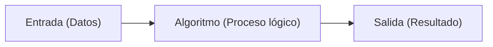
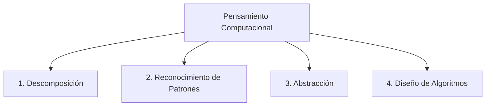
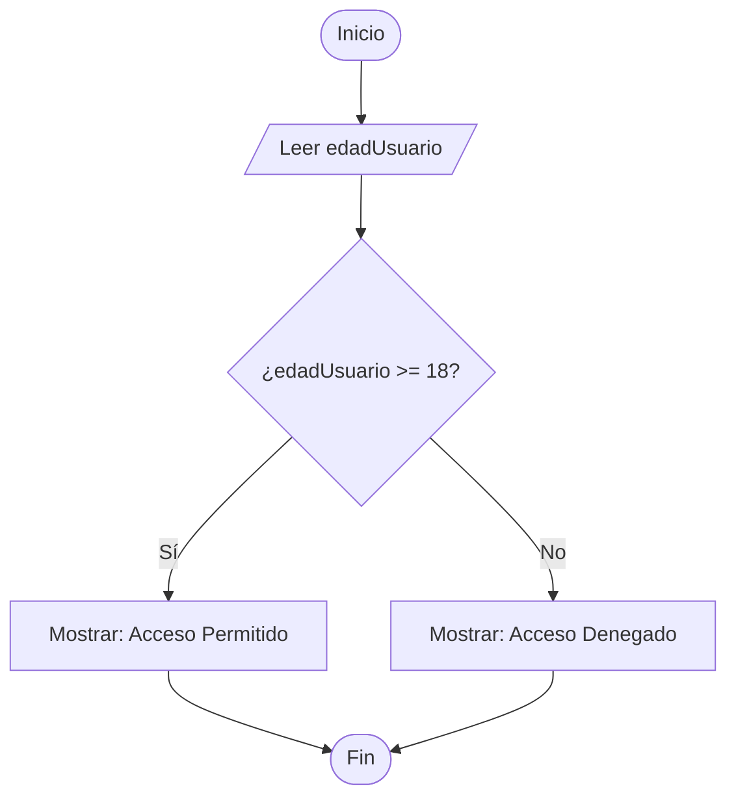

# Módulo 1: Pensamiento Computacional y Algoritmos

Antes de escribir una sola línea de código en cualquier lenguaje, existe una habilidad previa que separa a quienes simplemente copian sintaxis de quienes realmente saben resolver problemas: el **pensamiento computacional**.

Programar no consiste en memorizar palabras en inglés (`if`, `for`, `function`); programar es el arte de **descomponer un problema de la vida real en instrucciones tan claras y precisas que hasta una máquina sin conciencia pueda ejecutarlas**.

---

## 1.1 ¿Qué es un Algoritmo?

Un **algoritmo** es una secuencia ordenada, finita y no ambigua de pasos que conducen a la solución de un problema o a la realización de una tarea determinada.



### Características Obligatorias de Todo Algoritmo:
1. **Finitud:** Debe tener un inicio y un final claramente delimitados. No puede ejecutarse eternamente sin rumbo.
2. **Precisión:** Cada paso debe estar rigurosamente definido. "Agrega un poco de sal" no es algorítmico; "Agrega 5 gramos de sal" sí lo es.
3. **Determinismo (No ambigüedad):** Dados exactamente los mismos datos de entrada, el algoritmo debe producir siempre el mismo resultado.
4. **Entrada y Salida:** Recibe cero o más datos de entrada y genera uno o más resultados comprobables.

> 💡 **La regla de oro de la informática:**
> Una computadora es sumamente rápida, pero absolutamente literal. Nunca asume intenciones: **hace exactamente lo que le dices que haga, no lo que quisiste decirle**.

---

## 1.2 Los 4 Pilares del Pensamiento Computacional

Cuando un ingeniero de software se enfrenta a un requerimiento complejo, aplica cuatro técnicas cognitivas fundamentales:



### 1. Descomposición
Consiste en tomar un problema gigante y abrumador y dividirlo en subproblemas más pequeños y manejables (técnica de *Divide y Vencerás*).
* *Ejemplo:* Si tienes que construir un sistema de comercio electrónico, no lo resuelves todo a la vez. Lo divides en:
  1. Validar si el usuario existe.
  2. Verificar si hay stock disponible.
  3. Calcular impuestos y gastos de envío.
  4. Procesar el cobro bancario.
  5. Descontar el stock y enviar un email de confirmación.

### 2. Reconocimiento de Patrones
Identificar similitudes, regularidades o tendencias entre problemas actuales y problemas resueltos en el pasado.
* *Ejemplo:* Calcular el total con IVA de un carrito de compras y calcular la propina de una cuenta de restaurante siguen el mismo patrón: `Total = MontoBase + (MontoBase * Porcentaje)`.

### 3. Abstracción
Filtrar los detalles irrelevantes para concentrarse únicamente en la información verdaderamente necesaria para resolver el problema.
* *Ejemplo:* Si modelas un usuario para una tienda de ropa en línea, necesitas su nombre, correo, talla y dirección de envío. Su tipo de sangre, su color de ojos o la marca de su auto son detalles que debes descartar mediante la abstracción.

### 4. Diseño de Algoritmos
Establecer la serie lógica de pasos ordenados paso a paso para resolver cada subproblema obtenido en la fase de descomposición.

---

## 1.3 El Modelo Mental Universal: Entrada ➔ Proceso ➔ Salida (IPO)

Cualquier programa informático del mundo, desde una calculadora básica hasta un modelo de inteligencia artificial de última generación, encaja dentro del modelo **IPO (Input - Process - Output)**:

| Fase | Pregunta Clave | Ejemplo: Cálculo de Envío Gratis |
| :--- | :--- | :--- |
| **Entrada (Input)** | ¿Qué datos necesito recibir del exterior? | Subtotal de compra (`$65.00`) y distancia (`12 km`). |
| **Proceso (Process)** | ¿Qué reglas de negocio y transformaciones debo aplicar? | Si el subtotal es mayor a `$50.00` y la distancia es menor a `15 km`, el costo es `$0.00`. Si no, sumar `$5.00` base + `$1.00` por km excedente. |
| **Salida (Output)** | ¿Qué resultado final debo entregar al usuario o sistema? | Costo final de envío (`$0.00`) y mensaje (`"¡Envío gratuito aplicado!"`). |

---

## 1.4 Pseudocódigo y Diagramas de Flujo

Escribir código directamente en el editor sin planificar suele conducir a código espagueti y horas perdidas depurando. Para estructurar la solución usamos dos herramientas previas:

### A. Pseudocódigo
Es una forma de escribir algoritmos utilizando un lenguaje humano estructurado, independiente de cualquier sintaxis de programación formal.

```text
ALGORITMO ValidarAccesoDiscoteca
  ENTRADA: edadUsuario (Número)
  
  INICIO
    SI edadUsuario >= 18 ENTONCES
      MOSTRAR "Acceso permitido: Eres mayor de edad."
      PERMITIR_PASO = VERDADERO
    SINO
      MOSTRAR "Acceso denegado: Eres menor de edad."
      PERMITIR_PASO = FALSO
    FIN SI
    
    RETORNAR PERMITIR_PASO
  FIN
```

### B. Diagramas de Flujo
Representación visual y gráfica del flujo lógico de un algoritmo. Los símbolos estándar son:

* **Óvalo / Terminal:** Marca el `Inicio` o el `Fin` del proceso.
* **Rectángulo:** Representa una instrucción u operación interna (cálculo, asignación de variable).
* **Rombo:** Representa una decisión condicional con dos o más caminos (verdadero/falso).
* **Paralelogramo:** Representa una operación de Entrada o Salida de datos.



---

## 1.5 Patrones Lógicos Fundamentales

En programación existen ciertos patrones repetitivos que utilizarás una y otra vez:

### 1. El Patrón Acumulador
Una variable que comienza en un valor neutral (normalmente `0` para sumas o `1` para multiplicaciones) y va "acumulando" resultados sucesivos.
* *Pseudocódigo:*
  ```text
  total = 0
  POR CADA producto EN carrito:
      total = total + producto.precio
  ```

### 2. El Patrón Contador
Una variable numérica que se incrementa en una cantidad fija (habitualmente de uno en uno: `contador = contador + 1`) para registrar cuántas veces ocurre un evento.
* *Pseudocódigo:*
  ```text
  intentosFallidos = 0
  SI contraseñaEsIncorrecta:
      intentosFallidos = intentosFallidos + 1
  ```

### 3. La Bandera Booleana (*Flag*)
Una variable de tipo verdadero/falso que actúa como un interruptor para recordar si un evento o condición ocurrió durante el proceso.
* *Pseudocódigo:*
  ```text
  usuarioEncontrado = FALSO
  POR CADA usuario EN baseDeDatos:
      SI usuario.email == emailBuscado:
          usuarioEncontrado = VERDADERO
  ```

---

## 🛠️ Reto Práctico del Módulo

**Problema:** Imagina que tienes una máquina expendedora de café que acepta monedas de `$1`, `$2`, `$5` y `$10`. Un café cuesta `$15`. La máquina debe aceptar monedas hasta alcanzar o superar el precio, entregar el café y calcular el cambio si el usuario pagó de más.

**Tu misión:**
1. Identifica claramente las **Entradas**, el **Proceso** y las **Salidas** (modelo IPO).
2. Escribe el algoritmo en **pseudocódigo** limpio utilizando los conceptos de acumulador y decisión condicional.
3. Dibuja el diagrama de flujo mentalmente o en una hoja de papel para verificar que no haya cabos sueltos ni bucles infinitos.
