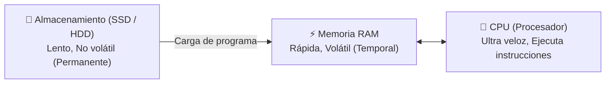
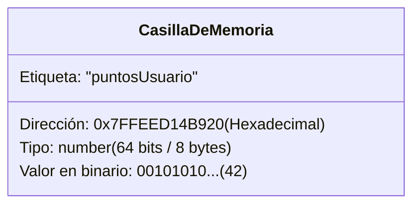
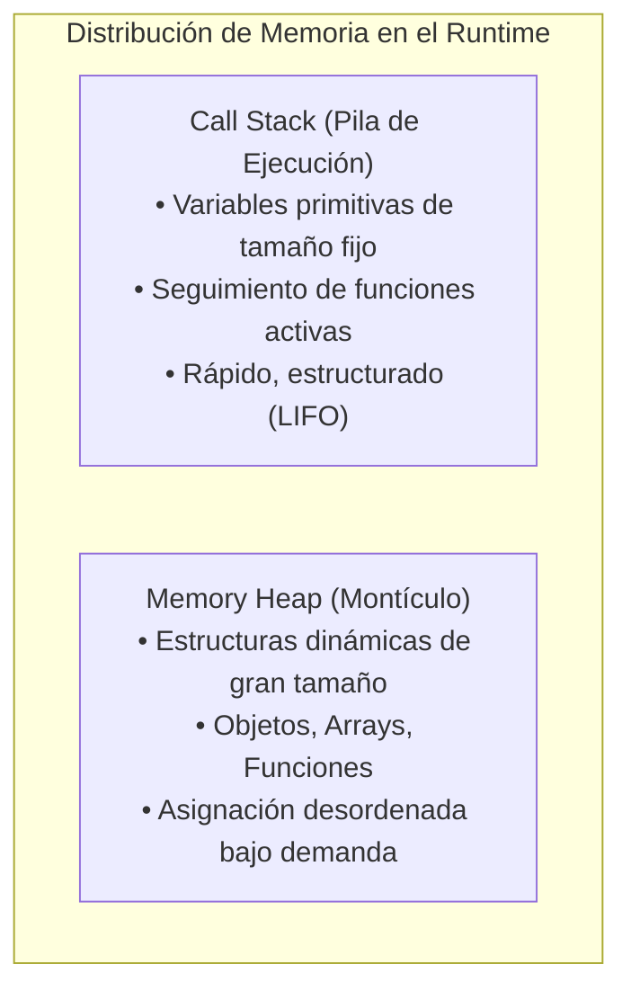

# Módulo 2: Cómo Funciona una Computadora y el Código

Muchos desarrolladores principiantes escriben código viéndolo como una fórmula mágica. Sin embargo, cuando comprendes qué sucede físicamente dentro del procesador y en la memoria al presionar "Ejecutar", los errores dejan de ser un misterio y optimizar programas se vuelve natural.

---

## 2.1 Hardware Esencial: Los 3 Componentes Clave

Todo dispositivo informático (tu laptop, tu smartphone o un servidor en la nube) procesa información mediante tres piezas fundamentales:



1. **CPU (Unidad Central de Procesamiento):**
   * Es el "cerebro" matemático de la computadora. Contiene la Unidad Aritmético Lógica (ALU) y registros ultrarrápidos.
   * Ejecuta miles de millones de instrucciones elementales por segundo (ciclos de reloj en Gigahertz, GHz).
2. **Memoria RAM (Random Access Memory):**
   * Es la mesa de trabajo de la CPU. Cuando abres un programa, el sistema operativo lo copia desde el disco a la memoria RAM.
   * **Es volátil:** si apagas la computadora o cierras el programa, todo lo que estaba en la RAM desaparece de inmediato.
   * **Acceso aleatorio:** la CPU puede acceder a cualquier celda de memoria en el mismo tiempo, sin importar en qué posición física se encuentre.
3. **Almacenamiento Secundario (SSD / HDD):**
   * Es el archivo permanente de tu computadora. Es millones de veces más lento que la RAM, pero conserva la información cuando no hay corriente eléctrica.

### ¿Cómo entiende la máquina los datos? Bits y Bytes
A nivel físico, los transistores de la CPU solo entienden dos estados: **presencia de voltaje (`1`)** o **ausencia de voltaje (`0`)**. A esto lo llamamos un **bit** (*binary digit*).
* 1 Bit = `0` o `1`.
* 1 Byte = 8 bits consecutivos (ejemplo: `01000001` representa la letra 'A' en formato ASCII).
* 1 Kilobyte (KB) = 1,024 bytes.
* 1 Megabyte (MB) = 1,024 KB.
* 1 Gigabyte (GB) = 1,024 MB.

---

## 2.2 ¿Qué es una Variable en Memoria?

Cuando escribes en tu código una instrucción como:

```typescript
let puntosUsuario: number = 42;
```

A nivel de hardware, ocurren cuatro cosas concretas:



1. **Dirección de Memoria:** El sistema operativo aparta un espacio físico en la memoria RAM, identificado por un número hexadecimal único (por ejemplo: `0x7FFEED14B920`).
2. **Etiqueta (Identificador):** Como a los humanos nos cuesta recordar direcciones como `0x7FFEED...`, el compilador nos permite asociar un nombre amigable: `puntosUsuario`.
3. **Tipo de Dato:** Determina cuántos bytes de memoria debe reservar la máquina y cómo debe interpretar esos ceros y unos.
4. **Valor:** El contenido real que se graba en los transistores correspondientes a esa dirección.

---

## 2.3 Compiladores vs Intérpretes vs Transpiladores

Las computadoras no entienden palabras en inglés como `function` o `return`. Solo entienden **código máquina** (secuencias de ceros y unos). Existen tres formas principales de traducir nuestro código humano:

| Tipo | ¿Cómo funciona? | Ventaja | Desventaja | Ejemplos |
| :--- | :--- | :--- | :--- | :--- |
| **Compilador** | Traduce **todo** el código fuente a un archivo binario ejecutable (`.exe`, `.bin`) antes de que el usuario lo corra. | Máxima velocidad de ejecución en tiempo real. | Proceso de compilación previo; el ejecutable depende del sistema operativo. | C, C++, Rust, Go |
| **Intérprete** | Un programa lee el código fuente **línea por línea** y lo va ejecutando directamente sobre la marcha. | Portabilidad inmediata; ideal para pruebas rápidas y scripting. | Velocidad de ejecución más lenta que el código compilado nativo. | Python clásico, Ruby, PHP antiguo |
| **Motor JIT** *(Híbrido)* | Interpreta el código al inicio, pero identifica partes repetidas ("hot paths") y las compila a código máquina en plena ejecución. | Combina la flexibilidad de los lenguajes dinámicos con una velocidad impresionante. | Consumo inicial de memoria en el arranque. | Motor **V8** (Google Chrome y Node.js), SpiderMonkey (Firefox) |
| **Transpilador** | Traduce código de un lenguaje a **otro lenguaje de nivel similar**, no a código binario. | Permite usar características avanzadas o tipado estricto en ecosistemas existentes. | Requiere un paso de build o empaquetado. | **TypeScript ➔ JavaScript**, Babel, Sass ➔ CSS |

> [!IMPORTANT]
> **El navegador jamás ejecuta TypeScript.**
> TypeScript es una herramienta pensada exclusivamente para el desarrollador. Antes de llegar a Chrome, Safari o Firefox, el compilador de TypeScript (`tsc`) o empaquetadores como Vite eliminan todos los tipos e interfaces, entregando **JavaScript estándar** que el motor del navegador pueda interpretar.

---

## 2.4 El Entorno de Ejecución (Runtime)

Cuando ejecutas código en el navegador o en Node.js, este vive dentro de un entorno de ejecución (*runtime*). En el ecosistema de JavaScript y TypeScript, la memoria se organiza en dos zonas clave:



### 1. El Call Stack (Pila de Ejecución)
* Es una estructura de datos lineal y ultra rápida.
* Almacena las variables primitivas (números, booleanos) y lleva el control estricto de **qué función se está ejecutando ahora mismo** y a dónde debe volver cuando termine.
* Si una función llama a otra función infinitamente, el Call Stack se llena hasta agotar la memoria asignada, provocando el famoso error: `Maximum call stack size exceeded` (**Stack Overflow**).

### 2. El Memory Heap (Montículo de Memoria)
* Es un espacio amplio de memoria no estructurado.
* Aquí se almacenan los objetos complejos, listas (arrays) y funciones, cuyo tamaño no se conoce con exactitud de antemano o puede crecer dinámicamente con el tiempo.
* Las variables en el Stack guardan una "tarjeta de referencia" (puntero) que apunta a la ubicación real del objeto en el Heap.

### 3. El Garbage Collector (Recolector de Basura)
En lenguajes como C, el programador debe liberar la memoria manualmente cuando deja de usar un dato. Si lo olvida, el programa consume toda la RAM de la máquina (*Memory Leak*). 
En JavaScript y TypeScript, un proceso automático llamado **Garbage Collector** monitorea periódicamente la memoria y elimina del Heap cualquier objeto al que ya no apunte ninguna referencia activa.

---

## 🛠️ Reto Práctico del Módulo

**Ejercicio de Trazabilidad Mental:**

Observa este código:

```typescript
function duplicar(num: number): number {
  let resultado: number = num * 2;
  return resultado;
}

let edad: number = 20;
let edadDoble: number = duplicar(edad);
```

**Responde a las siguientes preguntas con lo aprendido:**
1. ¿Qué variables y funciones entran primero al **Call Stack** al arrancar el programa?
2. Cuando la función `duplicar(edad)` termina de ejecutarse y devuelve el valor `40`, ¿qué le sucede a la variable local `resultado` en la memoria RAM?
3. ¿Por qué el archivo `.ts` que contiene este código no puede ser enlazado directamente en una etiqueta `<script src="archivo.ts">` sin pasar por un proceso de transpilación previa?
