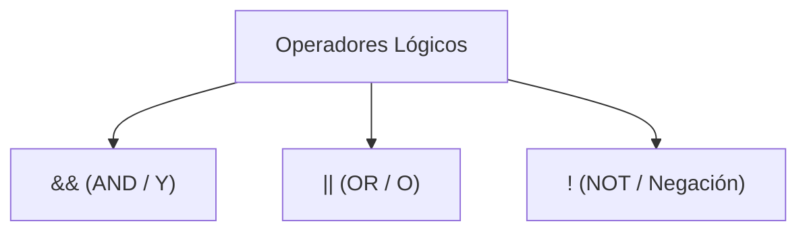

# Módulo 4: Lógica Booleana y Control de Flujo

Los programas no son líneas rectas que se ejecutan ciegamente de principio a fin. Un programa inteligente es capaz de evaluar su entorno, tomar decisiones y bifurcar su comportamiento en función de las circunstancias. A esto le llamamos **control de flujo**.

---

## 4.1 Lógica Booleana y Tablas de Verdad

Para construir condiciones complejas combinamos expresiones booleanas mediante tres operadores lógicos esenciales:



### 1. Conjunción: `&&` (AND / Y)
Devuelve `true` **únicamente si ambas condiciones son verdaderas**. Si una sola de ellas es falsa, el resultado global es falso.

| Condición A | Condición B | A && B |
| :---: | :---: | :---: |
| `true` | `true` | **`true`** |
| `true` | `false` | `false` |
| `false` | `true` | `false` |
| `false` | `false` | `false` |

```typescript
const tieneEdad: boolean = true;
const tieneBoleto: boolean = true;
const puedeEntrarAlConcierto: boolean = tieneEdad && tieneBoleto; // true
```

### 2. Disyunción: `||` (OR / O)
Devuelve `true` si **al menos una de las dos condiciones es verdadera**. Solo devuelve `false` cuando ambas son falsas.

| Condición A | Condición B | A \|\| B |
| :---: | :---: | :---: |
| `true` | `true` | **`true`** |
| `true` | `false` | **`true`** |
| `false` | `true` | **`true`** |
| `false` | `false` | `false` |

```typescript
const esAdmin: boolean = false;
const esPropietario: boolean = true;
const puedeEditarArticulo: boolean = esAdmin || esPropietario; // true
```

### 3. Negación: `!` (NOT / NO)
Invierte el valor de verdad. Si algo es verdadero lo convierte en falso, y viceversa.
El operador doble bang (`!!`) se utiliza comúnmente como un atajo idiomático para forzar cualquier valor a su equivalente booleano estricto.

```typescript
const tiendaAbierta: boolean = false;
console.log(!tiendaAbierta); // true

const texto: string = "Hola";
console.log(!!texto); // true (convierte string no vacío a boolean true)
```

---

## 4.2 Valores Truthy y Falsy

En JavaScript y TypeScript, cuando colocas un dato que no es un booleano dentro de un `if (...)`, el motor lo evalúa implícitamente como "verdadero" (*Truthy*) o "falso" (*Falsy*).

### La Lista Completa de Valores Falsy (¡Solo son 7!):
Cualquier valor que esté en esta lista será interpretado como `false`:
1. `false` (el booleano literal)
2. `0` y `-0` (el número cero)
3. `""` (string vacío, sin espacios)
4. `null`
5. `undefined`
6. `NaN`
7. `0n` (BigInt cero)

### Valores Truthy:
**Absolutamente todo lo demás es Truthy.** Esto incluye casos que suelen sorprender a los principiantes:
* `" "` (un string con un solo espacio ya es Truthy porque no está vacío).
* `[]` (un array vacío es Truthy).
* `{}` (un objeto vacío es Truthy).
* `"0"` o `"false"` (strings con contenido son Truthy).

```typescript
// Cuidado con esta trampa clásica en interfaces web:
const cantidadCarrito: number = 0;

if (cantidadCarrito) {
  // ❌ NUNCA entrará aquí, porque 0 es Falsy
  console.log(`Tienes ${cantidadCarrito} productos`);
}
```

---

## 4.3 Estructuras Condicionales: `if`, `else if`, `else`

La estructura `if` evalúa una expresión. Si es `true`, ejecuta su bloque de código; si no, pasa a la siguiente condición o al bloque por defecto (`else`):

```typescript
const calificacion: number = 85;

if (calificacion >= 90) {
  console.log("Excelente");
} else if (calificacion >= 70) {
  console.log("Aprobado");
} else {
  console.log("Reprobado");
}
```

### El Antipatrón de la Flecha (*Arrow Anti-Pattern*) vs Guard Clauses
Anidar múltiples condicionales dentro de otros condicionales genera un triángulo de código ilegible y difícil de mantener:

```typescript
// ❌ Código espagueti (Antipatrón de la flecha)
function procesarPago(usuario: any, saldo: number) {
  if (usuario) {
    if (usuario.estaActivo) {
      if (saldo > 0) {
        return "Pago procesado con éxito";
      } else {
        return "Saldo insuficiente";
      }
    } else {
      return "Usuario inactivo";
    }
  } else {
    return "Usuario no existe";
  }
}
```

#### ✅ La Solución Profesional: Cláusulas de Guarda (*Early Return*)
Consiste en validar primero los casos de error o casos límite y salir inmediatamente (`return`), dejando el flujo principal plano y legible:

```typescript
// ✅ Código limpio y legible con Early Return
function procesarPago(usuario: any, saldo: number) {
  if (!usuario) return "Usuario no existe";
  if (!usuario.estaActivo) return "Usuario inactivo";
  if (saldo <= 0) return "Saldo insuficiente";

  // El camino feliz queda sin anidación:
  return "Pago procesado con éxito";
}
```

---

## 4.4 El Operador Ternario (`? :`)

El operador ternario es una forma concisa de escribir un `if...else` de una sola línea cuando deseas **asignar un valor**:

```typescript
const edad: number = 19;

// Sintaxis: condicion ? valorSiVerdadero : valorSiFalso
const acceso: string = (edad >= 18) ? "Permitido" : "Denegado";
```

> [!WARNING]
> **No anides ternarios:**
> Evita escribir cosas como `a ? b : c ? d : e`. Destruye la legibilidad. Si necesitas más de dos ramas, usa un `if/else` tradicional o un `switch`.

---

## 4.5 La Estructura `switch`

Cuando una decisión depende de múltiples valores discretos de una **misma variable**, `switch` es mucho más organizado que encadenar muchos `else if`:

```typescript
enum EstadoEnvio {
  Pendiente = "PENDIENTE",
  Transito = "TRANSITO",
  Entregado = "ENTREGADO",
  Cancelado = "CANCELADO"
}

const estadoActual: EstadoEnvio = EstadoEnvio.Transito;

switch (estadoActual) {
  case EstadoEnvio.Pendiente:
    console.log("Tu orden se está preparando en almacén.");
    break; // Esencial para detener la ejecución
  case EstadoEnvio.Transito:
    console.log("El repartidor lleva tu paquete.");
    break;
  case EstadoEnvio.Entregado:
    console.log("El paquete fue entregado.");
    break;
  default:
    console.log("Hubo un problema o el pedido fue cancelado.");
    break;
}
```

* **`break`:** Si olvidas colocar `break`, la ejecución continuará hacia el siguiente caso sin comprobar su condición (comportamiento llamado *fallthrough*).
* **`default`:** Se ejecuta si ninguno de los casos anteriores coincidió.

---

## 4.6 Cortocircuito y Nullish Coalescing (`??`)

En JavaScript y TypeScript, los operadores lógicos devuelven el valor real del operando evaluado, no solo un booleano. Esto permite técnicas elegantes:

### Cortocircuito con `&&`
Evalúa de izquierda a derecha. Si el primer valor es Falsy, se detiene y lo devuelve; si es Truthy, evalúa y devuelve el segundo:

```typescript
const usuarioAutenticado: boolean = true;
// Si está autenticado, llama a la función de bienvenida:
usuarioAutenticado && console.log("¡Bienvenido de vuelta!");
```

### Operador OR (`||`) vs Nullish Coalescing (`??`)

Tradicionalmente se usaba `||` para asignar valores por defecto, pero tenía un defecto con el número `0` o los textos vacíos `""`:

```typescript
let intentosMaximos: number = 0; // El usuario configuró 0 intentos permitidos

// ❌ Con || (falla porque 0 es Falsy):
let limiteConOr = intentosMaximos || 5; 
console.log(limiteConOr); // 5 (¡Sobreescribió el 0 legítimo!)

// ✅ Con ?? (Solo reemplaza si es null o undefined):
let limiteConNullish = intentosMaximos ?? 5;
console.log(limiteConNullish); // 0 (¡Respeta el valor del usuario!)
```

---

## 🛠️ Reto Práctico del Módulo

**Ejercicio: Clasificador de Tarifas para un Parque Temático**

Escribe una función o bloque lógico que calcule el precio de entrada a un parque temático aplicando las siguientes reglas:
1. La tarifa base para adultos (18 a 64 años) es de `$50`.
2. Los niños menores de 5 años entran gratis (`$0`).
3. Los menores de 5 a 17 años reciben un 50% de descuento sobre la tarifa base.
4. Los adultos mayores de 65 años en adelante reciben un 40% de descuento.
5. Si el visitante tiene un cupón de descuento VIP especial (`esVIP = true`), se le descuentan `$10` adicionales al precio final calculado, pero el precio nunca puede ser menor a `$0`.
6. Implementa la solución aplicando el principio de **Cláusulas de Guarda / Early Return** para evitar anidaciones innecesarias.
