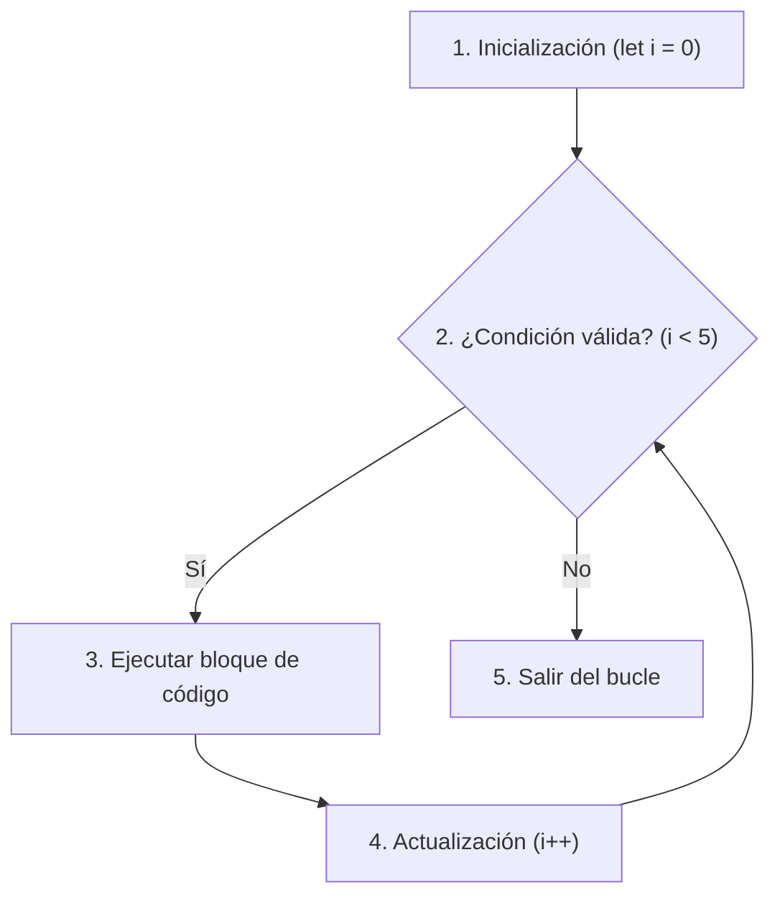

# Módulo 5: Ciclos e Iteración

Una de las grandes ventajas de una computadora sobre un ser humano es su capacidad para ejecutar una misma tarea millones de veces con absoluta precisión y sin agotarse. Los **ciclos (o bucles)** son las estructuras que nos permiten repetir un bloque de instrucciones hasta que se cumpla una condición determinada.

---

## 5.1 El Principio DRY (*Don't Repeat Yourself*)

Imagina que necesitas imprimir en pantalla los números del 1 al 5. Podrías escribir:

```typescript
console.log(1);
console.log(2);
console.log(3);
console.log(4);
console.log(5);
```

¿Pero qué pasaría si necesitaras hacerlo hasta el 10,000? Escribir 10,000 líneas no solo sería inviable, sino que violaría el principio **DRY (No te repitas)**. Los bucles nos permiten condensar tareas repetitivas en unas pocas líneas elegantes.

---

## 5.2 El Bucle `for` Clásico

El bucle `for` se utiliza cuando sabemos (o podemos calcular) **cuántas veces exactas** queremos repetir un proceso:



```typescript
for (let i: number = 0; i < 5; i++) {
  console.log(`Iteración número: ${i}`);
}
```

### Anatomía de las tres partes del `for`:
1. **Inicialización (`let i = 0`):** Se ejecuta **una sola vez** al inicio. Crea la variable contadora (tradicionalmente llamada `i` por *index*).
2. **Condición de parada (`i < 5`):** Se evalúa antes de cada iteración. Si es `true`, el código interno se ejecuta; en cuanto es `false`, el bucle se detiene.
3. **Paso de actualización (`i++`):** Se ejecuta al finalizar cada vuelta para modificar el contador.

### El Error "Off-by-One" (Desfase por uno)
Es uno de los bugs más comunes en toda la industria. Ocurre cuando confundes `<` con `<=` al recorrer arrays:

```typescript
const nombres = ["Ana", "Beto", "Carlos"]; // Longitud: 3. Índices válidos: 0, 1, 2.

// ❌ Error Off-by-One:
for (let i = 0; i <= nombres.length; i++) {
  console.log(nombres[i]); 
  // En la última vuelta (i = 3), nombres[3] es undefined.
}

// ✅ Correcto: Usar siempre < con la longitud
for (let i = 0; i < nombres.length; i++) {
  console.log(nombres[i]);
}
```

### Recorrido en Sentido Inverso
También puedes configurar el bucle para que cuente hacia atrás:

```typescript
for (let i = 10; i >= 1; i--) {
  console.log(`Cuenta regresiva: ${i}`);
}
console.log("¡Despegue!");
```

---

## 5.3 Bucles Condicionales: `while` y `do...while`

Cuando **no sabemos de antemano cuántas vueltas dará el bucle**, sino que dependemos de un estado o evento externo, usamos `while`.

### A. El bucle `while`
Evalúa la condición **antes** de entrar. Si la condición es falsa desde el principio, el bloque no se ejecuta ni una sola vez (0 o más veces):

```typescript
let bateria: number = 100;

while (bateria > 20) {
  console.log(`Dispositivo en uso. Batería restante: ${bateria}%`);
  bateria -= 25; // Descarga en cada ciclo
}
console.log("Advertencia: Batería baja, conecte el cargador.");
```

### B. El bucle `do...while`
Ejecuta el bloque de código **primero** y comprueba la condición al final. Esto garantiza que el código se ejecute **al menos una vez** (1 o más veces):

```typescript
let intentos: number = 0;

do {
  intentos++;
  console.log(`Intentando conectar al servidor... Intento #${intentos}`);
} while (intentos < 1);
```

### ⚠️ El Peligro del Bucle Infinito
Si la condición del bucle nunca se vuelve falsa, el programa entra en un bucle infinito que consumirá el 100% de la CPU y congelará la pestaña del navegador o el servidor:

```typescript
// ❌ ¡NUNCA HAGAS ESTO!
let x = 1;
while (x > 0) {
  console.log(x);
  // Olvidaste incrementar o decrementar x. x siempre será > 0.
}
```

---

## 5.4 Control de Bucles: `break` y `continue`

Podemos alterar el comportamiento normal de una iteración usando dos comandos clave:

### 1. `break`: Detener y salir de inmediato
Cuando encuentras lo que estabas buscando, no tiene sentido seguir gastando ciclos de procesador:

```typescript
const numeros: number[] = [12, 45, 7, 89, 34, 99];
let numeroBuscado: number = 89;

for (let i = 0; i < numeros.length; i++) {
  if (numeros[i] === numeroBuscado) {
    console.log(`¡Encontrado en la posición ${i}!`);
    break; // Corta el bucle inmediatamente
  }
  console.log(`Revisando posición ${i}...`);
}
```

### 2. `continue`: Saltar a la siguiente iteración
Ignora el resto del código que queda en la vuelta actual y avanza directo al siguiente ciclo:

```typescript
// Imprimir solo números impares
for (let i = 1; i <= 6; i++) {
  if (i % 2 === 0) {
    continue; // Si es par, sáltatelo y ve a la siguiente vuelta
  }
  console.log(`Número impar: ${i}`); // Imprime 1, 3, 5
}
```

---

## 5.5 Bucles Anidados (Matrices y Grillas)

Un bucle anidado es simplemente un bucle dentro de otro bucle. El bucle interno completa todas sus vueltas por cada una de las vueltas del bucle externo:

```typescript
// Generar coordenadas para un mapa o tablero de ajedrez (3x3)
for (let fila = 0; fila < 3; fila++) {
  for (let columna = 0; columna < 3; columna++) {
    console.log(`Coordenada: [Fila: ${fila}, Columna: ${columna}]`);
  }
}
```

> [!CAUTION]
> **Cuidado con el rendimiento ($O(n^2)$):**
> Si un bucle recorre una lista de 1,000 elementos, se ejecutan 1,000 operaciones. Pero si anidas dos bucles de 1,000 elementos, se ejecutan $1,000 \times 1,000 = 1,000,000$ de operaciones. Mantén la anidación al mínimo indispensable.

---

## 5.6 Bucles Modernos: `for...of` vs `for...in`

JavaScript moderno introdujo dos variantes más limpias y legibles:

```typescript
const frutas: string[] = ["Manzana", "Plátano", "Cereza"];

// 1. for...of: Itera directamente sobre los VALORES de una lista
for (const fruta of frutas) {
  console.log(fruta); // "Manzana", "Plátano", "Cereza"
}

// 2. for...in: Itera sobre las CLAVES o ÍNDICES (se usa principalmente para objetos)
const coche = { marca: "Toyota", modelo: "Corolla", año: 2022 };
for (const propiedad in coche) {
  console.log(`${propiedad}: ${(coche as any)[propiedad]}`);
}
```

> [!NOTE]
> En arrays, utiliza siempre `for...of` o métodos funcionales (`.forEach()`, `.map()`). Evita `for...in` en listas ya que recorre los índices como strings y puede iterar propiedades heredadas indeseadas.

---

## 🛠️ Reto Práctico del Módulo

**Ejercicio: Simulador de Cine y Venta de Asientos**

Imagina que representas una sala de cine con 5 filas y 6 asientos por fila:
1. Utiliza bucles anidados para construir una matriz (un array bidimensional) donde todos los asientos comiencen con el estado `"LIBRE"`.
2. Simula la compra de 4 asientos específicos cambiando su estado a `"OCUPADO"`.
3. Escribe un bucle que recorra la sala e imprima cuántos asientos libres quedan en total y cuántos hay disponibles por cada fila.
4. Si una fila completa tiene todos sus asientos ocupados, imprime una alerta con el texto `"¡Fila X completamente llena!"`.
