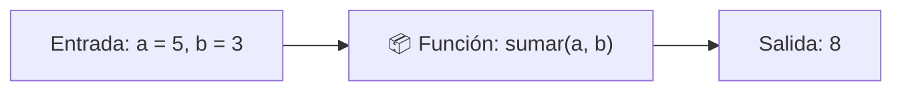
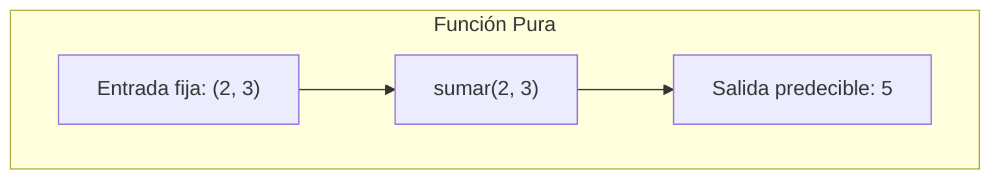
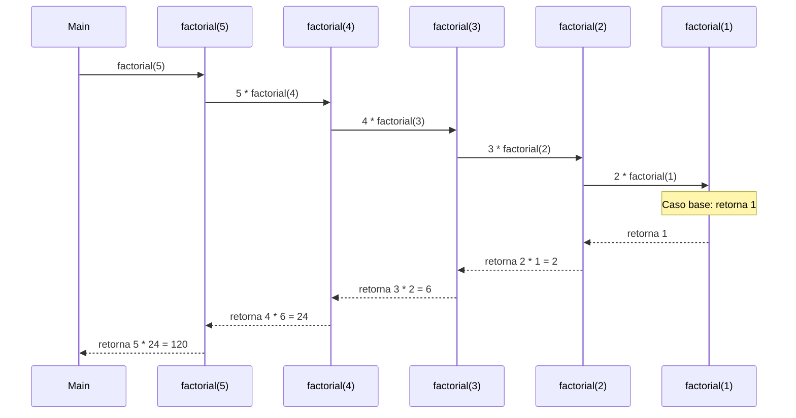

# Módulo 6: Funciones, Parámetros y Modularidad

Escribir cientos de instrucciones en un solo archivo continuo es la receta perfecta para crear software incomprensible y propenso a fallos. Las **funciones** son las unidades fundamentales de modularidad en la programación: encapsulan un fragmento de lógica para que pueda ser probado, nombrado y reutilizado tantas veces como sea necesario.

---

## 6.1 La Metáfora de la Caja Negra

Una función puede imaginarse como una pequeña fábrica cerrada:
1. **Entradas (Parámetros):** La materia prima que recibe.
2. **Proceso interno:** Las instrucciones que transforman esa materia prima.
3. **Salida (Retorno):** El producto final terminado que entrega al exterior.



### El Principio de Responsabilidad Única (SRP)
Una buena función debe obedecer una regla de oro: **debe hacer una sola cosa, y hacerla excepcionalmente bien**. Si una función calcula el total de una factura, envía un correo, guarda en la base de datos y formatea un PDF, debe dividirse en 4 funciones especializadas más pequeñas.

---

## 6.2 Parámetros vs Argumentos

Aunque muchas personas los usan como sinónimos, existe una diferencia técnica crucial:

```typescript
// 'precio' y 'descuento' son PARÁMETROS:
// Son las variables de plantilla declaradas en la definición de la función.
function calcularPrecioFinal(precio: number, descuento: number = 0): number {
  return precio - (precio * descuento);
}

// 100 y 0.20 son ARGUMENTOS:
// Son los valores reales y concretos que envías al momento de llamarla.
const total: number = calcularPrecioFinal(100, 0.20);
```

### Parámetros por Defecto
Permiten asignar un valor de respaldo en caso de que quien invoque la función no envíe dicho argumento:

```typescript
function saludar(nombre: string, saludo: string = "Hola"): string {
  return `${saludo}, ${nombre}!`;
}

console.log(saludar("Aldair"));          // "Hola, Aldair!" (usa el valor por defecto)
console.log(saludar("Aldair", "Buenos días")); // "Buenos días, Aldair!"
```

### Parámetros Rest (`...args`)
Cuando no sabes de antemano cuántos argumentos enviará el usuario, el operador rest agrupa todos los argumentos sobrantes en un array:

```typescript
function sumarTodo(...numeros: number[]): number {
  let acumulador = 0;
  for (const n of numeros) {
    acumulador += n;
  }
  return acumulador;
}

console.log(sumarTodo(1, 2));             // 3
console.log(sumarTodo(10, 20, 30, 40));   // 100
```

---

## 6.3 `return` vs `console.log`: El Gran Malentendido

Uno de los errores más comunes al empezar a programar es confundir imprimir un mensaje en la terminal con devolver un dato computable:

```typescript
// ❌ Función con impresión, pero sin retorno utilizable:
function multiplicarMal(a: number, b: number): void {
  console.log(a * b); // Solo muestra el número en consola, no devuelve nada
}

// ✅ Función con retorno formal:
function multiplicarBien(a: number, b: number): number {
  return a * b; // Devuelve el dato hacia el programa
}

const resultado1 = multiplicarMal(5, 5); // resultado1 vale 'undefined'
// const doble1 = resultado1 * 2; <--- Error: No puedes multiplicar undefined

const resultado2 = multiplicarBien(5, 5); // resultado2 vale 25
const doble2 = resultado2 * 2;           // 50 (¡Completamente válido!)
```

* `console.log()` es una herramienta para los ojos del programador durante el desarrollo.
* `return` es el contrato de salida que permite encadenar funciones y guardar valores en memoria.
* Cuando el flujo de ejecución llega a un `return`, la función **termina de inmediato**. Cualquier línea escrita debajo de un `return` nunca se ejecutará (*código inalcanzable*).

---

## 6.4 Formas de Declarar Funciones

En TypeScript y JavaScript moderno encontrarás tres sintaxis comunes:

### 1. Declaración Tradicional (`Function Declaration`)
Tiene la ventaja de tener *hoisting completo* (puede ser invocada antes de la línea donde fue escrita).

```typescript
function duplicar(n: number): number {
  return n * 2;
}
```

### 2. Expresión de Función (`Function Expression`)
Se asigna una función anónima a una variable `const`.

```typescript
const duplicar = function(n: number): number {
  return n * 2;
};
```

### 3. Funciones Flecha (*Arrow Functions*)
Introducidas en ES6, son la sintaxis predominante en frameworks como React y Vue. Si el cuerpo de la función consta de una sola expresión, el `return` y las llaves `{}` son **implícitos**:

```typescript
// Sintaxis estándar con llaves
const duplicar = (n: number): number => {
  return n * 2;
};

// Sintaxis compacta con retorno implícito (una sola línea)
const duplicarCorto = (n: number): number => n * 2;
```

---

## 6.5 Funciones Puras vs Impuras (La Base de los Frameworks)

Comprender esta distinción te ahorrará cientos de horas de frustración al aprender React, Vue o Redux:



### ¿Qué es una Función Pura?
Cumple dos condiciones estrictas:
1. **Determinismo:** Dados los mismos argumentos de entrada, siempre devuelve exactamente el mismo resultado.
2. **Cero Efectos Secundarios (*No Side Effects*):** No altera nada fuera de su propio ámbito local (no muta variables globales, no modifica el DOM, no hace llamadas a servidores externos).

```typescript
// ✅ Función Pura: Predecible, fácil de testear
function calcularIva(monto: number): number {
  return monto * 0.16;
}
```

### ¿Qué es una Función Impura?
Es aquella que depende de factores externos cambiantes o que produce cambios colaterales en el entorno exterior:

```typescript
// ❌ Función Impura:
let totalGlobal = 0;

function agregarAlTotal(monto: number): number {
  totalGlobal += monto; // ¡Muta una variable del exterior!
  return totalGlobal;
}

// ❌ También es impura porque depende del tiempo o del azar:
function generarCodigoTicket(): string {
  return `TICKET-${Math.random()}-${Date.now()}`;
}
```

> [!TIP]
> En aplicaciones profesionales, busca que la gran mayoría de tu lógica de negocio resida en **funciones puras**. Deja los efectos secundarios (guardar en base de datos, pintar en pantalla) aislados en capas específicas.

---

## 6.6 Recursividad: Funciones que se Llaman a Sí Mismas

Una función **recursiva** es aquella que resuelve un problema dividiéndolo en versiones más pequeñas de sí mismo, invocándose a sí misma dentro de su propio cuerpo.

Toda función recursiva requiere obligatoriamente **dos elementos**:
1. **Caso Base:** La condición de parada que devuelve un valor directo sin volverse a llamar.
2. **Paso Recursivo:** La llamada a sí misma con un argumento que se acerque progresivamente al caso base.

### Ejemplo Clásico: El Factorial ($5! = 5 \times 4 \times 3 \times 2 \times 1$)

```typescript
function factorial(n: number): number {
  // 1. Caso Base: Si llegamos a 1, nos detenemos
  if (n <= 1) {
    return 1;
  }
  
  // 2. Paso Recursivo: n multiplicado por el factorial de (n - 1)
  return n * factorial(n - 1);
}

console.log(factorial(5)); // 120
```



> [!CAUTION]
> **El peligro del Stack Overflow en recursión:**
> Si olvidas definir el caso base o la condición de parada nunca se cumple, la función se invocará sin fin hasta desbordar el Call Stack de la máquina (`RangeError: Maximum call stack size exceeded`).

---

## 🛠️ Reto Práctico del Módulo

**Ejercicio: De Código Espagueti a Arquitectura Modular**

Observa este código desorganizado:

```typescript
let precio = 200;
let descuento = 0.10;
let impuesto = 0.16;
let precioConDescuento = precio - (precio * descuento);
let precioFinal = precioConDescuento + (precioConDescuento * impuesto);
console.log("El precio final a pagar es: " + precioFinal);
```

**Tu misión:**
1. Descompón este cálculo creando tres funciones puras independientes:
   * `aplicarDescuento(precio: number, porcentaje: number): number`
   * `calcularImpuesto(monto: number, tasa: number): number`
   * `generarResumenFactura(precioBase: number, descuento: number, tasaImpuesto: number): string`
2. Convierte las funciones a sintaxis de **Arrow Functions**.
3. Implementa una función recursiva llamada `cuentaRegresiva(segundos: number): void` que imprima los números en orden descendente hasta llegar a cero e imprima `"¡Tiempo agotado!"`.
