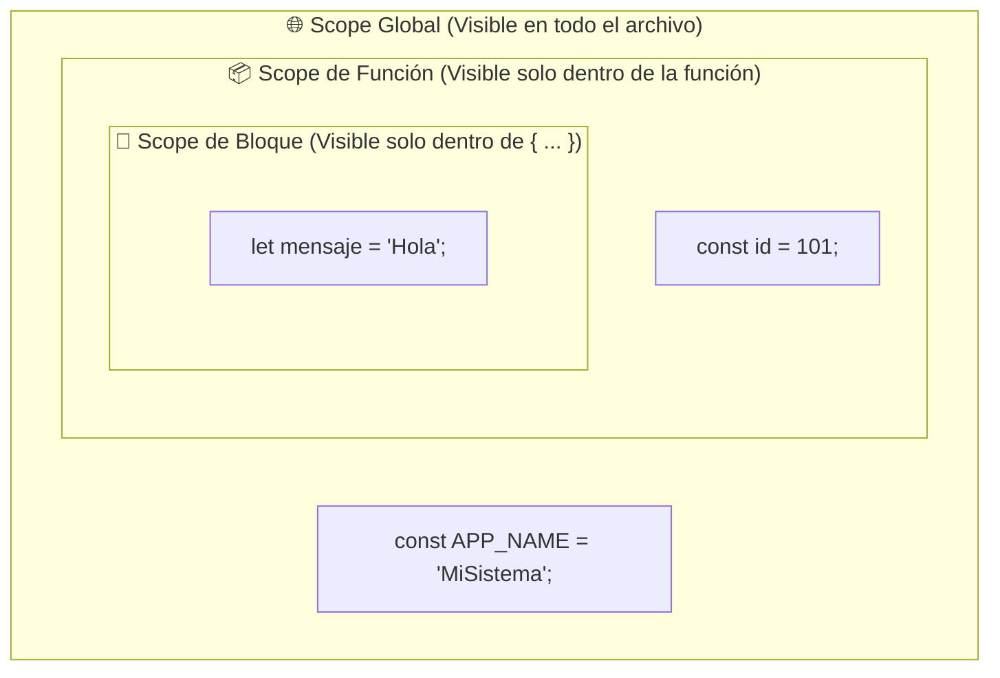
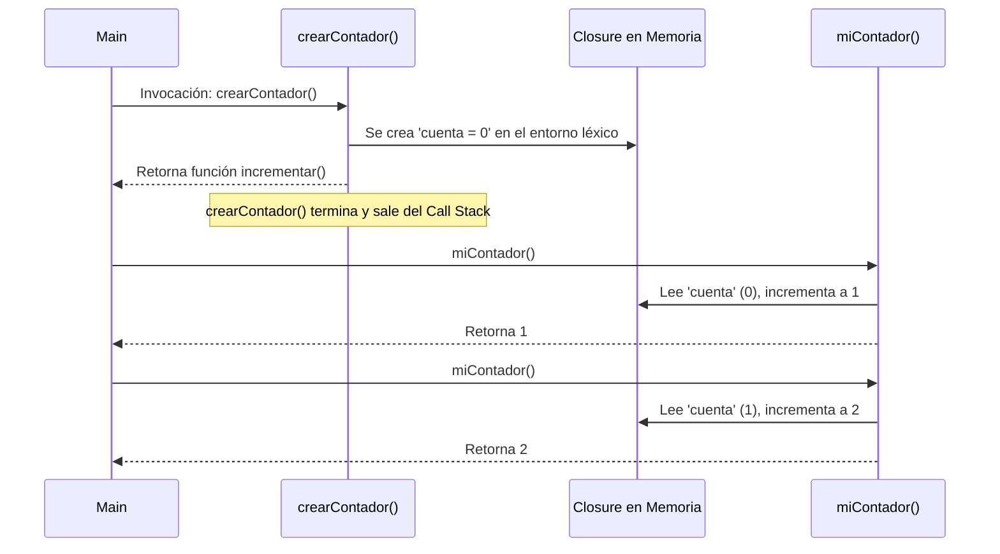

# Módulo 7: Ámbito (Scope), Ciclo de Vida y Closures

¿Alguna vez te has preguntado por qué una variable declarada dentro de una función no puede ser leída desde afuera? ¿O cómo una función puede "recordar" datos incluso después de haber terminado de ejecutarse? La respuesta está en el **ámbito (Scope)** y en las **clausuras (Closures)**.

---

## 7.1 ¿Qué es el Scope (Ámbito)?

El **Scope** es el conjunto de reglas que determina la accesibilidad y visibilidad de las variables en las distintas partes de tu código. Si una variable está fuera de su ámbito de validez, el motor de JavaScript lanzará un `ReferenceError: [variable] is not defined`.



### 1. Scope Global
Cualquier variable declarada en la raíz del archivo, fuera de cualquier función o bloque. Es accesible desde cualquier lugar.
* *Peligro:* Abusar de variables globales provoca colisiones de nombres y datos difíciles de rastrear.

### 2. Scope de Función
Las variables declaradas dentro del cuerpo de una función nacen al invocarse la función y se destruyen en la memoria cuando la función termina.

```typescript
function autenticar() {
  const tokenSecreto = "xyz-123"; // Scope de función
  console.log(tokenSecreto); // Válido
}

autenticar();
// console.log(tokenSecreto); <--- Error: tokenSecreto no existe en el ámbito exterior
```

### 3. Scope de Bloque (`{ ... }`)
Cualquier fragmento de código delimitado por un par de llaves `{}` (como un `if`, `for`, `while` o simplemente un bloque suelto).

```typescript
if (true) {
  let variableDeBloque = "Solo existo aquí adentro";
  const piLocal = 3.14;
}

// console.log(variableDeBloque); <--- Error: No existe fuera del bloque 'if'
```

---

## 7.2 Por qué `var` es Obsoleto: La Fuga de Ámbito

Antes de 2015, `var` era la única palabra para crear variables. El gran problema de `var` es que **no respeta el Scope de Bloque**: solo respeta el Scope de Función.

```typescript
// ❌ Comportamiento peligroso con 'var':
if (true) {
  var usuario = "Carlos";
}
console.log(usuario); // "Carlos" (¡La variable se fugó del bloque if!)

// ✅ Comportamiento predecible con 'let':
if (true) {
  let usuarioSeguro = "Carlos";
}
// console.log(usuarioSeguro); <--- Error: usuarioSeguro is not defined
```

---

## 7.3 Hoisting (Elevación) y la Zona Muerta Temporal (TDZ)

Cuando el motor de JavaScript lee un archivo, realiza su trabajo en **dos fases**:
1. **Fase de Creación (Compilación previa):** Escanea el código, reserva espacio en memoria y registra las declaraciones de funciones y variables.
2. **Fase de Ejecución:** Corre el código línea por línea asignando los valores reales.

El **Hoisting** es el fenómeno por el cual las declaraciones parecen "elevarse" mágicamente a la parte superior de su ámbito antes de ejecutarse:

### A. Hoisting en Funciones Declaradas
Las declaraciones con la palabra `function` se elevan por completo (nombre y cuerpo), permitiendo llamarlas antes de su definición:

```typescript
saludar(); // ¡Funciona correctamente! Imprime "Hola"

function saludar() {
  console.log("Hola");
}
```

### B. Hoisting en `let` y `const`: La TDZ (*Temporal Dead Zone*)
Las variables `let` y `const` también se registran en la fase previa, pero **no se inicializan**. El período entre el inicio del bloque y la línea donde está escrita la declaración se denomina **Zona Muerta Temporal (TDZ)**:

```typescript
// console.log(edad); <--- Error: Cannot access 'edad' before initialization
// ^^^^^^^^^^^^^^^^^ Estamos en la Zona Muerta Temporal (TDZ)
let edad: number = 25;
console.log(edad); // 25 (Zona segura)
```

---

## 7.4 Sombreado de Variables (*Variable Shadowing*)

Ocurre cuando declaras una variable en un ámbito interno con el **mismo nombre exacto** que una variable en un ámbito externo. La variable interna "hace sombra" y oculta temporalmente a la exterior:

```typescript
const puntos: number = 100; // Ámbito externo

function jugar() {
  const puntos: number = 50; // Sombra la variable externa dentro de este ámbito
  console.log(`Puntos dentro del juego: ${puntos}`); // 50
}

jugar();
console.log(`Puntos globales: ${puntos}`); // 100 (El original permanece intacto)
```

---

## 7.5 Closures (Clausuras): La Memoria Persistente

Un **Closure** es una de las características más elegantes y potentes del desarrollo con JavaScript/TypeScript.

> 🧠 **Definición formal:**
> Un closure es la combinación de una función y el **entorno léxico** dentro del cual fue creada. Esto significa que una función interna conserva acceso permanente a las variables de su función padre, **incluso después de que la función padre haya terminado de ejecutarse y haya salido del Call Stack**.

```typescript
function crearContador() {
  let cuenta: number = 0; // Variable privada, protegida dentro del closure

  return function incrementar(): number {
    cuenta++; // La función interna "recuerda" la variable 'cuenta'
    return cuenta;
  };
}

const miContador = crearContador();

console.log(miContador()); // 1
console.log(miContador()); // 2
console.log(miContador()); // 3
```



### ¿Por qué los Closures son Indispensables?
1. **Encapsulamiento y Privacidad de Datos:** La variable `cuenta` en el ejemplo anterior no puede ser modificada directamente desde el exterior (`miContador.cuenta = 99` no funciona). Solo puede alterarse a través de la función autorizada.
2. **Fábricas de Funciones (*Function Factories*):**
   ```typescript
   function crearMultiplicador(factor: number) {
     return (numero: number) => numero * factor;
   }

   const duplicar = crearMultiplicador(2);
   const triplicar = crearMultiplicador(3);

   console.log(duplicar(10)); // 20
   console.log(triplicar(10)); // 30
   ```
3. **La Base de los Frameworks Modernos:**
   Tanto los **Hooks de React** (`useState`, `useEffect`) como los **Composables de Vue 3** funcionan enteramente gracias a los closures, permitiendo que los componentes recuerden su estado reactivo a lo largo del tiempo.

---

## 🛠️ Reto Práctico del Módulo

**Ejercicio: Bóveda Bancaria Segura con Closures**

Escribe una función fábrica llamada `crearBoveda(pinSeguridad: string, saldoInicial: number)` que retorne un objeto con tres métodos para gestionar una cuenta bancaria sin exponer el saldo ni el PIN directamente:

1. `consultarSaldo(pin: string): number | string`: Si el PIN coincide, retorna el saldo; si no, retorna `"PIN incorrecto"`.
2. `depositar(monto: number): string`: Incrementa el saldo si el monto es mayor a 0 y retorna `"Depósito exitoso"`.
3. `retirar(pin: string, monto: number): string`: Verifica el PIN; si es correcto y hay fondos suficientes, descuenta el saldo y retorna `"Retiro exitoso"`. Si no hay saldo suficiente, retorna `"Fondos insuficientes"`.

*Verifica que nadie pueda acceder ni modificar el saldo escribiendo `boveda.saldo = 999999` desde el exterior.*
