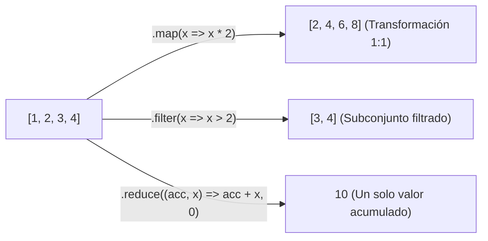

# Módulo 8: Arrays y Manipulación de Listas

En el desarrollo de software moderno (especialmente en Frontend), más del 70% de tu tiempo consistirá en recibir listas de datos de un servidor, ordenarlas, filtrarlas y transformarlas para mostrarlas en la interfaz de usuario. Los **Arrays** son la estructura de datos por excelencia para manejar colecciones de elementos.

---

## 8.1 Anatomía de un Array

Un array es una lista ordenada de valores indexados numéricamente comenzando desde el índice `0`:

```typescript
const tecnologias: string[] = ["HTML", "CSS", "JavaScript", "TypeScript"];

console.log(tecnologias[0]);          // "HTML" (Primer elemento)
console.log(tecnologias.length);     // 4 (Cantidad total de elementos)
console.log(tecnologias[tecnologias.length - 1]); // "TypeScript" (Último elemento tradicional)

// Sintaxis moderna con .at(): permite índices negativos para leer desde el final
console.log(tecnologias.at(-1));     // "TypeScript" (Último)
console.log(tecnologias.at(-2));     // "JavaScript" (Penúltimo)
```

---

## 8.2 Métodos Mutadores (Modifican el Array Original)

Los métodos mutadores alteran directamente la estructura del array original en memoria.

| Método | Acción | Retorno |
| :--- | :--- | :--- |
| **`.push(item)`** | Agrega uno o más elementos al **final** | La nueva longitud del array |
| **`.pop()`** | Elimina y devuelve el **último** elemento | El elemento eliminado |
| **`.unshift(item)`** | Agrega uno o más elementos al **inicio** | La nueva longitud del array |
| **`.shift()`** | Elimina y devuelve el **primer** elemento | El elemento eliminado |
| **`.splice(start, count, ...items)`** | Inserta, reemplaza o elimina elementos en una posición intermedia | Array con los elementos eliminados |
| **`.reverse()`** | Invierte el orden de los elementos | El mismo array invertido |
| **`.sort()`** | Ordena los elementos en su lugar | El mismo array ordenado |

```typescript
const frutas: string[] = ["Manzana", "Pera"];
frutas.push("Naranja"); // ["Manzana", "Pera", "Naranja"]
frutas.unshift("Fresa"); // ["Fresa", "Manzana", "Pera", "Naranja"]
frutas.pop();           // Elimina "Naranja"
```

### ⚠️ La Gran Trampa de `.sort()` en JavaScript
Por defecto, `.sort()` convierte los elementos a cadenas de texto y los ordena en base al código de caracteres UTF-16 (orden lexicográfico/alfabético). Esto produce bugs catastróficos con números:

```typescript
const numeros: number[] = [10, 5, 40, 25, 100, 1];

// ❌ Ordenamiento por defecto (¡Totalmente incorrecto para números!):
numeros.sort();
console.log(numeros); // [1, 10, 100, 25, 40, 5] ('100' va antes de '5' alfabéticamente)

// ✅ Ordenamiento numérico correcto: Pasando una función comparadora (a, b)
// Si (a - b) es negativo, 'a' va antes que 'b'
numeros.sort((a, b) => a - b);
console.log(numeros); // [1, 5, 10, 25, 40, 100] (Ascendente)

// Para orden descendente: (b - a)
numeros.sort((a, b) => b - a);
console.log(numeros); // [100, 40, 25, 10, 5, 1]
```

---

## 8.3 Métodos No Mutadores (Inmutables)

Estos métodos no tocan el array original; devuelven un nuevo resultado o una copia parcial:

```typescript
const lenguajes = ["Java", "Python", "Rust", "Go"];

// .slice(inicio, finNoIncluido): Extrae una porción
const favoritos = lenguajes.slice(1, 3); // ["Python", "Rust"]

// .includes(valor): Comprobación booleana de pertenencia
console.log(lenguajes.includes("Rust")); // true
console.log(lenguajes.includes("PHP"));  // false

// .indexOf(valor): Devuelve el índice o -1 si no existe
console.log(lenguajes.indexOf("Go"));   // 3
console.log(lenguajes.indexOf("C#"));   // -1
```

---

## 8.4 Métodos Funcionales de Iteración (El Estándar Profesional)

En lugar de escribir bucles `for` manuales, los métodos de orden superior de los arrays permiten escribir código declarativo, legible y sin variables contadoras temporales:



### 1. `.map()`: Transformación 1 a 1
Genera un **nuevo array** aplicando una transformación a cada uno de los elementos. El nuevo array siempre tiene exactamente la misma cantidad de elementos que el original:

```typescript
const precios = [10, 20, 30];
const preciosConIva = precios.map(precio => precio * 1.16);
console.log(preciosConIva); // [11.6, 23.2, 34.8]
```

### 2. `.filter()`: Filtrado selectivo
Crea un **nuevo array** únicamente con los elementos que devuelven `true` ante la condición:

```typescript
const edades = [12, 25, 17, 30, 14, 19];
const mayoresDeEdad = edades.filter(edad => edad >= 18);
console.log(mayoresDeEdad); // [25, 30, 19]
```

### 3. `.find()` y `.findIndex()`: Búsqueda del primer elemento
A diferencia de `.filter()`, `.find()` se detiene inmediatamente al encontrar la primera coincidencia:

```typescript
const usuarios = [
  { id: 1, nombre: "Ana" },
  { id: 2, nombre: "Carlos" },
  { id: 3, nombre: "Beto" }
];

const encontrado = usuarios.find(u => u.id === 2); // { id: 2, nombre: "Carlos" }
const indice = usuarios.findIndex(u => u.nombre === "Beto"); // 2
```

### 4. `.some()` y `.every()`: Verificaciones lógicas
* `.some()`: Devuelve `true` si **al menos un elemento** cumple la condición.
* `.every()`: Devuelve `true` si **todos los elementos** sin excepción la cumplen.

```typescript
const notas = [8, 9, 10, 4];
console.log(notas.some(n => n < 5));  // true (¿Alguien reprobó?)
console.log(notas.every(n => n >= 5)); // false (¿Todos aprobaron?)
```

### 5. `.reduce()`: El Método Más Poderoso y Versátil
`.reduce()` procesa cada elemento para condensar todo el array en **un único resultado final** (un número, una cadena o incluso un objeto):

```typescript
const carrito = [
  { producto: "Teclado", precio: 50 },
  { producto: "Mouse", precio: 25 },
  { producto: "Monitor", precio: 200 }
];

// reduce(callback(acumulador, elementoActual), valorInicialAcumulador)
const totalPagar = carrito.reduce((acumulador, item) => {
  return acumulador + item.precio;
}, 0); // 0 es el valor inicial del acumulador

console.log(`Total: $${totalPagar}`); // Total: $275
```

---

## 8.5 Matrices: Arrays Multidimensionales

Una matriz es un array cuyos elementos son otros arrays (filas y columnas):

```typescript
const tableroAjedrez: string[][] = [
  ["T", "C", "A", "R", "D", "A", "C", "T"],
  ["P", "P", "P", "P", "P", "P", "P", "P"],
  [" ", " ", " ", " ", " ", " ", " ", " "],
  [" ", " ", " ", " ", " ", " ", " ", " "]
];

// Acceso: [fila][columna]
console.log(tableroAjedrez[0][3]); // "R" (Rey en la fila 0, columna 3)
```

---

## 🛠️ Reto Práctico del Módulo

**Ejercicio: Procesador de Cuentas Bancarias**

Dado el siguiente historial de transacciones de un usuario:

```typescript
interface Transaccion {
  id: number;
  tipo: "INGRESO" | "GASTO";
  monto: number;
  categoria: string;
}

const transacciones: Transaccion[] = [
  { id: 1, tipo: "INGRESO", monto: 1500, categoria: "Salario" },
  { id: 2, tipo: "GASTO", monto: 50, categoria: "Comida" },
  { id: 3, tipo: "GASTO", monto: 120, categoria: "Transporte" },
  { id: 4, tipo: "INGRESO", monto: 300, categoria: "Freelance" },
  { id: 5, tipo: "GASTO", monto: 80, categoria: "Comida" }
];
```

**Tu misión:**
1. Usa `.filter()` para obtener solo las transacciones de tipo `"GASTO"`.
2. Usa `.reduce()` sobre los gastos para calcular el monto total gastado.
3. Usa `.filter()` y `.reduce()` para calcular el gasto exclusivo de la categoría `"Comida"`.
4. Usa `.reduce()` para calcular el **balance neto final** (Ingresos totales menos Gastos totales).
5. Determina con `.some()` si hubo alguna transacción con un monto superior a `$1,000`.
