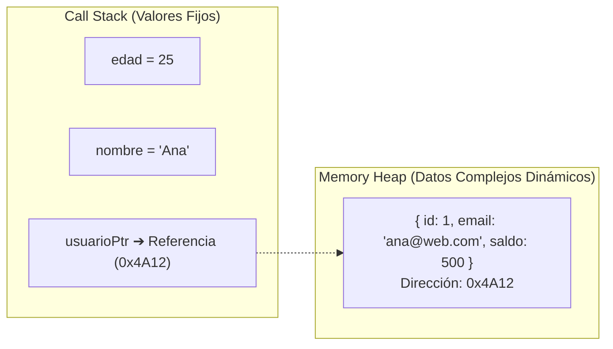
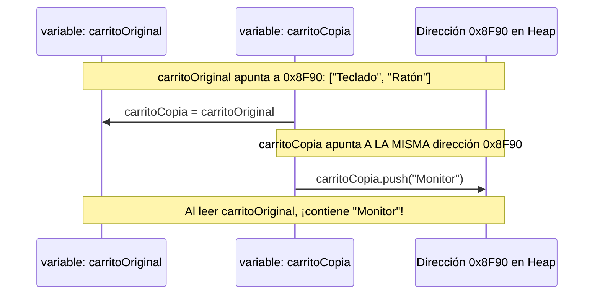

# Módulo 9: Paso por Valor vs Referencia e Inmutabilidad

Si tuvieras que elegir el concepto técnico donde más fallan los desarrolladores principiantes y que genera los errores más desconcertantes en JavaScript y TypeScript, es este: **la diferencia entre almacenar un dato por valor y manejarlo por referencia**.

Dominar este tema te permitirá entender de verdad cómo funcionan React, Vue y la arquitectura de estado predecible.

---

## 9.1 ¿Dónde Viven los Datos? Stack vs Heap

Como vimos en el Módulo 2, la memoria RAM se divide principalmente en dos zonas:



1. **Tipos Primitivos (Stack):** `number`, `string`, `boolean`, `null`, `undefined`, `symbol`, `bigint`.
   * Tienen un tamaño en memoria fijo y pequeño. El Call Stack guarda su **valor directo**.
2. **Tipos Complejos (Heap):** Objetos literales (`{}`), Arrays (`[]`), Funciones, Fechas.
   * Son estructuras dinámicas que pueden crecer o encogerse. Viven en el **Memory Heap**. La variable en el Stack no guarda el objeto en sí, sino una **referencia (puntero a la dirección de memoria)** donde reside el objeto en el Heap.

---

## 9.2 Asignación y Paso por Valor (Copia Real)

Cuando asignas una variable primitiva a otra, o la envías como argumento a una función, la computadora realiza una **copia idéntica e independiente**:

```typescript
let a: number = 10;
let b: number = a; // 'b' recibe una copia exacta del valor 10

b = 99; // Modificamos 'b'

console.log(a); // 10 (¡'a' no sufre ningún cambio!)
console.log(b); // 99
```

---

## 9.3 Asignación y Paso por Referencia (El Puntero Compartido)

Cuando asignas un objeto o un array a otra variable, **no estás copiando el objeto**: estás copiando la dirección de memoria (el puntero). Ambas variables apuntan exactamente al mismo objeto en el Heap:

```typescript
// ❌ El Error Clásico de Principiante:
const carritoOriginal: string[] = ["Teclado", "Ratón"];
const carritoCopia: string[] = carritoOriginal; // ¡Solo copiamos la dirección de memoria!

carritoCopia.push("Monitor");

// Al modificar carritoCopia, ¡también alteraste carritoOriginal!
console.log(carritoOriginal); // ["Teclado", "Ratón", "Monitor"]
console.log(carritoCopia);    // ["Teclado", "Ratón", "Monitor"]
```



Lo mismo ocurre al pasar un objeto a una función:

```typescript
function cumpleAnios(persona: { nombre: string; edad: number }): void {
  persona.edad += 1; // ¡Muta el objeto original fuera de la función!
}

const usuario = { nombre: "Carlos", edad: 30 };
cumpleAnios(usuario);
console.log(usuario.edad); // 31 (Efecto secundario accidental)
```

---

## 9.4 El Gran Mito de `const`

Muchos programadores creen erróneamente que declarar un objeto con `const` lo hace inmutable. Esto es falso:

```typescript
const configuracion = { tema: "oscuro", volumen: 80 };

// ❌ Reasignar la variable NO está permitido:
// configuracion = { tema: "claro", volumen: 50 }; // Error: Assignment to constant variable.

// ✅ Mutar las propiedades internas SÍ está permitido:
configuracion.tema = "claro"; // Funciona perfectamente
configuracion.volumen = 100;  // Funciona perfectamente
```

> [!IMPORTANT]
> **Lo que realmente hace `const`:**
> `const` congela la **flecha (el puntero de referencia)** en el Stack. Te impide apuntar la variable hacia otra dirección de memoria, pero **no congela el contenido interno** que vive en el Heap.

---

## 9.5 Inmutabilidad: Por qué es la Regla de Oro

La **inmutabilidad** es el principio de diseño según el cual los datos nunca se modifican directamente después de ser creados. En lugar de mutar un objeto, se genera un **nuevo objeto con los cambios aplicados**.

### Ventajas de la Inmutabilidad:
1. **Cero Efectos Secundarios:** Las funciones no corrompen datos de otras partes de la aplicación.
2. **Historial y Deshacer (*Undo/Redo*):** Al no destruir el estado anterior, puedes guardar versiones previas fácilmente.
3. **React y Vue:** Los frameworks modernos deciden si deben repintar la interfaz comparando referencias (`if (estadoAnterior !== estadoNuevo)`). Si mutas el mismo objeto en memoria, la referencia es idéntica y la pantalla no se actualiza.

---

## 9.6 Estrategias de Clonación e Inmutabilidad

Para trabajar de forma inmutable, debemos aprender a clonar nuestros datos:

### 1. Copia Superficial (*Shallow Copy*)
Copia las propiedades de primer nivel, pero los objetos o arrays anidados adentro **siguen compartiendo la misma referencia**.

```typescript
const productoOriginal = {
  id: 1,
  nombre: "Silla Gamer",
  precio: 150,
  detalles: { color: "Rojo", garantiaMeses: 12 } // Objeto anidado
};

// Opción A: Spread Operator ({ ...objeto }) -> El más común
const productoClon = { ...productoOriginal, precio: 175 }; // Modificamos precio limpiamente

productoClon.nombre = "Silla Oficina";
console.log(productoOriginal.nombre); // "Silla Gamer" (El original se mantiene)

// ⚠️ El peligro del Shallow Copy con objetos anidados:
productoClon.detalles.color = "Azul";
console.log(productoOriginal.detalles.color); // "Azul" (¡Se modificó en ambos!)
```

### 2. Copia Profunda (*Deep Clone*)
Crea una copia 100% independiente de todos los niveles anidados del objeto.

```typescript
// ✅ El estándar nativo moderno: structuredClone()
const clonProfundo = structuredClone(productoOriginal);

clonProfundo.detalles.color = "Verde";
console.log(productoOriginal.detalles.color); // "Azul" (¡Completamente independiente!)
```

*Nota histórica:* Antes de `structuredClone()`, se usaba `JSON.parse(JSON.stringify(obj))`, pero fallaba con funciones, fechas y valores `undefined`.

### 3. Congelamiento con `Object.freeze()`
Impide que se añadan, modifiquen o borren propiedades de primer nivel de un objeto en tiempo de ejecución:

```typescript
const permisos = Object.freeze({
  puedeLeer: true,
  puedeBorrar: false
});

// permisos.puedeBorrar = true; // Error en modo estricto, o ignorado silenciosamente
```

---

## 🛠️ Reto Práctico del Módulo

**Ejercicio: El Bug del Carrito de Compras**

Analiza el siguiente código que tiene un bug de mutación accidental:

```typescript
interface Articulo {
  id: number;
  nombre: string;
  precio: number;
}

const inventarioTienda: Articulo[] = [
  { id: 101, nombre: "Laptop", precio: 1000 },
  { id: 102, nombre: "Auriculares", precio: 100 }
];

// ❌ Esta función tiene un bug grave:
function aplicarDescuentoNegocio(lista: Articulo[], descuento: number): Articulo[] {
  for (let i = 0; i < lista.length; i++) {
    lista[i].precio -= lista[i].precio * descuento;
  }
  return lista;
}

const listaConDescuento = aplicarDescuentoNegocio(inventarioTienda, 0.20);
```

**Tu misión:**
1. Explica qué le ocurrió a los precios del `inventarioTienda` original al ejecutar esa función.
2. Reescribe la función `aplicarDescuentoNegocio` de forma **completamente inmutable y pura** usando `.map()` y el spread operator (`{ ...articulo }`), garantizando que el inventario original conserve sus precios intactos.
