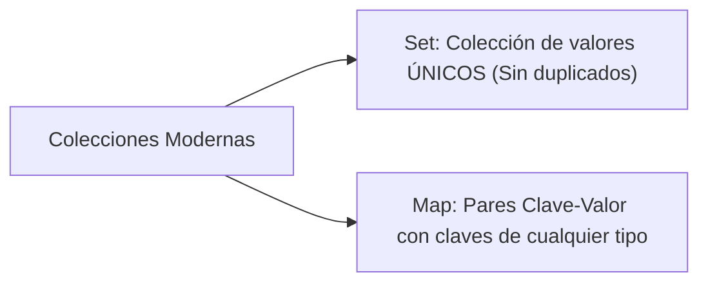

# Módulo 10: Objetos, Diccionarios y Colecciones

Si los arrays nos permiten representar listas ordenadas de elementos, los **objetos** nos permiten modelar entidades del mundo real mediante asociaciones de **clave-valor**. En este módulo aprenderás a manipular objetos con soltura y a utilizar estructuras avanzadas como `Map` y `Set`.

---

## 10.1 Anatomía de un Objeto

Un objeto es una colección de propiedades, donde cada propiedad tiene un nombre (clave) y un valor asociado:

```typescript
interface Usuario {
  id: number;
  nombre: string;
  correo: string;
  edad: number;
  estaActivo: boolean;
}

const usuario: Usuario = {
  id: 1,
  nombre: "Aldair Cruz",
  correo: "aldair@ejemplo.com",
  edad: 28,
  estaActivo: true
};
```

### Notación de Punto vs Notación de Corchetes

Existen dos formas de leer y modificar las propiedades de un objeto:

```typescript
// 1. Notación de Punto (La más limpia y recomendada por defecto)
console.log(usuario.nombre); // "Aldair Cruz"
usuario.edad = 29;

// 2. Notación de Corchetes (Obligatoria para claves dinámicas o con caracteres especiales)
console.log(usuario["correo"]); // "aldair@ejemplo.com"

// Clave dinámica evaluada en tiempo de ejecución:
const propiedadABuscar: string = "nombre";
console.log((usuario as any)[propiedadABuscar]); // "Aldair Cruz"
```

---

## 10.2 Métodos Nativos para Inspeccionar Objetos

JavaScript cuenta con funciones estáticas en la clase global `Object` para trabajar con objetos como si fueran colecciones:

```typescript
const producto = {
  codigo: "SKU-99",
  nombre: "Monitor 4K",
  precio: 350
};

// 1. Obtener todas las claves (array de strings)
console.log(Object.keys(producto)); 
// ["codigo", "nombre", "precio"]

// 2. Obtener todos los valores
console.log(Object.values(producto)); 
// ["SKU-99", "Monitor 4K", 350]

// 3. Obtener pares [clave, valor] (Tuplas para iterar fácilmente)
for (const [clave, valor] of Object.entries(producto)) {
  console.log(`Propiedad: ${clave} -> Valor: ${valor}`);
}

// 4. Comprobar si una propiedad existe:
console.log("precio" in producto); // true
console.log(Object.hasOwn(producto, "descuento")); // false
```

---

## 10.3 Objetos Anidados y Encadenamiento Opcional (`?.`)

En aplicaciones reales que consumen APIs, los objetos suelen tener estructuras profundamente anidadas. Acceder a una propiedad de algo que es `null` o `undefined` produce el infame error: `TypeError: Cannot read properties of undefined`:

```typescript
const cliente = {
  nombre: "Mariana",
  direccion: {
    ciudad: "Guadalajara"
    // Nota: 'coordenadas' no existe aquí
  }
};

// ❌ Sin encadenamiento opcional (provoca caída de la aplicación):
// console.log(cliente.direccion.coordenadas.latitud); // TypeError!

// ✅ Con Optional Chaining (?.):
// Si 'coordenadas' es undefined, se detiene y devuelve undefined sin romper nada.
console.log((cliente.direccion as any)?.coordenadas?.latitud); // undefined

// Combinado con Nullish Coalescing (??) para valor de respaldo:
const lat = (cliente.direccion as any)?.coordenadas?.latitud ?? 0.0;
console.log(lat); // 0.0
```

---

## 10.4 Desestructuración (*Destructuring*)

La desestructuración te permite "desempacar" propiedades de un objeto o elementos de un array directamente en variables independientes:

```typescript
const configuracion = {
  tema: "oscuro",
  idioma: "es",
  notificaciones: true,
  volumen: 75
};

// Extraemos tema e idioma en una sola línea limpia:
const { tema, idioma } = configuracion;
console.log(tema, idioma); // "oscuro", "es"

// Renombrar variables y asignar valores por defecto:
const { volumen: nivelSonido, fuente = "Arial" } = configuracion as any;
console.log(nivelSonido); // 75
console.log(fuente);      // "Arial" (valor por defecto)

// Desestructuración con operador Rest (extraer unas y agrupar el resto):
const { notificaciones, ...otrasConfiguraciones } = configuracion;
console.log(otrasConfiguraciones); // { tema: "oscuro", idioma: "es", volumen: 75 }
```

---

## 10.5 Objetos como Diccionarios de Búsqueda ($O(1)$)

En lugar de escribir estructuras `switch` o cadenas infinitas de `if...else if`, un objeto puede funcionar como una **tabla de correspondencias directa** (Lookup Table):

```typescript
// ❌ Código verboso con switch:
function obtenerColorEstado(estado: string): string {
  switch (estado) {
    case "exito": return "#28a745";
    case "alerta": return "#ffc107";
    case "error": return "#dc3545";
    default: return "#6c757d";
  }
}

// ✅ Código elegante y ultrarrápido con Diccionario (Acceso instantáneo O(1)):
const COLORES_ESTADO: Record<string, string> = {
  exito: "#28a745",
  alerta: "#ffc107",
  error: "#dc3545"
};

function obtenerColorLimpio(estado: string): string {
  return COLORES_ESTADO[estado] ?? "#6c757d";
}
```

---

## 10.6 Colecciones Nativas Modernas: `Set` y `Map`

JavaScript cuenta con dos estructuras de datos avanzadas que resuelven limitaciones de los objetos y arrays clásicos:



### 1. `Set`: Valores Únicos Garantizados
Un `Set` es una colección que **no permite elementos duplicados**:

```typescript
const visitas = new Set<string>();

visitas.add("192.168.1.1");
visitas.add("192.168.1.2");
visitas.add("192.168.1.1"); // Ignorado automáticamente, ya existe

console.log(visitas.size); // 2
console.log(visitas.has("192.168.1.1")); // true (Búsqueda instantánea)

// ⚡ El truco estrella: Eliminar duplicados de un array en una sola línea
const numerosConDuplicados = [1, 2, 2, 3, 4, 4, 5];
const numerosUnicos = [...new Set(numerosConDuplicados)];
console.log(numerosUnicos); // [1, 2, 3, 4, 5]
```

### 2. `Map`: Diccionarios Avanzados
A diferencia de los objetos comunes (donde las claves solo pueden ser cadenas o símbolos), en un `Map` la clave puede ser **cualquier tipo de dato**, incluyendo otros objetos o funciones:

```typescript
const rolesUsuario = new Map<object, string>();

const usuario1 = { id: 1, nombre: "Ana" };
const usuario2 = { id: 2, nombre: "Beto" };

rolesUsuario.set(usuario1, "ADMINISTRADOR");
rolesUsuario.set(usuario2, "LECTOR");

console.log(rolesUsuario.get(usuario1)); // "ADMINISTRADOR"
console.log(rolesUsuario.size);          // 2
```

---

## 🛠️ Reto Práctico del Módulo

**Ejercicio: Contador de Frecuencia de Palabras**

Escribe una función llamada `analizarTexto(parrafo: string)` que reciba una cadena de texto larga y devuelva un análisis estadístico:
1. Divide el texto en palabras individuales ignorando mayúsculas/minúsculas y signos de puntuación.
2. Utiliza un `Set` para contar cuántas **palabras únicas** diferentes existen en el texto.
3. Utiliza un objeto diccionario o un `Map` para contar cuántas veces se repite cada palabra (frecuencia).
4. Encuentra cuál es la palabra más repetida de todo el texto.
