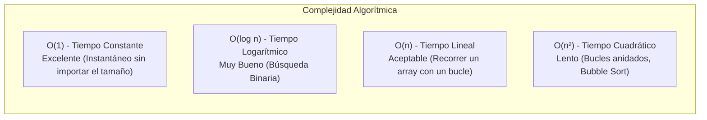
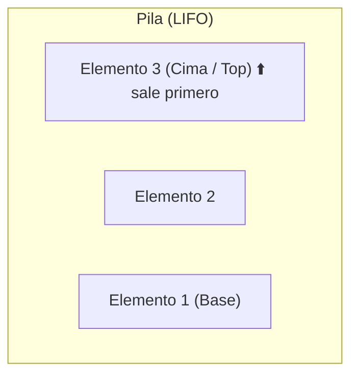
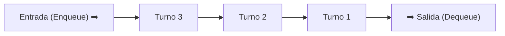
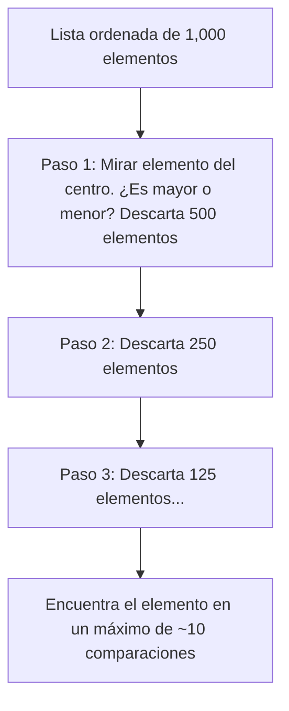

# Módulo 11: Estructuras Lineales y Algoritmos Básicos

¿Por qué los ingenieros de software eligen con tanto cuidado qué estructura de datos utilizar en lugar de meter todo dentro de un simple array? Porque la forma en que organizas los datos en memoria determina si tu aplicación responderá en milisegundos o si se congelará ante miles de usuarios.

---

## 11.1 Nociones Básicas de Eficiencia: Notación Big O

La **Notación Big O** es el lenguaje formal que usamos los programadores para describir cómo escala el tiempo de ejecución o el uso de memoria de un algoritmo a medida que el tamaño de los datos de entrada ($n$) se vuelve gigantesco.



* **$O(1)$ - Tiempo Constante:** El tiempo es siempre el mismo, haya 1 elemento o 10 millones (ejemplo: acceder a `array[0]` o buscar en un `Map`).
* **$O(n)$ - Tiempo Lineal:** Si el array se multiplica por 10, el tiempo de ejecución se multiplica por 10 (ejemplo: un bucle que busca un número recorriendo la lista).
* **$O(n^2)$ - Tiempo Cuadrático:** Si el array se multiplica por 10, el tiempo se multiplica por 100 (ejemplo: dos bucles anidados comprobando duplicados).

---

## 11.2 Pilas (*Stacks* - LIFO: Last In, First Out)

Una **Pila** es una estructura de datos lineal regida por el principio **LIFO**: el *último* elemento en entrar es el *primer* elemento en salir.



### Casos de Uso Reales:
* El botón **"Deshacer" (Ctrl + Z)** en cualquier editor de texto o diseño.
* El historial de navegación del explorador (el botón "Atrás").
* El **Call Stack** del motor de JavaScript para gestionar la ejecución de funciones.

### Implementación de una Pila en TypeScript:

```typescript
class Pila<T> {
  private elementos: T[] = [];

  // Apilar: agrega un elemento a la cima
  push(item: T): void {
    this.elementos.push(item);
  }

  // Desapilar: quita y devuelve el elemento de la cima
  pop(): T | undefined {
    return this.elementos.pop();
  }

  // Ver la cima sin retirarla
  peek(): T | undefined {
    return this.elementos.at(-1);
  }

  estaVacia(): boolean {
    return this.elementos.length === 0;
  }
}

// Ejemplo de uso: Historial de acciones
const historial = new Pila<string>();
historial.push("Escribir párrafo 1");
historial.push("Cambiar color a azul");
historial.push("Borrar imagen");

console.log(`Deshaciendo acción: ${historial.pop()}`); // "Borrar imagen"
console.log(`Última acción actual: ${historial.peek()}`); // "Cambiar color a azul"
```

---

## 11.3 Colas (*Queues* - FIFO: First In, First Out)

Una **Cola** es una estructura de datos regida por el principio **FIFO**: el *primer* elemento en entrar es el *primer* elemento en ser atendido (igual que una fila del supermercado).



### Casos de Uso Reales:
* La cola de impresión de una impresora (los documentos se imprimen en el orden en que llegaron).
* La cola de peticiones en un servidor web (*Request Queue*).
* La cola de tareas (*Callback Queue*) del **Event Loop** del navegador.

### Implementación de una Cola en TypeScript:

```typescript
class Cola<T> {
  private items: T[] = [];

  // Encolar: llega alguien al final de la fila
  enqueue(item: T): void {
    this.items.push(item);
  }

  // Desencolar: atiende al primero que llegó
  dequeue(): T | undefined {
    return this.items.shift();
  }

  // Mirar quién está al frente
  front(): T | undefined {
    return this.items[0];
  }

  tamaño(): number {
    return this.items.length;
  }
}

// Ejemplo: Fila de atención a clientes
const filaSoporte = new Cola<string>();
filaSoporte.enqueue("Cliente 1: Ana");
filaSoporte.enqueue("Cliente 2: Carlos");

console.log(`Atendiendo a: ${filaSoporte.dequeue()}`); // "Cliente 1: Ana"
console.log(`Siguiente en turno: ${filaSoporte.front()}`); // "Cliente 2: Carlos"
```

---

## 11.4 Algoritmos Clásicos de Búsqueda

### 1. Búsqueda Lineal ($O(n)$)
Recorre el array elemento por elemento de principio a fin hasta encontrar lo que busca o agotar la lista. Es la única opción cuando la lista está desordenada.

```typescript
function busquedaLineal(arr: number[], objetivo: number): number {
  for (let i = 0; i < arr.length; i++) {
    if (arr[i] === objetivo) return i; // Devuelve el índice
  }
  return -1; // No encontrado
}
```

### 2. Búsqueda Binaria ($O(\log n)$)
Solo funciona si el array está **previamente ordenado**. Aplica la técnica de descartar la mitad de los elementos en cada paso (como buscar un apellido en una guía telefónica abriéndola a la mitad):



```typescript
function busquedaBinaria(arrOrdenado: number[], objetivo: number): number {
  let inicio = 0;
  let fin = arrOrdenado.length - 1;

  while (inicio <= fin) {
    const medio = Math.floor((inicio + fin) / 2);

    if (arrOrdenado[medio] === objetivo) {
      return medio; // ¡Encontrado!
    } else if (arrOrdenado[medio] < objetivo) {
      inicio = medio + 1; // Busca en la mitad derecha
    } else {
      fin = medio - 1; // Busca en la mitad izquierda
    }
  }

  return -1;
}

const numerosOrdenados = [2, 5, 8, 12, 16, 23, 38, 56, 72, 91];
console.log(busquedaBinaria(numerosOrdenados, 23)); // Índice 5
```

---

## 🛠️ Reto Práctico del Módulo

**Ejercicio: Validador de Paréntesis y Llaves Balanceadas**

Un compilador necesita verificar si el código de un programador tiene los símbolos de apertura y cierre correctamente balanceados. 

Escribe una función `esExpresionBalanceada(codigo: string): boolean` utilizando una **Pila (Stack)**:
* Cada vez que encuentres un símbolo de apertura (`(`, `[`, `{`), agrégalo a la pila.
* Cada vez que encuentres un símbolo de cierre (`)`, `]`, `}`), verifica si la cima de la pila tiene su pareja correspondiente. Si no coincide o la pila está vacía, la expresión es inválida.
* Al terminar el recorrido, la pila debe quedar completamente vacía.

```typescript
console.log(esExpresionBalanceada("{ [ a * (b + c) ] }")); // true
console.log(esExpresionBalanceada("( [ ) ]"));             // false (cierre cruzado incorrecto)
console.log(esExpresionBalanceada("{ ( } )"));             // false
console.log(esExpresionBalanceada("((()"));                // false (quedó abierto)
```
