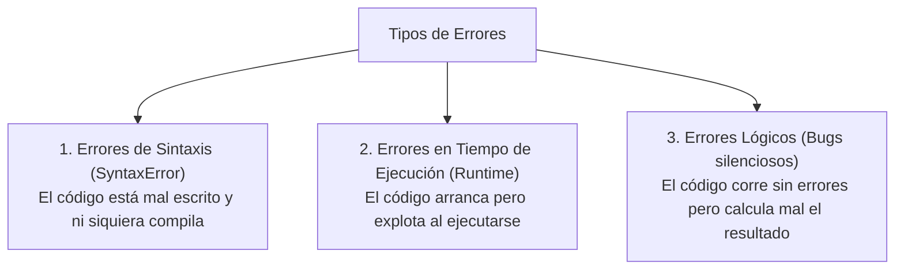
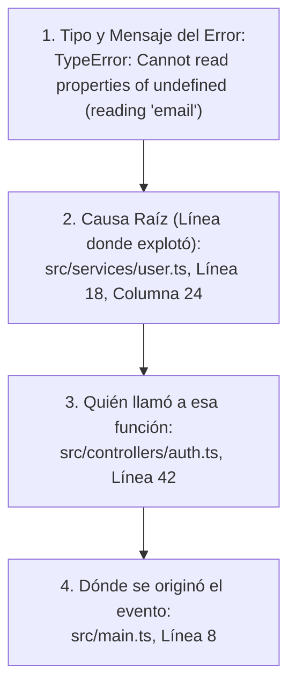

# Módulo 12: Manejo de Errores y Depuración (Debugging)

Los errores no son un indicador de fracaso ni una señal de que la programación no es para ti: **los errores son el pan de cada día de todo ingeniero de software**. Un desarrollador senior no es alguien que nunca comete errores, sino alguien que sabe diagnosticarlos, leer la consola con calma y corregirlos metódicamente.

---

## 12.1 Los Tres Grandes Tipos de Errores

Para solucionar un problema, primero debes clasificar a qué familia pertenece:



### 1. Errores de Sintaxis (*SyntaxError*)
Ocurren cuando violas las reglas gramaticales del lenguaje (olvidar cerrar un paréntesis, escribir `funtion` en vez de `function`, etc.). Tu editor (VS Code) y TypeScript los marcarán en rojo inmediatamente antes de que intentes correr el programa.

### 2. Errores en Tiempo de Ejecución (*Runtime Errors*)
El código tiene una sintaxis válida, pero intenta realizar una acción imposible durante la ejecución:

* **`ReferenceError`:** Intentar leer una variable que no existe o antes de ser inicializada.
  ```typescript
  // console.log(saldoTotal); // ReferenceError: saldoTotal is not defined
  ```
* **`TypeError`:** Intentar operar sobre un tipo de dato incorrecto, como ejecutar algo que no es una función, o leer propiedades de `null` o `undefined`.
  ```typescript
  let usuario = null;
  // usuario.nombre; // TypeError: Cannot read properties of null (reading 'nombre')
  ```

### 3. Errores Lógicos (Los más peligrosos)
El programa no lanza ninguna alerta roja, pero la lógica de negocio es errónea:

```typescript
// ❌ Error lógico: El programador sumó en lugar de restar el descuento
function aplicarDescuento(precio: number, descuento: number) {
  return precio + (precio * descuento); // ¡El producto se volvió más caro!
}
```

---

## 12.2 Manejo Controlado con `try...catch...finally`

Cuando trabajas con operaciones que escapan de tu control absoluto (conexiones de red, lectura de archivos, datos enviados por usuarios externos), debes proteger tu código para que un fallo no tire la aplicación entera:

```typescript
function parsearDatosUsuario(jsonString: string) {
  try {
    // 1. Bloque 'try': El código que intentamos ejecutar y que podría fallar
    console.log("Iniciando lectura de datos...");
    const datos = JSON.parse(jsonString);
    return datos;

  } catch (error) {
    // 2. Bloque 'catch': Se ejecuta ÚNICAMENTE si ocurre un error en el try
    console.error("Ocurrió un error al procesar el JSON:", (error as Error).message);
    return null; // Devolvemos un valor seguro de rescate

  } finally {
    // 3. Bloque 'finally': Se ejecuta SIEMPRE, haya habido error o no
    // Ideal para tareas de limpieza (cerrar loaders, apagar conexiones)
    console.log("Operación de lectura finalizada.");
  }
}
```

### Lanzar Errores Personalizados con `throw`
Tú también puedes forzar un error si se violan las reglas de tu aplicación:

```typescript
function retirarDinero(saldo: number, monto: number): number {
  if (monto <= 0) {
    throw new Error("El monto a retirar debe ser mayor a cero.");
  }
  if (monto > saldo) {
    throw new Error("Fondos insuficientes en la cuenta.");
  }
  return saldo - monto;
}
```

---

## 12.3 Cómo Leer un Stack Trace (La Consola Roja)

Cuando la consola muestra un texto rojo intimidante, **no entres en pánico**. Está diseñado para decirte con precisión quirúrgica dónde está el problema:

```text
TypeError: Cannot read properties of undefined (reading 'email')
    at formatearUsuario (src/services/user.ts:18:24)
    at cargarPerfil (src/controllers/auth.ts:42:10)
    at HTMLButtonElement.<anonymous> (src/main.ts:8:3)
```



1. **Primera línea:** Te dice el tipo de error y qué intentó hacer (`Cannot read properties of undefined (reading 'email')`). Significa que la variable antes del `.email` era `undefined`.
2. **Segunda línea:** Te indica el **archivo exacto y el número de línea** donde ocurrió la explosión (`user.ts:18`).
3. **Líneas siguientes:** La pila de llamadas (*Call Stack*) que te muestra cómo se fue llamando cada función hasta llegar al error.

---

## 12.4 Técnicas Profesionales de Depuración

### 1. Más allá de `console.log()`
* **`console.table()`:** Muestra arrays u objetos en una tabla visual limpia e interactiva:
  ```typescript
  const usuarios = [
    { id: 1, rol: "Admin", activo: true },
    { id: 2, rol: "User", activo: false }
  ];
  console.table(usuarios);
  ```
* **`console.warn()` y `console.error()`:** Imprimen con colores amarillos y rojos en la consola para filtrar fácilmente.
* **`console.time()` y `console.timeEnd()`:** Miden cuántos milisegundos tarda en ejecutarse un bloque de código:
  ```typescript
  console.time("Procesando lista");
  // ... algún cálculo pesado ...
  console.timeEnd("Procesando lista"); // "Procesando lista: 14.2ms"
  ```

### 2. La Sentencia `debugger;` y los Breakpoints
Si escribes la palabra reservada `debugger;` en tu código y tienes abiertas las herramientas de desarrollador del navegador (F12):

```typescript
function calcularTotal(items: any[]) {
  debugger; // 🛑 El navegador pausará la ejecución exactamente en esta línea
  return items.reduce((acc, item) => acc + item.precio, 0);
}
```

Al pausarse, el panel de desarrollo te permite:
* Ver el valor real de cada variable en ese milisegundo exacto.
* Avanzar paso a paso (*Step Over*) línea por línea viendo cómo cambian los datos.
* Evaluar expresiones en vivo en la consola de la pestaña de depuración.

---

## 🛠️ Reto Práctico del Módulo

**Ejercicio: Cacería de Bugs**

Identifica el error en cada uno de estos 3 fragmentos y explica cómo corregirlo:

```typescript
// Fragmento 1:
const configuracion = { idioma: "es" };
configuracion = { idioma: "en" };

// Fragmento 2:
function obtenerIniciales(nombreCompleto: string) {
  const partes = nombreCompleto.split(" ");
  return partes[0][0] + partes[1][0];
}
obtenerIniciales("Aldair"); // ¿Qué sucede aquí?

// Fragmento 3:
for (let i = 0; i <= 5; i++) {
  setTimeout(() => {
    console.log(i);
  }, 100);
}
```
