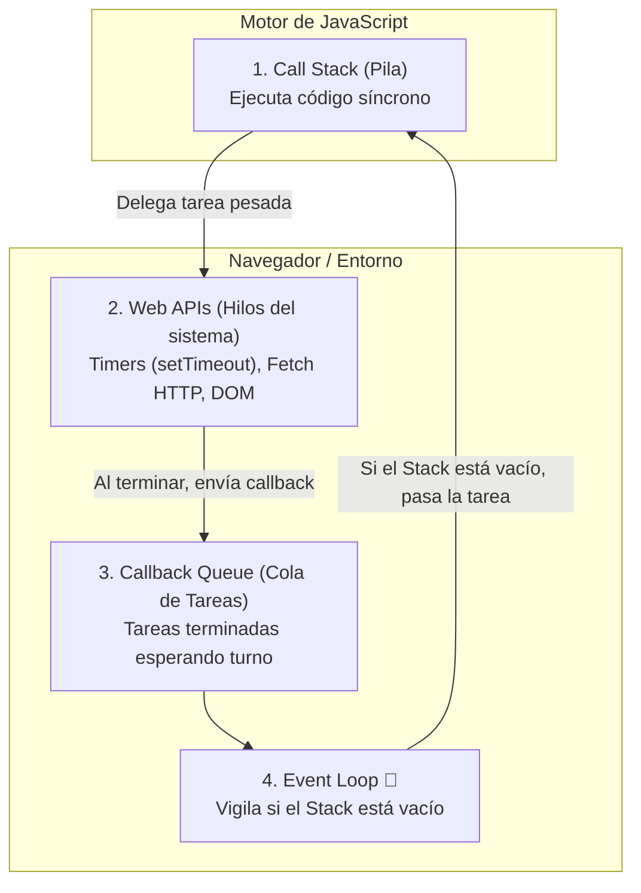
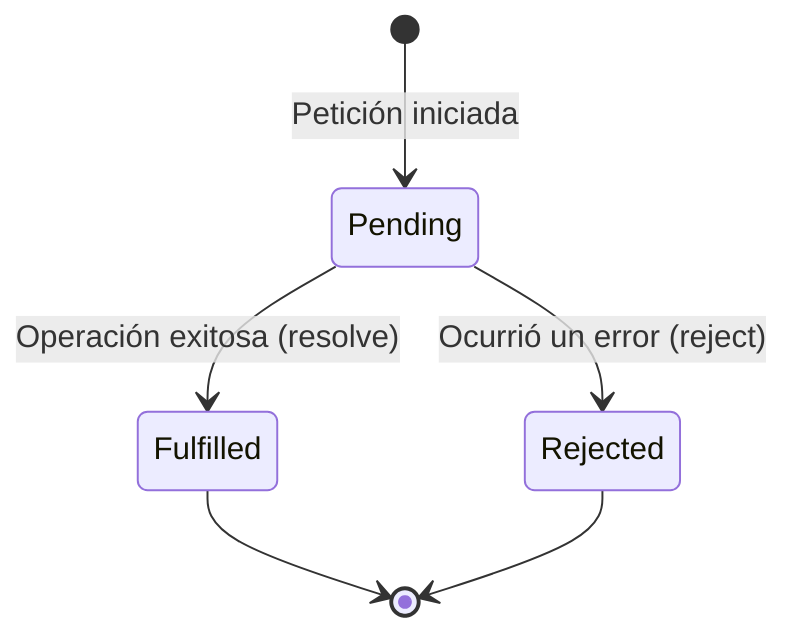

# Módulo 13: Introducción al Asincronismo y el Event Loop

En la vida real no te quedas congelado mirando la tostadora hasta que sale el pan: pones el pan a tostar y, mientras tanto, preparas el café. En informática, esa capacidad de iniciar una tarea demorada y continuar haciendo otras cosas mientras esperamos la respuesta se llama **asincronismo**.

---

## 13.1 Por qué JavaScript es Asíncrono

JavaScript es un lenguaje de **un solo hilo (*single-threaded*)**. Esto significa que solo tiene un Call Stack y solo puede ejecutar **una sola instrucción a la vez**.

Si hicieras una petición a un servidor que tarda 3 segundos de forma *síncrona (bloqueante)*, el navegador se congelaría por completo durante esos 3 segundos: el usuario no podría hacer clic, ni hacer scroll, ni escribir en ningún input. Para evitar esto, las operaciones pesadas se delegan de forma asíncrona.

---

## 13.2 Los 4 Actores del Event Loop

Para entender cómo JavaScript logra ser no bloqueante con un solo hilo, debes conocer la interacción de cuatro componentes:



1. **Call Stack:** Donde se ejecuta tu código JavaScript principal.
2. **Web APIs:** Hilos de fondo del navegador (o C++ en Node.js) que resuelven peticiones de red o temporizadores sin bloquear a JavaScript.
3. **Callback Queue:** Una cola FIFO donde las Web APIs depositan las funciones de respuesta una vez terminadas.
4. **Event Loop:** Un ciclo continuo que monitorea el Call Stack. **Solo cuando el Call Stack está 100% vacío**, el Event Loop toma la primera tarea de la cola y la sube al Stack para ser ejecutada.

> [!NOTE]
> **Por qué `setTimeout(fn, 0)` no es inmediato:**
> Incluso si configuras un retraso de `0` milisegundos, la función pasa obligatoriamente por la Web API y la Callback Queue. Se ejecutará únicamente después de que todo el código síncrono del archivo haya terminado.

---

## 13.3 De Callbacks a Promesas

### El Problema de los Callbacks (*Callback Hell*)
Al principio, para manejar respuestas asíncronas se pasaban funciones dentro de funciones, lo que derivaba en la "pirámide de la muerte":

```typescript
// ❌ Callback Hell: Ilegible y difícil de gestionar
obtenerUsuario(id, (usuario) => {
  obtenerPedidos(usuario.id, (pedidos) => {
    obtenerDetalles(pedidos[0].id, (detalles) => {
      console.log(detalles);
    });
  });
});
```

### ¿Qué es una Promesa?
Una **Promesa** es un objeto que representa el resultado eventual de una operación asíncrona. Es como el ticket que te dan en una cafetería: te promete que recibirás tu café en el futuro, o te avisarán si se agotó el grano.



```typescript
// Consumo tradicional con .then() y .catch():
miPromesaDeServidor()
  .then((datos) => console.log("Datos recibidos:", datos))
  .catch((error) => console.error("Falló la petición:", error))
  .finally(() => console.log("Operación terminada"));
```

---

## 13.4 La Sintaxis Moderna: `async` y `await`

Introducido en ES2017, `async/await` es "azúcar sintáctico" que te permite escribir código asíncrono con la misma claridad y estructura que el código síncrono tradicional:

* **`async`:** Se coloca antes de la función para indicar que siempre devolverá una Promesa.
* **`await`:** Solo se puede usar dentro de funciones `async`. Pausa la ejecución de la función hasta que la promesa se resuelva, sin congelar el hilo principal del navegador.

```typescript
// ✅ Código asíncrono limpio y lineal:
async function cargarDatosUsuario(id: number) {
  try {
    console.log("Cargando usuario...");
    const usuario = await obtenerUsuarioDeBD(id);
    const pedidos = await obtenerPedidos(usuario.id);
    
    console.log("Pedidos cargados:", pedidos);
    return pedidos;

  } catch (error) {
    console.error("No se pudieron cargar los datos:", error);
  }
}
```

---

## 13.5 Consumo Práctico de APIs con `fetch`

`fetch()` es la función nativa del navegador para realizar peticiones HTTP hacia servidores externos:

```typescript
interface UsuarioAPI {
  id: number;
  name: string;
  email: string;
}

async function obtenerUsuarios(): Promise<void> {
  try {
    // 1. Iniciar la petición HTTP (GET por defecto)
    const respuesta = await fetch("https://jsonplaceholder.typicode.com/users/1");

    // 2. Verificar si el servidor respondió con un código exitoso (200-299)
    if (!respuesta.ok) {
      throw new Error(`Error en el servidor. Código de estado: ${respuesta.status}`);
    }

    // 3. Transformar el flujo de datos a formato JSON tipado
    const usuario: UsuarioAPI = await respuesta.json();
    console.log(`Usuario: ${usuario.name} (${usuario.email})`);

  } catch (error) {
    console.error("Error en la conexión:", (error as Error).message);
  }
}

obtenerUsuarios();
```

---

## 🛠️ Reto Práctico del Módulo

**Ejercicio: Simulador de Petición con Estados de Carga**

Escribe una función asíncrona `consultarClima(ciudad: string)` que simule una llamada a un servidor meteorológico:
1. Crea una promesa manual que tarde 2 segundos en resolverse utilizando `new Promise()` y `setTimeout()`.
2. Si el nombre de la ciudad es `"Error"`, la promesa debe rechazarse (*reject*) con un mensaje de fallo.
3. Si la ciudad es válida, la promesa debe resolverse (*resolve*) entregando un objeto `{ ciudad: string, temperatura: number, condicion: string }`.
4. Consume tu función usando `async/await` y `try/catch`. Imprime `"Cargando clima..."` al inicio, los datos al completarse, y un mensaje en el bloque `finally` indicando `"Consulta climática finalizada"`.
