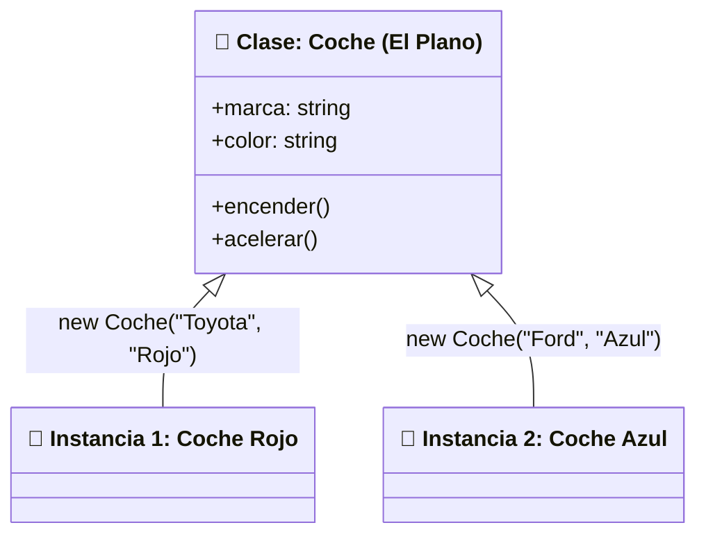
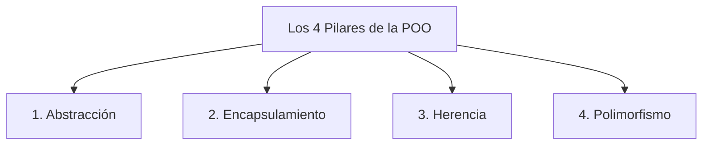

# Módulo 14: Introducción a la Programación Orientada a Objetos

A medida que una aplicación crece, tener cientos de funciones y variables sueltas por todo el código se vuelve insostenible. La **Programación Orientada a Objetos (POO)** es un paradigma que nos enseña a estructurar el software empaquetando los **datos (estado)** y las **acciones (comportamiento)** en entidades coherentes llamadas **objetos**.

---

## 14.1 Clases vs Instancias: El Plano y el Edificio

Para entender la POO, la analogía arquitectónica es perfecta:



* **Clase (El Molde o Plano):** Es la definición abstracta. Especifica qué características y qué capacidades tendrán los objetos de ese tipo. No ocupa memoria real para datos.
* **Instancia (El Objeto Real):** Es el objeto físico concreto creado en memoria mediante la palabra clave `new`, con valores específicos para sus propiedades.

---

## 14.2 Anatomía de una Clase en TypeScript

```typescript
class CuentaBancaria {
  // 1. Propiedades (Estado)
  titular: string;
  saldo: number;

  // 2. Constructor: Se ejecuta automáticamente al hacer 'new'
  constructor(titular: string, saldoInicial: number = 0) {
    this.titular = titular;
    this.saldo = saldoInicial;
  }

  // 3. Métodos (Comportamiento)
  depositar(monto: number): void {
    if (monto <= 0) return;
    this.saldo += monto;
    console.log(`Depósito de $${monto}. Nuevo saldo: $${this.saldo}`);
  }
}

// Creación de instancias con 'new':
const cuenta1 = new CuentaBancaria("Aldair", 100);
cuenta1.depositar(50); // "Depósito de $50. Nuevo saldo: $150"
```

### ¿Qué representa `this`?
La palabra clave `this` se refiere a la **instancia concreta y específica** sobre la que se está ejecutando el método en ese momento. Si `cuenta1.depositar()` se ejecuta, `this.saldo` modifica el saldo de `cuenta1`, no el de otra cuenta.

---

## 14.3 Los Cuatro Pilares Fundamentales de la POO



### 1. Abstracción
Consiste en ocultar la complejidad interna y exponer únicamente los controles necesarios.
* *Ejemplo:* Para conducir un automóvil solo necesitas presionar el pedal del acelerador. No necesitas saber cuántos mililitros de gasolina inyectó el motor ni a qué presión están los pistones.

### 2. Encapsulamiento y Modificadores de Acceso
Protege la información interna para evitar que sea manipulada de forma errónea o maliciosa desde el exterior. TypeScript ofrece cuatro modificadores clave:

* **`public` (Por defecto):** Accesible desde cualquier lugar.
* **`private`:** Solo accesible **dentro** de la propia clase.
* **`protected`:** Accesible dentro de la clase y en aquellas clases que hereden de ella.
* **`readonly`:** Se puede leer libremente, pero solo se asigna en el constructor.

```typescript
class Usuario {
  public id: number;
  public nombre: string;
  private claveHash: string; // 🔒 Nadie desde afuera puede leer ni alterar esto

  constructor(id: number, nombre: string, clave: string) {
    this.id = id;
    this.nombre = nombre;
    this.claveHash = clave;
  }

  validarClave(intento: string): boolean {
    return this.claveHash === intento; // Solo la clase maneja la clave interna
  }
}
```

#### Atajo de TypeScript: Parameter Properties
Puedes declarar e inicializar propiedades directamente dentro del constructor en una sola línea:

```typescript
class Producto {
  // TypeScript crea las variables y les asigna el valor automáticamente
  constructor(
    public id: number,
    public nombre: string,
    private _precio: number
  ) {}
}
```

### 3. Herencia (`extends` y `super`)
Permite crear clases hijas que heredan todas las propiedades y métodos de una clase padre, agregando o personalizando su propia lógica:

```typescript
// Clase Base (Padre)
class Empleado {
  constructor(public nombre: string, public salarioBase: number) {}

  describir(): void {
    console.log(`Empleado: ${this.nombre}`);
  }
}

// Clase Derivada (Hija)
class Desarrollador extends Empleado {
  constructor(nombre: string, salarioBase: number, public lenguaje: string) {
    super(nombre, salarioBase); // Llama al constructor de la clase padre Empleado
  }

  programar(): void {
    console.log(`${this.nombre} está escribiendo código en ${this.lenguaje}...`);
  }
}

const dev = new Desarrollador("Aldair", 3000, "TypeScript");
dev.describir(); // Heredado del padre
dev.programar(); // Propio del Desarrollador
```

### 4. Polimorfismo
Es la capacidad de clases hijas de **responder de manera distinta al mismo método**:

```typescript
class Notificador {
  enviar(mensaje: string): void {
    console.log(`Notificación genérica: ${mensaje}`);
  }
}

class NotificadorEmail extends Notificador {
  override enviar(mensaje: string): void {
    console.log(`📧 Enviando Email: ${mensaje}`);
  }
}

class NotificadorSMS extends Notificador {
  override enviar(mensaje: string): void {
    console.log(`📱 Enviando SMS: ${mensaje}`);
  }
}

// Una sola lista con distintos tipos polimórficos:
const canales: Notificador[] = [new NotificadorEmail(), new NotificadorSMS()];
canales.forEach(canal => canal.enviar("Tu código de verificación es 4821"));
```

---

## 14.4 Propiedades y Métodos Estáticos (`static`)

Un método o propiedad marcado como `static` pertenece a la **clase misma**, no a una instancia individual. No necesitas instanciar con `new` para usarlos:

```typescript
class Matematicas {
  static readonly PI: number = 3.14159;

  static calcularAreaCirculo(radio: number): number {
    return this.PI * radio * radio;
  }
}

// Se invoca directamente sobre la clase (igual que Math.round() o Date.now()):
console.log(Matematicas.calcularAreaCirculo(5));
```

---

## 🛠️ Reto Práctico del Módulo

**Ejercicio: Sistema Bancario con Clases y Herencia**

Modela un sistema bancario implementando los 4 pilares de la POO:
1. Crea una clase base `Cuenta` con las propiedades `titular: string` y `private _saldo: number`.
2. Implementa un método `depositar(monto: number)` y un método `retirar(monto: number)` que no permita retiros si no hay saldo suficiente.
3. Provee un getter `get saldo(): number` para consultar el saldo de forma segura sin permitir la sobreescritura externa directa.
4. Crea una clase hija `CuentaAhorro` que herede de `Cuenta` y reciba una propiedad adicional `tasaInteresAnual: number`.
5. Agrega un método `aplicarInteresMensual()` en `CuentaAhorro` que calcule el interés correspondiente al saldo actual y lo deposite automáticamente.
